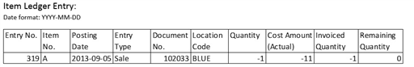
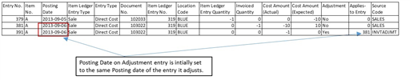
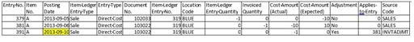
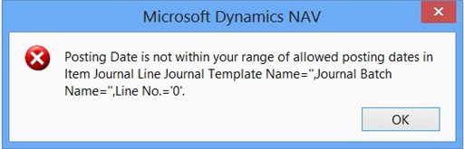
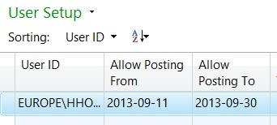
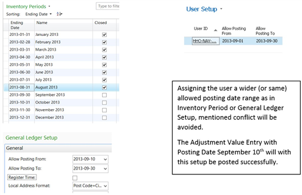
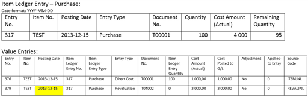
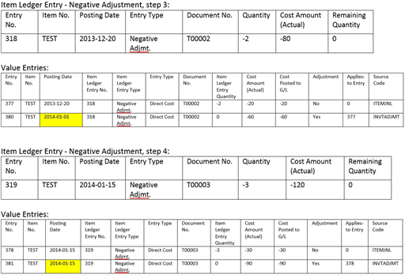
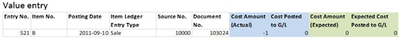

# Design Details: Posting Date on Adjustment Value Entry
This article provides guidance for users of the Inventory Costing functionality in [!INCLUDE[prod_short](includes/prod_short.md)]. The specific article is providing guidance in how the **Adjust Cost - Item Entries** batch job identifies and assigns a posting date to the value entries that the batch job is about to create.  

First the concept of the process is reviewed, how the batch job identifies and assigns the Posting Date to the Value Entry to be created. Thereafter there are some scenarios shared that we in the support team come across from time to time and finally there is a summary of the concepts used.  

## The Concept  
The **Adjust Cost – Item Entries** batch job assigns a posting date to the value entry it is about to create in the following steps:  

1.  Initially the Posting Date of the entry to be created is the same date as the entry it adjusts.  

2.  The Posting Date is validated against Inventory Periods and/or General Ledger Setup.  

3.  Assignment of Posting Date; If the initial Posting Date is not within allowed posting date range the batch job will assign an allowed Posting Date from either General Ledger Setup or Inventory Period. If both Inventory Periods and allowed posting dates in General Ledger Setup are defined, the later date of the two will be assigned to the Adjustment Value Entry.  

 Let’s review this process more in practice. Assume we have an Item Ledger Entry of Sale. The item was shipped on September 5, 2013 and it was invoiced the day after.  

  

Below, the first Value Entry (379) represents the shipment and carry the same Posting Date as the parent Item ledger Entry.  

The second Value Entry (381) represents the invoice.  

 The third Value Entry (391) is an Adjustment of the invoicing Value Entry (381)  

   

 Step 1: Adjustment Value Entry to be created is assigned same Posting Date as the entry it adjusts, illustrated above by Value entry 391.  

 Step 2: Validation of initial assigned Posting Date.  

The **Adjust Cost – Item Entries** batch job determines if the initial Posting Date of the Adjustment Value Entry is within allowed posting date range based upon Inventory Periods and/or General Ledger Setup.  

 Let’s review the above mentioned Sale by adding setup of allowed posting date ranges.  

 Inventory Periods:  

 First allowed posting date is the first day in the first open period. September 1, 2013.  

 General Ledger Setup:  

 First allowed posting date is the date stated in field Allow Posting From: September 10, 2013.  

 If both Inventory Periods and allowed posting dates in General Ledger Setup are defined, the later date of the two will define the allowed posting date range.  

 Step 3: Assignment of an allowed posting date;  

 The initial assigned Posting Date was September 6 as illustrated in step 1. However, in the second step the Adjust Cost – Item entries batch job identifies that earliest allowed Posting Date is September 10 and thereby assigns September 10 to the Adjustment Value Entry, below.  

 

 We have now reviewed the concept for assigning Posting Dates to Value Entries created by the Adjust Cost - Item entries batch job.  

 Let’s continue to review some scenarios that we in the support team comes across from time to time in relation to assigned Posting Dates in the Adjust Cost – Item entries batch job and related setups.  

## Scenarios  

### Scenario I: “Posting Date is not within your range of allowed posting dates…”  
 This is a scenario where a user is experiencing mentioned error message when the Adjust Cost – Item entries batch job is run.  

 In the previous section, describing the concept of assigning posting dates, the intention of the Adjust Cost – Item entries batch job is to create a Value Entry with Posting Date September 10th.  

 We follow up on the User Setup:  

 The user in this case has an allowed posting date range from September 11 to September 30 and is thereby not allowed to post the Adjustment Value Entry with Posting Date September 10th.  

 Knowledge Base article [952996](https://mbs2.microsoft.com/Knowledgebase/kbdisplay.aspx?WTNTZSMNWUKNTMMYXUPYZQPOUXNXSPSYOQQYYMLUQLOYYMWP) discusses more scenarios related to mentioned error message.  

### Scenario II: Posting Date on Adjustment Value Entry versus Posting Date on entry causing the adjustment such as Revaluation or Item charge.  

### Revaluation scenario:  
 Prerequisites:  

 Inventory setup:  

-   Automatic Cost Posting = Yes  

-   Automatic Cost Adjustment=Always  

-   Average Cost Calc. Type=item  

-   Average Cost Period=Day  

 General Ledger Setup:  

-   Allow Posting From = January 1, 2014  

-   Allow Posting To = empty  

 User Setup:  

-   Allow Posting From = December 1, 2013.  

-   Allow Posting to = empty  

##### To test the scenario  

1.  Create item TEST:  

     Base unit of measure = PCS  

     Costing Method = Average  

     Select optional posting groups.  

2.  Open Item Journal, create, and post a line as follows:  

     Posting Date = December 15, 2013  

     Item = TEST  

     Entry Type = Purchase  

     Quantity = 100  

     Unit Amount = 10  

3.  Open Item Journal, create, and post a line as follows:  

     Date = December 20, 2013  

     Item = TEST  

     Entry Type = Negative Adjustment  

     Quantity = 2  

4.  Open Item Journal, create, and post a line as follows:  

     Date = January 15, 2014  

     Item = TEST  

     Entry Type = Negative Adjustment  

     Quantity = 3  

5.  Open Revaluation Journal, create, and post a line as follows:  

     Item = TEST  

     Applies-to Entry = select Purchase entry posted at step 2. The Posting Date of the revaluation will be the same as the entry it adjusts.  

     Unit Cost Revalued = 40  

 The following Item Ledger and Value Entries have been posted:  

 

 The Adjust Cost – Item entries batch job has recognized a change in cost and adjusted the Negative Adjustments.  

 **Review of Posting Dates on created Adjustment Value Entries:** The earliest allowed Posting Date the Adjust Cost - Item Entries batch job has to relate to is January 1, 2014 as stated in the General Ledger Setup.  

 **Negative Adjustment in step 3:** assigned Posting Date is January 1, provided by General Ledger Setup. The Posting Date of the Value Entry in scope for adjustment is December 20, 2013. According to General Ledger Setup, the date is not within allowed posting date range. Therefore the Posting Date stated in the Allow Posting From field in the General Ledger Setup is assigned to the Adjustment Value Entry.  

 **Negative Adjustment in step 4:** assigned Posting Date is January 15. The Value Entry in scope of adjustment has Posting Date January 15, which is within the allowed posting date range according to General Ledger Setup.  

 The adjustment made for the Negative Adjustment in step 3 causes discussion. The favorable Posting Date for the Adjustment Value Entry would have been December 20 or at least within December as the revaluation causing the change in COGS was posted in December.  

 To achieve adjustment in December of the Negative Adjustment in step 3, the General Ledger Setup, Allow Posting From field, need to state a date in December.  

 **Conclusion:**  

 With the experiences from this scenario, considering most suitable setup of allowed posting date range for a company, you might want to consider the following information: As long as you allow changes in inventory value to be posted in a period, December in this case, the setup that the company uses for allowed posting date ranges should be aligned with this decision. The Allow Posting From in the General Ledger Setup, stating December 1, would allow the revaluation made in December to be forwarded to affected outbound entries in the same period.  

 User groups not allowed to post in December but in January, which was probably intended to be limited by the General Ledger Setup in this scenario, should instead be addressed via the User setup.  

### Item charge scenario:  
 Prerequisites:  

 Inventory setup:  

-   Automatic Cost Posting = Yes  

-   Automatic Cost Adjustment=Always  

-   Average Cost Calc. Type=item  

-   Average Cost Period=Day  

 General Ledger Setup:  

-   Allow Posting From = December 1, 2013.  

-   Allow Posting To = empty  

 User Setup:  

-   Allow Posting From = December 1, 2013.  

-   Allow Posting to = empty  

##### To test the scenario  

1.  Create item charge:  

     Base unit of measure = PCS  

     Costing Method = Average  

     Select optional posting groups.  

2.  Create new purchase order  

     Buy-from Vendor No.: 10000  

     Posting Date = December 15, 2013  

     Vendor Invoice No.: 1234  

     On the purchase order line:  

     Item = CHARGE  

     Quantity = 1  

     Direct Unit Cost = 100  

     Post Receive and Invoice.  

3.  Create new sales order:  

     Sell-to Customer No.: 10000  

     Posting Date = December 16, 2013  

     On the sales order line:  

     Item = CHARGE  

     Quantity = 1  

     Unit Price = 135  

     Post Ship and Invoice.  

4.  General Ledger Setup:  

     Allow Posting From = January 1, 2014  

     Allow Posting To = blank  

5.  Create new purchase order:  

     Buy-from Vendor No.: 10000  

     Posting Date = January 2, 2014  

     Vendor Invoice No.: 2345  

     On the purchase order line:  

     Item Charge = JB-FREIGHT  

     Quantity = 1  

     Direct Unit Cost = 3  

     Assign Item Charge to Purchase Receipt from step 2.  

     Post Receipt and Invoice.  

     

6.  On work date January 3, a purchase invoice arrives, containing an additional item charge to the purchase made in step 2. This invoice has document date December 30 and is therefore posted with Posting Date December 30, 2013.  

     Create new purchase order:  

     Buy-from Vendor No.: 10000  

     Posting Date = December 30, 2013  

     Vendor Invoice No.: 3456  

     On the purchase order line:  

     Item Charge = JB-FREIGHT  

     Quantity = 1  

     Direct Unit Cost = 2  

     Assign Item Charge to Purchase Receipt from step 2  

     Post Receipt and Invoice.  

   

 Inventory Valuation report is printed as of Date December 31 , 2013  

 **Summary of scenario:**  

 The described scenario ends up with an Inventory Valuation report demonstrating Quantity = 0 while the Value = 2. The Item charge posted in step 11 is part of the Inventory Increase value of December while the Inventory Decrease of the same period is not affected.  

 Having the General Ledger Setup stating Allow Posting From January 1 was a good thing for the first Item charge. The costs of the Inventory Increase and Decrease was recorded in the same period. For the second Item charge however, the General Ledger Setup causes the change in COGS to be recognized in the period after.  

 **Conclusion:**  

 It’s a challenge to have the Inventory Valuation report to demonstrate Quantity = 0 while the Value <> 0. In this case it’s also more difficult to express the optimal settings, having purchase invoices arriving the same day but addressing different periods or even fiscal years. Crossing to a new fiscal year usually requires some planning and as part of that the insight of Adjust Cost – Item entries process, recognizing COGS, is to be considered.  

 In this scenario one option could have been to have the General Ledger Setup, field Allow Posting From, stating a date in December for a couple of more days and the posting of the first item charge postponed to allow all costs for the previous period/fiscal year to be recognized for the period they belong to first, having the Adjust Cost – Item entries batch job run and thereafter move the allowed posting date to the new period\/fiscal year. The first item charge with posting date January 2 could then be posted.  

## History of Adjust Cost – Item entries batch job  
 Below is a summary of the concept assigning Posting Dates to Adjustment Value Entries by the Adjust Cost – Item entries batch job.  

### About the request form posting date:  
 There is no longer a posting date to be stated in the request form of the Adjust Cost - Item entries batch job. The batch job runs through all necessary changes and creates value entries with the posting date of the value entry it adjusts. If the posting date is not within allowed posting date range the posting date in the Allow Posting From field in the General Ledger Setup, OR if the Inventory periods are used, the later date of the two will be used. See described concept above.  

## History of Post Inventory cost to G/L batch job  
 The Post Inventory Cost to G/L batch job is closely related to the Adjust Cost – Item entries batch job why the history of this batch job is summarized and shared here as well.  
 

### About the posting date
 There is no longer a posting date to be stated in the request form of the Post Inventory Cost to G/L batch job. The G/L entry is created with the same Posting Date as the related value entry. In order to complete the batch job, the allowed posting date range must allow the Posting Date of the created G/L entry. If not, the allowed posting date range must be temporarily reopened by changing or removing the dates in the Allow Posting From and To fields in the General Ledger Setup. To avoid reconciliation issues, it is required that Posting Date of the G/L Entry corresponds to the Posting Date of the Value Entry.  

 The batch job scans Table 5811 - Post Value Entry to G/L, to identify the Value Entries in scope for posting to General Ledger. After a successful run, the table is emptied.

## See Also  
[Design Details: Inventory Costing](design-details-inventory-costing.md)  
[Design Details: Item Application](design-details-item-application.md)  

[!INCLUDE[footer-include](includes/footer-banner.md)]
