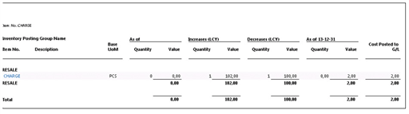

# Posting Date on Adjustment Value Entry Compared to the Source Entry

This article compares the Posting Date on the Adjustment Value Entry with the Posting Date on the entry causing the running of the Adjust Cost - Item Entries batch job, in particular a Revaluation scenario and an Item Charge scenario.

The **Adjust Cost - Item Entries** batch job will process your data depending on your scenario and configuration of [!INCLUDE[prod_short](includes/prod_short.md)]. In this section, we describe two separate processes, and for each one we show the type of impact the Adjust Cost - Item Entries batch job has on the data.

## Revaluation scenario

### Prerequisites  

Please enter the following values:

**Inventory setup**:  

- Automatic Cost Posting = Yes  

- Automatic Cost Adjustment = Always  

- Average Cost Calc. Type = Item  

- Average Cost Period = Day  

**General Ledger Setup**:  

- Allow Posting From = January 1, 2021  

- Allow Posting To = Empty  

**User Setup**:  

- Allow Posting From = December 1, 2020  

- Allow Posting To = Empty  

### To test the scenario

Test this scenario by carrying out the following steps.

1. Create an **Item** called TEST with the following values:  

     - Base unit of measure = PCS  

     - Costing Method = Average  

     - Select optional posting groups.  

2. Open an **Item Journal**, then create a new entry, and post a line as follows:  

     - Posting Date = December 15, 2020  

     - Item = TEST  

     - Entry Type = Purchase  

     - Quantity = 100  

     - Unit Amount = 10  

3. Open an **Item Journal**, then create a new entry, and post a line as follows:  

     - Date = December 20, 2020  

     - Item = TEST  

     - Entry Type = Negative Adjustment  

     - Quantity = 2  

4. Open an **Item Journal**, then create a new entry, and post a line as follows:  

     - Date = January 15, 2021  

     - Item = TEST  

     - Entry Type = Negative Adjustment  

     - Quantity = 3  

5. Open an **Item Revaluation Journal**, then create a new entry, and post a line as follows:  

     - Item = TEST  

     - Applies-to Entry = select Purchase entry posted at step 2. The Posting Date of the revaluation will be the same as the entry it adjusts.  

     - Unit Cost (Revalued) = 40  

The following **Item Ledger** and **Value Entries** have been posted:  

**Item Ledger Entry - purchase**:  

|Entry Number  |Item No.  |Posting Date  |Entry Type  |Document No.  |Quantity  |Cost Amount (Actual)  |Remaining Quantity  |
|---------|---------|---------|---------|---------|---------|---------|---------|
|317     |TEST         |2020-12-15         |Purchase         |T00001         |100         |4000         |95        |

**Value Entries**  

|Entry Number  |Item No.  |Posting Date  |Item Ledger Entry No.  |Item Ledger Entry Type  |Entry Type  |Document No.  |Item Number Entry Quantity  |Cost Amount (Actual)  |Cost Posted to G/L  |Adjustment  |Applies to Entry  |Source Code  |
|---------|---------|---------|---------|---------|---------|---------|---------|---------|---------|---------|---------|---------|
|376     |TEST|   2020-12-15    |317         |Purchase         |Direct Cost         |T00001         |100         |1 000,00          |1 000,00    |No         |0         |ITEMNL         |
|379     |TEST   |**2020-12-15**    |317         |Purchase         |Revaluation         |T04002         |0         |3 000,00         |3 000,00         |No         |0         |REVALINL         |

**Item Ledger Entry - negative adjustment, Step 3**  

|Entry No.  |Item No.  |Posting Date  |Entry Type  |Document No.  |Quantity  |Cost Amount (Actual)  |Remaining Quantity  |
|---------|---------|---------|---------|---------|---------|---------|---------|
|318     |TEST      |2020-12-20   |Negative Adjmt.  |T00002         |-2         |-80         | 0        |

**Value Entries**  

|Entry Number  |Item No.  |Posting Date  |Item Ledger Entry No.  |Item Ledger Entry Type  |Entry Type  |Document No.  |Item Number Entry Quantity  |Cost Amount (Actual)  |Cost Posted to G/L  |Adjustment  |Applies to Entry  |Source Code  |
|---------|---------|---------|---------|---------|---------|---------|---------|---------|---------|---------|---------|---------|
|377     |TEST|   2020-12-20    |318         |Negative Adjmt.         |Direct Cost         |T00002         |-2         |-20          |-20    |No         |0         |ITEMNL         |
|380     |TEST   |**2021-01-01**    |318         |Negative Adjmt.         |Direct Cost         |T04002         |0         |-60         |-60         |Yes         |377         |INVTADAMT         |

**Item Ledger Entry - negative adjustment, Step 4**  

|Entry No.  |Item No.  |Posting Date  |Entry Type  |Document No.  |Quantity  |Cost Amount (Actual)  |Remaining Quantity  |
|---------|---------|---------|---------|---------|---------|---------|---------|
|319     |TEST      |2021-01-15   |Negative Adjmt.  |T00003         |-3         |-120         | 0        |

**Value Entries**  

|Entry Number  |Item No.  |Posting Date  |Item Ledger Entry No.  |Item Ledger Entry Type  |Entry Type  |Document No.  |Item Number Entry Quantity  |Cost Amount (Actual)  |Cost Posted to G/L  |Adjustment  |Applies to Entry  |Source Code  |
|---------|---------|---------|---------|---------|---------|---------|---------|---------|---------|---------|---------|---------|
|378     |TEST|   2021-01-15    |319         |Negative Adjmt.         |Direct Cost         |T00003         |-3         |-30          |-30    |No         |0         |ITEMNL         |
|381     |TEST   |**2021-01-15**    |319         |Negative Adjmt.         |Direct Cost         |T04003         |0         |-90         |-90         |Yes         |378         |INVTADAMT         |

The **Adjust Cost – Item Entries** batch job has recognized a change in cost and adjusted the Negative Adjustments.  

**Review of Posting Dates on created adjustment value entries:** The earliest allowed Posting Date the Adjust Cost - Item Entries batch job has to relate to is January 1, 2021 as stated in the General Ledger Setup.  

**Negative Adjustment in step 3:** assigned Posting Date is January 1, provided by General Ledger Setup. The Posting Date of the Value Entry in the scope for adjustment is December 20, 2020. According to the General Ledger Setup, the date is not within the allowed posting date range. Therefore the Posting Date stated in the Allow Posting From field in the General Ledger Setup is assigned to the Adjustment Value Entry.  

**Negative Adjustment in step 4:** assigned Posting Date is January 15. The Value Entry in scope of adjustment has Posting Date January 15, which is within the allowed posting date range according to General Ledger Setup.  

The adjustment made for the Negative Adjustment in step 3 causes discussion. The favorable Posting Date for the Adjustment Value Entry would have been December 20 or at least within December as the revaluation causing the change in COGS was posted in December.  

To achieve adjustment in December of the Negative Adjustment in step 3, the General Ledger Setup, Allow Posting From field, needs to state a date in December.  

### Conclusion

With the experience gained in this scenario, when considering the most suitable setup for an allowed posting date range for a company, you might want to consider the following. As long as you allow changes in the inventory value to be posted in a period, such as December in this case, the setup that the company uses for allowed posting date ranges should be aligned with this decision. The Allow Posting From in the General Ledger Setup, stating December 1, would allow the revaluation made in December to be forwarded to affected outbound entries in the same period.  

User groups not allowed to post in December but in January, which was probably intended to be limited by the General Ledger Setup in this scenario, should instead be addressed via the User setup.  

## Item charge scenario  

### Prerequisites  

Please enter the following values:

**Inventory setup**:  

- Automatic Cost Posting = Yes  

- Automatic Cost Adjustment = Always  

- Average Cost Calc. Type = Item  

- Average Cost Period = Day  

**General Ledger Setup**:  

- Allow Posting From = December 1, 2020.  

- Allow Posting To = Empty  

**User Setup**:  

- Allow Posting From = December 1, 2020.  

- Allow Posting to = Empty  

### To test the scenario  

Test this scenario by carrying out the following steps:

1.  Create an **Item** Charge with the following values:  

     - Base unit of measure = PCS  

     - Costing Method = Average  

     - Select optional posting groups.  

2.  Create a new **Purchase Order** with the following values:  

     - Buy-from Vendor No.: 10000  

     - Posting Date = December 15, 2020

     - Vendor Invoice No.: 1234  

     On the Purchase Order Line select the following values:  

     - Item = CHARGE  

     - Quantity = 1  

     - Direct Unit Cost = 100  

     To complete the step, Post the document as Received and Invoiced.  

3.  Create a new **Sales Order** with the following values:  

     - Sell-to Customer No.: 10000  

     - Posting Date = December 16, 2020  

     On the Sales Order Line:  

     - Item = CHARGE  

     - Quantity = 1  

     - Unit Price = 135  

     To complete the step, Post the document as Received and Invoiced.  

4.  Enter values for the **General Ledger Setup** page:  

     - Allow Posting From = January 1, 2021  

    -  Allow Posting To = blank  

5.  Create a new **Purchase Order** with the following values:  

     - Buy-from Vendor No.: 10000  

     - Posting Date = January 2, 2021  

     - Vendor Invoice No.: 2345  

     On the Purchase Order Line:  

     - Item Charge = JB-FREIGHT  

     - Quantity = 1  

     - Direct Unit Cost = 3  

     - Assign the Item Charge to the Purchase Receipt from step 2.  

     To complete the step, Post the document as Received and Invoiced.  

**Status Item Ledger Entry of purchase step 2**:  
  
|Entry Number  |Item No.  |Posting Date  |Entry Type  |Document No.  |Quantity  |Cost Amount (Actual)  |Remaining Quantity  |
|---------|---------|---------|---------|---------|---------|---------|---------|
|324     |CHARGE         |2020-12-15         |Purchase         |107030         |1         |105         |0        |

**Value Entries**  

|Entry Number |Item No.  |Posting Date  |Item Ledger Entry No.  |Item Ledger Entry Type  |Entry Type  |Document No.  | Item Charge No.    |  Item Ledger Entry Quantity   |Cost Amount (Actual)     |Cost Posted to G/L |Adjustment |Applies-to Entry |
|---------|---------|---------|---------|---------|---------|---------|---------|---------|---------|---------|---------|---------|
|397      |CHARGE|   2020-12-15    |324         |Purchase         |Direct Cost         |108029         |         |1          |100    |100         |NO         |0         |
|399      |CHARGE   |2021-01-02    |324         |Purchase         |Direct Cost         |108009         |JBFREIGHT         |0         |3         |3         |NO         |0         |

**Status Item Ledger Entry sale**:  
  
|Entry No.  |Item No.  |Posting Date  |Entry Type  |Document No.  |Quantity  |Cost Amount (Actual)  |Remaining Quantity  |
|---------|---------|---------|---------|---------|---------|---------|---------|
|325     |CHARGE         |2020-12-16         |Sale         |102035         |-1         |-105         |0        |

**Value Entries**  

|Entry Number |Item No.  |Posting Date  |Item Ledger Entry No.  |Item Ledger Entry Type  |Entry Type  |Document No.  | Item Charge No.    |  Item Ledger Entry Quantity   |Cost Amount (Actual)     |Cost Posted to G/L |Adjustment |Applies-to Entry |
|---------|---------|---------|---------|---------|---------|---------|---------|---------|---------|---------|---------|---------|
|398      |CHARGE|   2020-12-16    |325         |Sale         |Direct Cost         |109024         |         |-1          |-100    |-100         |NO         |0         |
|400      |CHARGE   |2021-01-01    |325         |Sale         |Direct Cost         |109024         |         |0         |-3         |-3         |Yes         |398         |

6.  On work date January 3, a purchase invoice arrives containing an additional item charge to the purchase made in step 2. This invoice has document date December 30, and is therefore posted with Posting Date December 30, 2020.  

     Create a new **Purchase Order** with the following values:  

     - Buy-from Vendor No.: 10000  

     - Posting Date = December 30, 2020  

     - Vendor Invoice No.: 3456  

     On the Purchase Order Line select the following values:  

     - Item Charge = JB-FREIGHT  

     - Quantity = 1  

     - Direct Unit Cost = 2  

     Assign Item Charge to the Purchase Receipt from step 2  

     To complete the step, Post the document as Received and Invoiced.  

**Status Item Ledger Entry of purchase**:  

|Entry Number  |Item No.  |Posting Date  |Entry Type  |Document No.  |Quantity  |Cost Amount (Actual)  |Remaining Quantity  |
|---------|---------|---------|---------|---------|---------|---------|---------|
|324     |CHARGE         |2020-12-15         |Purchase         |107030         |1         |105         |0        |

**Value Entries**  

|Entry No. |Item No.  |Posting Date  |Item Ledger Entry No.  |Item Ledger Entry Type  |Entry Type  |Document No.  | Item Charge No.    |  Item Ledger Entry Quantity   |Cost Amount (Actual)     |Cost Posted to G/L |Adjustment |Applies-to Entry |
|---------|---------|---------|---------|---------|---------|---------|---------|---------|---------|---------|---------|---------|
|397      |CHARGE   |2020-12-15    |324         |Purchase         |Direct Cost         |108029         |            |1         |100    |100         |No         |0         |
|399      |CHARGE   |2021-01-02    |324         |Purchase         |Direct Cost         |108030         |JBFREIGHT   |0         |3         |3         |No         |0         |
|401      |CHARGE   |**2020-12-30**    |324         |Purchase         |Direct Cost         |108031         |JBFREIGHT   |0         |2         |2         |No         |0         |

**Status Item Ledger Entry sale**:  
  
|Entry Number  |Item No.  |Posting Date  |Entry Type  |Document No.  |Quantity  |Cost Amount (Actual)  |Remaining Quantity  |
|---------|---------|---------|---------|---------|---------|---------|---------|
|325     |CHARGE         |2020-12-16         |Sale         |102035         |-1         |-105         |0        |

**Value Entries**  

|Entry No. |Item No.  |Posting Date  |Item Ledger Entry No.  |Item Ledger Entry Type  |Entry Type  |Document No.  | Item Charge No.    |  Item Ledger Entry Quantity   |Cost Amount (Actual)     |Cost Posted to G/L |Adjustment |Applies-to Entry |
|---------|---------|---------|---------|---------|---------|---------|---------|---------|---------|---------|---------|---------|
|398      |CHARGE   |2020-12-16        |325         |Sale         |Direct Cost         |103024         |            |-1         |-100       |-100         |No         |0         |
|400      |CHARGE   |2021-01-01        |325         |Sale         |Direct Cost         |103024         |            |0          |-3         |-3         |Yes         |398         |
|402      |CHARGE   |**2021-01-01**    |325         |Sale         |Direct Cost         |103024         |            |0          |-2         |-2         |Yes         |398         |

Inventory Valuation report is printed as of Date December 31, 2020

**Summary of scenario:**  

The described scenario ends up with an Inventory Valuation report demonstrating Quantity = 0 while the Value = 2. The Item charge posted in step 6 is part of the Inventory Increase value of December while the Inventory Decrease of the same period is not affected.  

Having the General Ledger Setup stating Allow Posting From January 1 was a good thing for the first Item charge. The costs of the Inventory Increase and Decrease was recorded in the same period. For the second Item charge however, the General Ledger Setup causes the change in COGS to be recognized in the period after.  

**Conclusion:**  

It is a challenge to get the Inventory Valuation report to demonstrate Quantity = 0 while the Value <> 0. In this case it is also more difficult to express the optimal settings, having purchase invoices arriving the same day but addressing different periods or even fiscal years. Crossing to a new fiscal year usually requires some planning and as part of that the insight into Adjust Cost – Item entries process, recognizing COGS, is to be considered.  

In this scenario one option could have been to have the General Ledger Setup, field Allow Posting From, stating a date in December for a couple of more days and the posting of the first item charge postponed to allow all costs for the previous period/fiscal year to be recognized for the period they belong to first, having the Adjust Cost – Item entries batch job run and thereafter move the allowed posting date to the new period\/fiscal year. The first item charge with posting date January 2 could then be posted.  

## Related information  

[Design Details: Posting Date on Adjustment Value Entry](design-details-inventory-adjustment-value-entry-posting-date.md)  
[Design Details: Inventory Costing](design-details-inventory-costing.md)  
[Design Details: Item Application](design-details-item-application.md)  

[!INCLUDE[footer-include](includes/footer-banner.md)]
