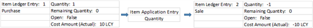
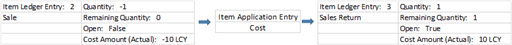
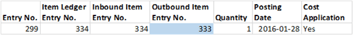

# Design Details: Known Item Application Issue
This article addresses an issue where the inventory level is zero although open item ledger entries exist in  [!INCLUDE[d365fin](includes/d365fin_md.md)].  

The article starts by listing typical symptoms of the issue, followed by the basics of item application to support the described reasons for this issue. At the end of the article is a workaround to address such open item ledger entries.  

## Symptoms of the Issue  
 Typical symptoms of the issue with zero inventory although open item ledger entries exist are the following:  

-   The following message when you try to close an inventory period: “The inventory cannot be closed because there is negative inventory for one or more items.”  

-   An item ledger entry situation where both an outbound item ledger entry and its related inbound item ledger entry are open.  

     See the following example of an item ledger entry situation.  

     |Entry No.|Posting Date|Entry Type|Document Type|Document No.|Item No.|Location Code|Quantity|Cost Amount (Actual)|Invoiced Quantity|Remaining Quantity|Open|  
     |---------|------------|----------|-------------|------------|--------|-------------|--------|------------------------|-----------------|------------------|----|  
     |333|01/28/2018|Sale|Sales Shipment|102043|TEST|BLUE|-1|-10|-1|-1|Yes|  
     |334|01/28/2018|Sale|Sales Shipment|102043|TEST|BLUE|1|10|1|1|Yes|  

## Basics of Item Application  
 An item application entry is created for every inventory transaction to link the cost recipient to its cost source so that the cost can be forwarded according to the costing method. For more information, see [Design Details: Item Application](design-details-item-application.md).  

-   For an inbound item ledger entry, the item application entry is created when the item ledger entry is created.  

-   For an outbound item ledger entry, the item application entry is created when the item ledger entry is posted, IF there is an open inbound item ledger entry with available quantity that it can apply to. If there is no open inbound item ledger entry that it can apply to, then the outbound item ledger entry remains open until an inbound item ledger entry that it can apply to is posted.  

 There are two types of item application:  

-   Quantity Application  

-   Cost Application  

### Quantity Application  
 Quantity applications are made for all inventory transactions and are created automatically, or manually in special processes. When made manually, quantity applications are referred to as fixed application.  

 The following diagram shows how quantity applications are made.  

 Notice above that item ledger entry 1 (Purchase) is both the supplier of the item and the cost source to the applied item ledger entry, item ledger entry 2 (Sale).  

> [!NOTE]  
>  If the outbound item ledger entry is valued by average cost, then the applied inbound item ledger entry is not the unique cost source. It merely plays a part in the calculation of the average cost of the period.  

### Cost Application  
Cost applications are only created for inbound transactions where the **Appl.-from Item Entry** field is filled to provide a fixed application. This typically happens in connection with a sales credit memo or an undo shipment scenario. The cost application ensures that the item re-enters inventory with the same cost as when it was shipped.  

The following diagram shows how cost applications are made.  

|Entry No.|Posting Date|Entry Type|Document Type|Document No.|Item No.|Location Code|Quantity|Cost Amount (Actual)|Invoiced Quantity|Remaining Quantity|Open|  
|---------|------------|----------|-------------|------------|--------|-------------|--------|------------------------|-----------------|------------------|----|  
|333|01/28/2018|Sale|Sales Shipment|102043|TEST|BLUE|-1|-10|-1|-1|Yes|  
|334|01/28/2018|Sale|Sales Shipment|102043|TEST|BLUE|1|10|1|1|Yes|  

 Notice above that inbound item ledger 3 (Sales Return) is a cost recipient for the original outbound item ledger entry 2 (Sale).  

## Illustration of a Basic Cost Flow  
 Assume a complete cost flow where an item is received, is shipped and invoiced, is returned with exact\-cost reversal, and is shipped again.  

 The following diagram illustrates the cost flow.  

 Notice above that the cost is forwarded to item ledger entry 2 (Sale), then to item ledger entry 3 (Sales Return), and finally to item ledger entry 4 (Sale 2).  

## Reasons for the Issue  
 The issue with zero inventory although open item ledger entries exist can be caused by the following scenarios:  

-   Scenario 1: A shipment and invoice is posted although the item is not available. The posting is then exact-cost reversed with a sales credit memo.  

-   Scenario 2: A shipment is posted although the item is not available. The posting is then undone with the Undo Shipment function.  

 The following diagram illustrates how item applications are made in both scenarios.  

  

 Notice above that a cost application is made (represented by the blue arrows) to ensure that item ledger entry 2 (Sales Return) is assigned the same costs as the item ledger entry that it reverses, item ledger entry 1 (Sale 1). However, a quantity application (represented by the red arrows) is not made.  

 Item ledger entry 2 (Sales Return) cannot be both a cost recipient of the original item ledger entry and at the same time be a supplier of items and their source of costs. Therefore, the original item ledger entry 1 (Sale 1) remains open until a valid source appears.  

## Identifying the Issue  
 To find out if the open item ledger entries are created, do as follows for the respective scenario:  

 For scenario 1, identify the issue as follows:  

-   In the **Posted Sales Credit Memo** or **Posted Return Receipt** page, look up from the **Appl.\-from Item Entry** field to see if the field is populated, and in that case to which item ledger entry the return receipt is cost applied.  

 For scenario 2, identify the issue in either of the following ways:  

-   Look for an open outbound item ledger entry and an inbound item ledger entry with same number in the **Document No.** field, and Yes in the **Correction** field. See the following example of such an item ledger entry situation.  

|Entry No.|Posting Date|Entry Type|Document Type|Document No.|Item No.|Location Code|Quantity|Cost Amount (Actual)|Invoiced Quantity|Remaining Quantity|Open|Correction|  
|---------|------------|----------|-------------|------------|--------|-------------|--------|------------------------|-----------------|------------------|----|---------|
|333|01/28/2018|Sale|Sales Shipment|102043|TEST|BLUE|-1|-10|-1|-1|Yes|No|  
|334|01/28/2018|Sale|Sales Shipment|102043|TEST|BLUE|1|10|1|1|Yes|**Yes**|  

-   On the **Posted Sales Shipment** page, look up from the **Appl.-from Item Entry** field to see if the field is populated, and in that case to which item ledger entry the return receipt is cost applied.  

> [!NOTE]  
>  Cost applications cannot be identified on the **Applied Item Entries** page because that page only shows quantity applications.  

 For both scenarios, identify the involved cost application as follows:  

1.  Open the **Item Application Entry** table.  

2.  Filter on the **Item Ledger Entry No.** field using the number of the Sales Return item ledger entry.  

3.  Analyze the item application entry, taking note of the following:  

     If the **Outbound Item Entry No.** field is populated for an inbound item ledger entry (positive quantity), then it means that the inbound item ledger entry is the cost recipient of the outbound item ledger entry.  

     See the following example of an item application entry.  

     |Entry No.|Item Ledger Entry No.|Inbound Item Entry No.|Outbound Item Entry No.|Quantity|Posting Date|Cost Application|  
     |---------|---------------------|----------------------|-----------------------|--------|------------|----------------|  
     |299|334|334|333|1|01/28/2018|Yes|  
<!--  -->

 Notice above that inbound item ledger entry 334 is cost applied to outbound item ledger entry 333.  

## Workaround for the Issue  
 On the **Item Journal** page, post the following lines for the item in question:  

-   A positive adjustment to close the open outbound item ledger entry.  

-   A negative adjustment with the same quantity.  

     This adjustment balances the inventory increase caused by the positive adjustment and closes the open inbound item ledger entry.  

 The result is that inventory is zero and all item ledger entries are closed.  

## See Also  
[Design Details: Item Application](design-details-item-application.md)   
[Design Details: Inventory Costing](design-details-inventory-costing.md)  
