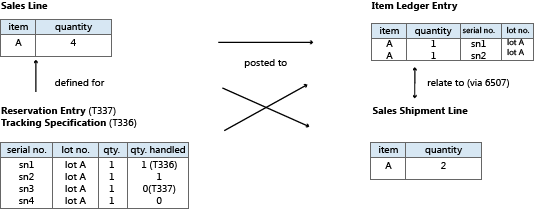

# Design Details: Item Tracking Design
In the first version of Item Tracking in [!INCLUDE[d365fin](includes/d365fin_md.md)] 2.60, serial numbers or lot numbers were recorded directly on item ledger entries. This design provided full availability information and simple tracking of historic entries, but it lacked flexibility and functionality.  

From [!INCLUDE[d365fin](includes/d365fin_md.md)] 3.00, item tracking functionality was in a separate object structure with intricate links to posted documents and item ledger entries. This design was flexible and rich in functionality, but item tracking entries were not fully involved in availability calculations.  

Since [!INCLUDE[d365fin](includes/d365fin_md.md)] 3.60, item tracking functionality is integrated with the reservation system, which handles reservation, order tracking, and action messaging. For more information, see “Design Details: Reservation, Order Tracking, and Action Messaging” in “Design Details: Supply Planning”.  

This latest design incorporates item tracking entries in total availability calculations throughout the system, including planning, manufacturing, and warehousing. The old concept of carrying serial and lot numbers on the item ledger entries is reintroduced to ensure simple access to historical data for item tracking purposes. In connection with item tracking improvements in [!INCLUDE[d365fin](includes/d365fin_md.md)] 3.60, the reservation system was expanded to non-order network entities, such as journals, invoices, and credit memos.  

With the addition of serial or lot numbers, the reservation system handles permanent item attributes while also handling intermittent links between supply and demand in the form of order tracking entries and reservation entries. Another different characteristic of serial or lot numbers compared to the conventional reservation data is the fact that they can be posted, either partially or fully. Therefore, the **Reservation Entry** table (T337) now works with a related table, the **Tracking Specification** table (T336), which manages and displays summing across active and posted item tracking quantities. For more information, see [Design Details: Active versus Historic Item Tracking Entries](design-details-active-versus-historic-item-tracking-entries.md).  

The following diagram outlines the design of item tracking functionality in [!INCLUDE[d365fin](includes/d365fin_md.md)].  

  

The central posting object is redesigned to handle the unique subclassification of a document line in the form of serial or lot numbers, and special relation tables are added to create the one-to-many relations between posted documents and their split item ledger entries and value ledger entries.  

Codeunit 22, **Item Jnl. – Post Line**, now splits the posting according to the item tracking numbers that are specified on the document line. Each unique item tracking number on the line creates its own item ledger entry for the item. This means that the link from the posted document line to the associated item ledger entries is now a one-to-many relation. This relation is handled by the following item tracking relation tables.  

|Field|Description|  
|---------------|---------------------------------------|  
|**Item Entry Relation** (T6507)|Relates shipped or received lines to item ledger entries|  
|**Value Entry Relation** (T6508)|Relates invoiced lines to value entries|  

For more information, see [Design Details: Item Tracking Posting Structure](design-details-item-tracking-posting-structure.md).  

## See Also  
[Design Details: Item Tracking](design-details-item-tracking.md)
