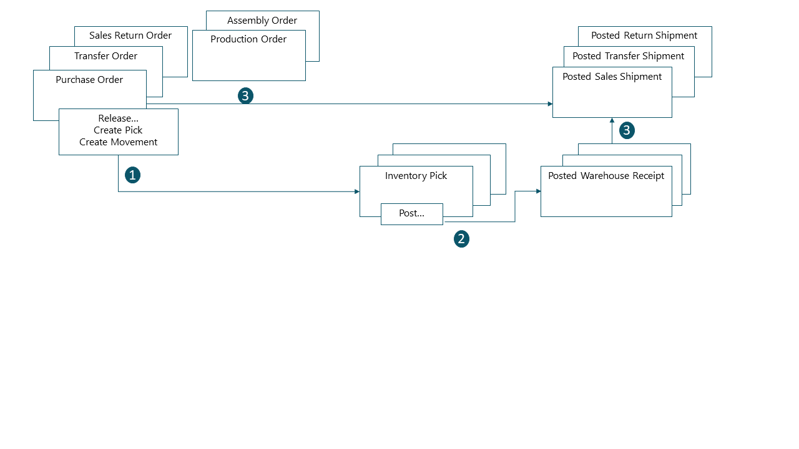
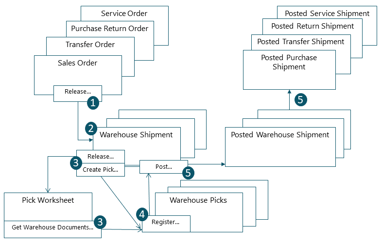

# Design Details: Outbound Warehouse Flow
The outbound flow in the warehouse begins with a request from released source documents to bring the items out of the warehouse location, either to be shipped to an external party or to another company location. From the storage area, warehouse activities are performed at different complexity levels to bring the items out to the shipping docks.  

 Each item is identified and matched to a corresponding inbound source document. The following outbound source documents exist:  

- Sales order  
- Outbound transfer order  
- Purchase return order  
- Service order  

In addition, the following internal source documents exist that function like outbound sources:  

- Production order with component need  
- Assembly order with component need  

 The last two documents represent outbound flows from the warehouse to internal operation areas. For more information about warehouse handling for internal inbound and outbound processes, see [Design Details: Internal Warehouse Flows](design-details-internal-warehouse-flows.md).  

 Processes and UI documents in outbound warehouse flows are different for basic and advanced warehouse configurations. The main difference is that activities are performed order-by-order in basic warehouse configurations, and they are consolidated for multiple orders in advanced warehouse configurations. For more information about different warehouse complexity levels, see [Design Details: Warehouse Overview](design-details-warehouse-setup.md).  

 In [!INCLUDE[d365fin](includes/d365fin_md.md)], the outbound processes of picking and shipping can be performed in four ways using different functionalities depending on the warehouse complexity level.  

|Method|Inbound Process|Bins|Picks|Shipments|Complexity Level (See [Design Details: Warehouse Setup](design-details-warehouse-setup.md))|  
|------------|---------------------|----------|-----------|---------------|--------------------------------------------------------------------------------------------------------------------|  
|A|Post pick and shipment from the order line|X|||2|  
|B|Post pick and shipment from an inventory pick document||X||3|  
|C|Post pick and shipment from a warehouse shipment document|||X|4/5/6|  
|D|Post pick from a warehouse pick document and post shipment from a warehouse shipment document||X|X|4/5/6|  

 Selecting an approach depends on the company's accepted practices and the level of their organizational complexity. In an order-by-order environment with straightforward processes and simple bin structure, method A, picking and shipping from the order line is appropriate. In other order-by-order companies where items for one order line might come from more than one bin or where warehouse workers cannot work with order documents, the use of separate pick documents is appropriate, method B. Where a company's picking and shipping processes involve multiple order handling and therefore require greater control and overview, the company might choose to use a warehouse shipment document and warehouse pick document to separate the picking and shipping tasks, methods C and D.  

 In methods A, B, and C, the actions of picking and shipping are combined in one step when posting the corresponding document as shipped. In method D, the pick is first registered, and then the shipment is posted at a later time from a different document.  

## Basic Warehouse Configurations  
 The following diagram illustrates the outbound warehouse flows by document type in basic warehouse configurations. The numbers in the diagram correspond with the steps in the sections following the diagram.  

   

### 1: Release Source Document / Create Inventory Pick or Movement  
 When a user who is responsible for source documents, such as a sales order processor or production planner, is ready for the outbound warehouse activity, he or she releases the source document to signal to warehouse workers that sold items or components can be picked and placed in the specified bins. Alternatively, the user creates inventory pick or movement documents for the individual order lines, in a push fashion, based on specified bins and quantities to handle.  

> [!NOTE]  
>  Inventory movements are used to move items to internal operation areas in basic warehouse configurations, based on source documents or on an ad hoc basis.  

### 2: Create Outbound Request  
 When the outbound source document is released, an outbound warehouse request is created automatically. It contains references to the source document type and number and is not visible to the user.  

### 3: Create Inventory Pick or Movement  
 In the **Inventory Pick** or **Inventory Movement** page, the warehouse worker retrieves, in a pull fashion, the pending source document lines based on outbound warehouse requests. Alternatively, the inventory pick lines are already created, in a push fashion, by the user who is responsible for the source document.  

### 4: Post Inventory Pick or Register Inventory Movement  
 On each line for items that have been picked or moved, partially or fully, the warehouse worker fills in the **Quantity** field, and then posts the inventory pick or registers the inventory movement. Source documents related to the inventory pick are posted as shipped or consumed. Source documents related to inventory movements are not posted.  

 For inventory picks, negative item ledger entries are created, warehouse entries are created, and the pick request is deleted, if fully handled. For example, the **Quantity Shipped** field on the outbound source document line is updated. A posted shipment document is created  that reflects the sales order, for example, and the shipped items.  

## Advanced Warehouse Configurations  
 The following diagram illustrates the outbound warehouse flow by document type in advanced warehouse configurations. The numbers in the diagram correspond with the steps in the sections following the diagram.  

   

### 1: Release Source Document  
 When a user who is responsible for source documents, such as a sales order processor or production planner, is ready for the outbound warehouse activity, he or she releases the source document to signal to warehouse workers that sold items or components can be picked and placed in the specified bins.  

### 2: Create Outbound Request  
 When the inbound source document is released, an outbound warehouse request is created automatically. It contains references to the source document type and number and is not visible to the user.  

### 3: Create Warehouse Shipment  
 On the **Warehouse Shipment** page, the shipping worker who is responsible retrieves pending source document lines based on the outbound warehouse request. Several source document lines can be combined in one warehouse shipment document.  

### 4: Release Shipment / Create Warehouse Pick  
 The shipping worker who is responsible releases the warehouse shipment, so that warehouse workers can  create or coordinate warehouse picks for the shipment in question.  

 Alternatively, the user creates warehouse pick document for individual shipment lines, in a push fashion, based on specified bins and quantities to handle.  

### 5: Release Internal Operation / Create Warehouse Pick  
 The user who is responsible for internal operations releases an internal source document, such as a production and assembly order, so that warehouse workers can create or coordinate warehouse picks for the internal operation in question.  

 Alternatively, the user creates warehouse pick documents for the individual production or assembly order, in a push fashion, based on specified bins and quantities to handle.  

### 6: Create Pick Request  
 When the outbound source document is released, a warehouse pick request is created automatically. It contains references to the source document type and number and is not visible to the user. Depending on the setup, consumption from a production and assembly order also creates a pick request to pick the needed components from inventory.  

### 7: Generate Pick Worksheet Lines  
 The user who is responsible for coordinating picks, retrieves warehouse pick lines in the **Pick Worksheet** based on pick requests from warehouse shipments or internal operations with component consumption. The user selects the lines to be picked and prepares the picks by specifying which bins to take from, which bins to place in, and how many units to handle. The bins may be predefined by setup of the warehouse location or operation resource.  

 The user specifies picking methods for optimized warehouse handling and then uses a function to create the corresponding warehouse pick documents, which are assigned to different warehouse workers who perform warehouse picks. When the warehouse picks are fully assigned, the lines in the **Pick Worksheet** are deleted.  

### 8: Create Warehouse Pick Documents  
 The warehouse worker who perform picks create a warehouse pick document, in a pull fashion, based on the released source document. Alternatively, the warehouse pick document is created and assigned to the warehouse worker in a push fashion.  

### 9: Register Warehouse Pick  
 On each line for items that have been picked, partially or fully, the warehouse worker fills in the **Quantity** field on the **Warehouse Pick** page and then registers the warehouse pick.  

 Warehouse entries are created, and the warehouse pick lines are deleted, if fully handled. The warehouse pick document remains open until the full quantity of the related warehouse shipment is registered. The **Qty. Picked** field on the warehouse shipment lines is updated accordingly.  

### 10: Post Warehouse Shipment  
 When all items on the warehouse shipment document are registered as picked to the specified shipment bins, the shipping worker who is responsible posts the warehouse shipment. Negative item ledger entries are created. For example, the **Quantity Shipped** field on the outbound source document line is updated.  

## See Also  
 [Design Details: Warehouse Management](design-details-warehouse-management.md)
