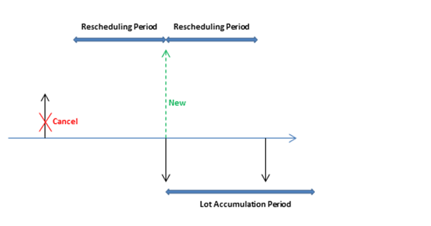
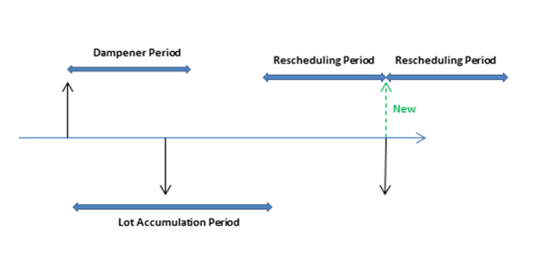

# Design Details: Planning Parameters
This topic describes the different planning parameters that you can use in [!INCLUDE[d365fin](includes/d365fin_md.md)].  

The way in which the planning system controls item supply is determined by various settings on the item card or SKU, and settings in manufacturing setup. The following table shows how these parameters are used for planning.  

|Purpose|Parameter|  
|-------------|---------------|  
|Define if the item is to be planned|Reordering Policy = Blank|  
|Define when to reorder|Time Bucket   Reorder Point   Safety Lead Time|  
|Define how much to reorder|Safety Stock Quantity   Reordering Policy:   -   Fixed Reorder Qty. plus Reorder Quantity -   Maximum Qty. plus Maximum Inventory -   Order -   Lot-for-Lot|  
|Optimize when and how much to reorder|Rescheduling Period   Lot Accumulation Period   Dampener Period|  
|Modify the supply orders|Minimum Order Quantity   Maximum Order Quantity   Order Multiple|  
|Delimit the planned item|Manufacturing Policy:   -   Make-to-Stock -   Make-to-Order|  

## Define If the Item Will Be Planned  
To include an item/SKU in the planning process, it must have a reordering policy otherwise it must be planned manually, for example, with the Order Planning feature.  

## Define When to Reorder  
Reorder proposals are generally released only when the projected available quantity has fallen to or below a given quantity. This quantity is defined by the reorder point. Otherwise, it will be zero. Zero can be adjusted by entering a safety stock quantity. If the user has defined a safety lead time, it will cause the proposal to be delivered in the period prior to the required due date.  

The **Time Bucket** field is used by reorder point policies (**Fixed Reorder Qty.** and **Maximum Qty.**), where the inventory level is checked after each time bucket. The first time bucket begins on the planning starting date.  

> [!NOTE]  
>  When calculating time buckets, the planning system ignores any working calendars that are defined in the **Base Calendar Code** field in the **Company Information** and **Location Card** pages.  

The default safety lead time, on the **Manufacturing Setup** page, should be set to at least one day. The due date of the demand may be known, but not the due time. The planning schedules backward to meet gross demand, and, if no safety lead time is defined, the goods may arrive too late to meet the demand.  

Three additional reorder period fields, **Rescheduling Period**, **Lot Accumulation Period**, and **Dampener Period**, also play a role in defining when to reorder. For more information, see [Optimize When and How Much to Reorder](design-details-planning-parameters.md#optimize-when-and-how-much-to-reorder).  

## Define How Much to Reorder  
If the planning system detects the need to reorder, the selected reordering policy is used to determine when and how much to order.  

Independent of the reordering policy, the planning system usually follows this logic:  

1. The quantity of the order proposal is calculated to meet the specified minimum inventory level of the item, usually the safety stock quantity. If nothing is specified, the minimum inventory level is zero.  
2. If the projected available inventory is below the safety stock quantity, a backward-scheduled supply order is suggested. The order quantity will at least fill the safety stock quantity, and can be increased by gross demand within the time bucket, by the reordering policy, and by the order modifiers.  
3. If the projected inventory is on or below the reorder point (calculated from aggregated changes within the time bucket) and above the safety stock quantity, a forward-scheduled exception order is suggested. Both the gross demand to be met and the reordering policy will determine the order quantity. At minimum, the order quantity will meet the reorder point.  
4. If there is more gross demand due before the ending date of the forward-scheduled order proposal, and this demand brings the currently calculated projected available inventory below the safety stock quantity, the order quantity is increased to make up the deficit. The suggested supply order is then scheduled backward from the due date of the gross demand that would have violated the safety stock quantity.  
5. If the **Time Bucket** field is not filled in, only the gross demand on the same due date will be added.  

     The following reorder period fields also play a role in defining how much to reorder: **Rescheduling Period**, **Lot Accumulation Period**, and **Dampener Period**. For more information, see [Optimize When and How Much to Reorder](design-details-planning-parameters.md#optimize-when-and-how-much-to-reorder).  

### Reordering Policies  
The following reordering policies affect the quantity that is being reordered.  

|Reordering policy|Description|  
|-----------------------|---------------------------------------|  
|**Fixed Reorder Qty.**|At a minimum, the order quantity will be equal to the reorder quantity. It can be increased to meet the demand or the desired inventory level. This reordering policy is usually used with a reorder point.|  
|**Maximum Qty.**|The order quantity will be calculated to meet the maximum inventory. If quantity modifiers are used, then maximum inventory can be violated. We do not recommend that you use the time bucket together with maximum quantity. The time bucket will usually be overruled. This reordering policy is usually used with a reorder point.|  
|**Order**|The order quantity will be calculated to meet each single demand event and the demand-supply set will remain linked until execution. No planning parameters are considered.|  
|**Lot-for-Lot**|The quantity is calculated to meet the sum of the demand that comes due in the time bucket.|  

##  Optimize When and How Much to Reorder  
To obtain a rational supply plan, a planner will fine-tune planning parameters to limit rescheduling suggestions, accumulate demand (dynamic reorder quantity), or to avoid insignificant planning actions. The following reorder period fields help optimize when and how much to reorder.  

|Field|Description|  
|---------------------------------|---------------------------------------|  
|**Rescheduling Period**|This field is used to determine whether the action message should reschedule an existing order or cancel it and create a new order. The existing order will be rescheduled within one rescheduling period before the current supply and until one rescheduling period after the current supply.|  
|**Lot Accumulation Period**|With the reordering policy Lot-for-Lot, this field is used to accumulate multiple supply needs into one supply order. From the first planned supply, the system accumulates all supply needs in the following lot accumulation period into one supply, which is placed on the date of the first supply. Demand outside the lot accumulation period is not covered by this supply.|  
|**Dampener Period**|This field is used to avoid minor rescheduling of existing supply out in time. Changes from the supply date until one dampener period from the supply date will not generate any action messages.   The dampener period specifies a period of time during which you do not want the planning system to propose to reschedule existing supply orders forward. This limits the number of insignificant rescheduling of existing supply to a later date if the rescheduled date is within the dampener period.   As a result, a positive delta between the suggested new supply date and the original supply date will always be larger than the dampener period.|  
> [!NOTE]
> With the reordering policy Lot-for-Lot, the value of the **Lot Accumulation Period** field must be equal to or larger than the value of the **Dampener Period** field. Otherwise, the dampener period will be automatically reduced during the planning routine to match the lot accumulation period.  

The timing of rescheduling period, dampener period, and lot accumulation period is based on a supply date. The time bucket is based on the planning start date, as shown in the following illustration.  

  

In the following examples, the black arrows represent existing supply (up) and demand (down). Red, green, and orange arrows are planning suggestions.  

**Example 1**: The changed date is outside the rescheduling period, which causes the existing supply to be canceled. A new supply is suggested to cover the demand in the lot accumulation period.  

  

**Example 2**: The changed date is in the rescheduling period, which causes the existing supply to be rescheduled. A new supply is suggested to cover the demand outside the lot accumulation period.  

  

**Example 3**: There is a demand in the dampener period and the supply quantity in the lot accumulation period matches the supply quantity. The next demand is uncovered and a new supply is suggested.  

  

**Example 4**: There is a demand in the dampener period and the supply remains on the same date. However, the current supply quantity is not enough to cover the demand in the lot accumulation period, so a change quantity action for the existing supply order is suggested.  

  

**Default values:** The default value of the **Time Bucket** field and the three reorder period fields is blank. For all fields, except the **Dampener Period** field, this means 0D (zero days). If the **Dampener Period** field is blank, the global value in the **Default Dampener Period** field on the **Manufacturing Setup** page will be used.  

## Modify the Supply Orders  
When the quantity of the order proposal has been calculated, one or more of the order modifiers can adjust it. For example, the maximum order quantity is larger than or equal to the minimum order quantity, which is larger than or equal to the order multiple.  

The quantity is decreased if it exceeds the maximum order quantity. Then, it is increased if it is below the minimum order quantity. Finally, it is rounded up so that it matches a specified order multiple. Any remaining quantity uses the same adjustments until the total demand has been converted into order proposals.  

## Delimit the Item  
The **Manufacturing Policy** option defines which additional orders the MRP calculation will propose.  

If the **Make-to-Stock** option is used, the orders concern only the item in question.  

If the **Make-to-Order** option is used, the planning system will analyze the production BOM of the item and create additional linked order proposals for those lower-level items that are also defined as make-to-order. This continues as long as there are make-to-order items in the descending BOM structures.  

## See Also  
[Design Details: Handling Reordering Policies](design-details-handling-reordering-policies.md)   
[Design Details: Balancing Demand and Supply](design-details-balancing-demand-and-supply.md)   
[Design Details: Central Concepts of the Planning System](design-details-central-concepts-of-the-planning-system.md)
