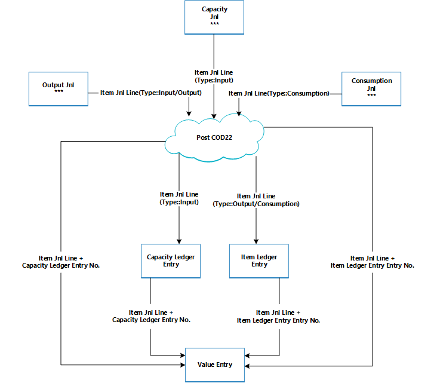
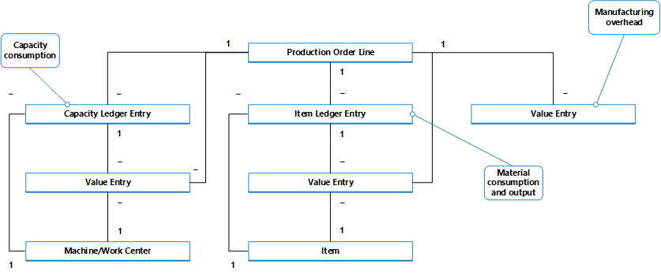

# Design Details: Production Order Posting
Similar to assembly order posting, the consumed components and the used machine time are converted and output as the produced item when the production order is finished. For more information, see [Design Details: Assembly Order Posting](design-details-assembly-order-posting.md). However, the cost flow for assembly orders is less complex, especially because assembly cost posting only occurs once and therefore does not generate work-in-process inventory.

Transactions that occur during the manufacturing process can be tracked through the following stages:  

1.  Purchase of materials and other manufacturing inputs.  
2.  Conversion into work in process.  
3.  Conversion into finished goods inventory.  
4.  Sale of finished goods.  

Therefore, apart from regular inventory accounts, a manufacturing company must establish three separate inventory accounts to record transactions at various stages of production.  

|Inventory Account|Description|  
|-----------------------|---------------------------------------|  
|**Raw Materials account**|Includes the cost of raw materials that are purchased but not yet transferred to production. The balance in the Raw Materials account indicates the cost of raw materials on hand.   When raw materials move into the production department, the cost of the materials is transferred from the Raw Materials account to the WIP account.|  
|**Work in Process (WIP) account**|Accumulates the costs that are incurred during production in the accounting period. The WIP account is debited for the cost of raw materials that are transferred from the raw materials warehouse, the cost of direct labor performed, and the manufacturing overhead costs that are incurred.   The WIP account is credited for the total manufacturing cost of units that are completed in the factory and transferred to the finished goods warehouse.|  
|**Finished Goods account**|This account includes the total manufacturing cost of units that are completed but not yet sold. At the time of sale, the cost of units sold is transferred from the Finished Goods account to the Cost of Goods Sold account.|  

The inventory value is calculated by tracking the costs of all increases and decreases, as expressed by the following equation:  

* inventory value = beginning balance of inventory + value of all increases - value of all decreases  

Depending on the type of inventory, increases and decreases are represented by different transactions.  

||Increases|Decreases|  
|-|---------------|---------------|  
|**Raw material inventory**|-   Net purchases of material -   Output of subassemblies -   Negative consumption|Material consumption|  
|**WIP inventory**|-   Material consumption -   Capacity consumption -   Manufacturing overhead|Output of end items (cost of goods manufactured)|  
|**Finished goods inventory**|Output of end items (cost of goods manufactured)|-   Sales (cost of goods sold) -   Negative output|  
|**Raw material inventory**|-   Net purchases of material -   Output of subassemblies -   Negative consumption|Material consumption|  

The values of increases and decreases are recorded in the different types of manufactured inventory in the same way as for purchased inventory. Every time a transaction of inventory increase or decrease takes place, an item ledger entry and a corresponding general ledger entry are created for the amount. For more information, see [Design Details: Inventory Posting](design-details-inventory-posting.md).  

Although values of transactions that are related to purchased goods are posted only as item ledger entries with related value entries, transactions that are related to produced items are posted as capacity ledger entries with related value entries, in addition to the item ledger entries.  

## Posting Structure  
Posting production orders to WIP inventory involves output, consumption, and capacity.  

The following diagram shows the involved posting routines in codeunit 22.  

  

The following diagram shows the associations between the resulting entries and the cost objects.  

  

The capacity ledger entry describes the capacity consumption in terms of time units, whereas the related value entry describes the value of the specific capacity consumption.  

The item ledger entry describes the material consumption or output in terms of quantities, whereas the related value entry describes the value of this specific material consumption or output.  

A value entry that describes WIP inventory value can be associated with one of the following combinations of cost objects:  

-   A production order line, a work or machine center, and a capacity ledger entry.  
-   A production order line, an item, and an item ledger entry.  
-   Only a production order line  

For more information about how costs from production and assembly are posted to the general ledger, see [Design Details: Inventory Posting](design-details-inventory-posting.md).  

## Capacity Posting  
Posting output from the last production order routing line results in a capacity ledger entry for the end item, in addition to its inventory increase.  

 The capacity ledger entry is a record of the time that was spent to produce the item. The related value entry describes the increase of the WIP inventory value, which is the value of the conversion cost. For more information, see “From the Capacity Ledger” in [Design Details: Accounts in the General Ledger](design-details-accounts-in-the-general-ledger.md).  

## Production Order Costing  
 To control inventory and production costs, a manufacturing company must measure the cost of production orders, because the predetermined standard cost of each produced item is capitalized in the balance sheet. For information about why produced items use the Standard costing method, see [Design Details: Costing Methods](design-details-costing-methods.md).  

> [!NOTE]  
>  In environments that do not use the Standard costing method, the actual rather than the standard cost of produced items is capitalized on the balance sheet.  

The actual cost of a production order consists of the following cost components:  

-   Actual material cost  
-   Actual capacity cost or subcontractor cost  
-   Manufacturing overhead  

These actual costs are posted to the production order and compared to the standard cost to calculate variances. Variances are calculated for each of the item cost components: raw materials, capacity, subcontractor, capacity overhead, and manufacturing overhead. The variances can be analyzed to determine problems, such as excessive waste in processing.  

In standard-cost environments, the costing of a production order is based on the following mechanism:  

1.  When the last routing operation is posted, the production order cost is posted to the item ledger and set to the expected cost.  

    This cost equals the output quantity that is posted in the output journal multiplied by the standard cost that is copied from the item card. The cost is treated as expected cost until the production order is finished. For more information, see [Design Details: Expected Cost Posting](design-details-expected-cost-posting.md).  

    > [!NOTE]  
    >  This differs from assembly order posting, which always posts actual costs. For more information, see [Design Details: Assembly Order Posting](design-details-assembly-order-posting.md).  
2.  When the production order is set to **Finished**, the order is invoiced by running the **Adjust Cost-Item Entries** batch job. As a result, the total cost of the order is calculated based on the standard cost of the consumed materials and capacity. The variances between the calculated standard costs and the actual production costs are calculated and posted.  

## See Also  
 [Design Details: Inventory Costing](design-details-inventory-costing.md)   
 [Design Details: Assembly Order Posting](design-details-assembly-order-posting.md)  
 [Managing Inventory Costs](finance-manage-inventory-costs.md)
 [Finance](finance.md)  
 [Working with Business Central](ui-work-product.md)
