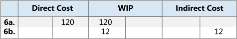

# Design Details: Reconciliation with the general ledger

When you post inventory transactions, such as sales shipments, production output, or negative adjustments, [!INCLUDE [prod_short](includes/prod_short.md)] records the inventory quantity and value changes in the item ledger entries and the value entries, respectively. The next step in the process is to post the inventory values to the inventory accounts in the general ledger.  

There are two ways to reconcile the inventory ledger with the general ledger:  

* Manually, by running the **Post Inventory Cost to G/L** batch job.  
* Automatically, every time that you post an inventory transaction.  

## Post Inventory Cost to G/L Batch Job  

When you run the **Post Inventory Cost to G/L** batch job, it creates the general ledger entries based on value entries. You can summarize general ledger entries for each value entry, or create general ledger entries for each combination of:

* Posting date
* Location code
* Inventory posting group
* General business posting group
* General product posting group

The posting dates of the general ledger entries are set to the posting date of the corresponding value entry, except when the value entry is in a closed accounting period. In that case, the value entry is skipped, and you must change either the general ledger setup or the user setup to enable posting in the date range.  

When you run the **Post Inventory Cost to G/L** batch job, you might receive errors because of missing setup or incompatible dimension setup. If the batch job encounters errors in the dimension setup, it overrides these errors and uses the dimensions of the value entry. For other errors, the batch job doesn't post the value entries and lists them at the end of the report in a section titled, **Skipped Entries**. To post these entries, you must first fix the errors. To see a list of errors before you run the batch job, you can run the **Post Invt. Cost to G/L - Test** report. This report lists all of the errors that are encountered during a test posting. You can fix the errors, and then run the inventory cost posting batch job without skipping any entries.  

## Automatic cost posting  

To set up cost posting to the general ledger to run automatically when you post an inventory transaction, select the **Automatic Cost Posting** checkbox on the **Inventory Setup** page. The posting date of the general ledger entry is the same as the posting date of the item ledger entry.  

## Account types  

During reconciliation, inventory values post to the inventory account in the balance sheet. The same amount, but with the reverse sign, is posted to the relevant balancing account. Usually, the balancing account is an income statement account. However, when you post direct cost related to consumption or output, the balancing account is a balance sheet account. The type of the item ledger entry and value entry determines which general ledger account to post to.  

The entry type indicates which general ledger account to post to. Either the quantity on the item ledger entry or the valued quantity on the value entry determine the type, because the quantities always have the same sign. For example, a sales entry with a positive quantity describes an inventory decrease caused by a sale, and a sales entry with a negative quantity describes an inventory increase caused by a sales return.  

### Example  

The following example shows a bike chain that is manufactured from purchased links. This example shows how the various general ledger account types are used in a typical scenario.  

The **Expected Cost Posting to G/L** checkbox on the **Inventory Setup** page is selected, and the following setup is defined.  

The following table shows how the link is set up on the item card.  

|Setup Field|Value|  
|-----------------|-----------|  
|**Costing Method**|Standard|  
|**Standard Cost**|LCY 1.00|  
|**Overhead Rate**|LCY 0.02|  

The following table shows how the chain is set up on the item card.  

|Setup Field|Value|  
|-----------------|-----------|  
|**Costing Method**|Standard|  
|**Standard Cost**|LCY 150.00|  
|**Overhead Rate**|LCY 25.00|  

The following table shows how the work center is set up on the work center card.  

|Setup Field|Value|  
|-----------------|-----------|  
|**Direct Unit Cost**|LCY 2.00|  
|**Indirect Cost Percentage**|10|  

##### Scenario  

1. The user purchases 150 links and posts the purchase order as received. (Purchase)  

    :::image type="content" source="media/design_details_inventory_costing_3_gl_posting_purchase.png" alt-text="Screenshot that shows the purchase.":::
2. The user posts the purchase order as invoiced. This action creates an overhead amount of LCY 3.00 to be allocated and a variance amount of LCY 18.00. (Purchase)  

    :::image type="content" source="media/design_details_inventory_costing_3_gl_posting_purchase_2.png" alt-text="Screenshot that shows posting a purchase order.":::

    1. The interim accounts are cleared. (Purchase)  
    2. The direct cost is posted. (Purchase)  
    3. The indirect cost is calculated and posted. (Purchase)  
    4. The purchase variance is calculated and posted (only for standard-cost items). (Purchase)  
3. The user sells one chain and posts the sales order as shipped. (Sale)  
4. The user posts the sales order as invoiced. (Sale)  

    1. The interim accounts are cleared. (Sale)  
    2. Cost of goods sold (COGS) is posted. (Sale)  

          
5. The user posts consumption of 150 links, which is the number of links used to produce one chain. (Consumption, Material)  

    :::image type="content" source="media/design_details_inventory_costing_3_gl_posting_material.png" alt-text="Screenshot that shows the results of posting material."::: 
6. The work center used 60 minutes to produce the chain. The user posts the conversion cost. (Consumption, Capacity)  

    1. The direct costs are posted. (Consumption, Capacity)  
    2. The indirect costs are calculated and posted. (Consumption, Capacity)  

          
7. The user posts the expected cost of one chain. (Output)  
8. The user finishes the production order and runs the **Adjust Cost - Item Entries** batch job. (Output)  

    1. The interim accounts are cleared. (Output)  
    2. The direct cost is transferred from the WIP account to the inventory account. (Output)  
    3. The indirect cost (overhead) is transferred from the indirect cost account to the inventory account. (Output)  
    4. This action results in a variance amount of LCY 157.00. Variances are only calculated for standard-cost items. (Output)  

        :::image type="content" source="media/design_details_inventory_costing_3_gl_posting_output1.png" alt-text="Screenshot that shows the results of posting output to G/L accounts.":::
        :::image type="content" source="media/design_details_inventory_costing_3_gl_posting_output2.png" alt-text="Screenshot that shows the results of posting output to the G/L ledger.":::

        > [!NOTE]  
        > For the sake of simplicity, only one variance account is shown. In reality, there are five different accounts:  
        > 
        >  * Material Variance  
        >  * Capacity Variance  
        >  * Capacity Overhead Variance  
        >  * Subcontracting Variance  
        >  * Manufacturing Overhead Variance  

9. The user revalues the chain from LCY 150.00 to LCY 140.00. (Adjustment/Revaluation/Rounding/Transfer)  

      

For more information about the relationship between the account types and the different types of value entries, see [Design Details: Accounts in the General Ledger](design-details-accounts-in-the-general-ledger.md).  

## Related information

[Design Details: Inventory Costing](design-details-inventory-costing.md)  
[Design Details: Expected Cost Posting](design-details-expected-cost-posting.md)  
[Design Details: Cost Adjustment](design-details-cost-adjustment.md)  
[Managing Inventory Costs](finance-manage-inventory-costs.md)  
[Finance](finance.md)  
[Work with [!INCLUDE[prod_short](includes/prod_short.md)]](ui-work-product.md)  

[!INCLUDE[footer-include](includes/footer-banner.md)]
