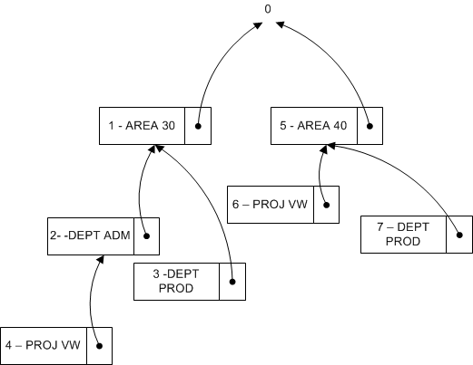

# Design Details: Searching for Dimension Combinations
When you close a page after you edit a set of dimensions, [!INCLUDE[d365fin](includes/d365fin_md.md)] evaluates whether the edited set of dimensions exists. If the set does not exist, a new set is created and the dimension combination ID is returned.  

## Building Search Tree  
 Table 481 **Dimension Set Tree Node** is used when [!INCLUDE[d365fin](includes/d365fin_md.md)] evaluates whether a set of dimensions already exists in table 480 **Dimension Set Entry** table. The evaluation is performed by recursively traversing the search tree starting at the top level numbered 0. The top level 0 represents a dimension set with no dimension set entries. The children of this dimension set represent dimension sets with only one dimension set entry. The children of these dimension sets represent dimension sets with two children, and so on.  

### Example 1  
 The following diagram represents a search tree with six dimension sets. Only the distinguishing dimension set entry is displayed in the diagram.  

   

 The following table describes a complete list of dimension set entries that make up each dimension set.  

|Dimension Sets|Dimension Set Entries|  
|--------------------|---------------------------|  
|Set 0|None|  
|Set 1|AREA 30|  
|Set 2|AREA 30, DEPT ADM|  
|Set 3|AREA 30, DEPT PROD|  
|Set 4|AREA 30, DEPT ADM, PROJ VW|  
|Set 5|AREA 40|  
|Set 6|AREA 40, PROJ VW|  

### Example 2  
 This example shows how [!INCLUDE[d365fin](includes/d365fin_md.md)] evaluates whether a dimension set that consists of the dimension set entries AREA 40, DEPT PROD exists.  

 First, [!INCLUDE[d365fin](includes/d365fin_md.md)] also updates the **Dimension Set Tree Node** table to make sure that the search tree looks like the following diagram. Thus dimension set 7 becomes a child of the dimension set 5.  

   

### Finding Dimension Set ID  
 At a conceptual level, **Parent ID**, **Dimension**, and **Dimension Value**, in the search tree, are combined and used as the primary key because [!INCLUDE[d365fin](includes/d365fin_md.md)] traverses the tree in the same order as the dimension entries. The GET function (record) is used to search for dimension set ID. The following code example shows how to find the dimension set ID when there are three dimension values.  

```  
DimSet."Parent ID" := 0;  // 'root'  
IF UserDim.FINDSET THEN  
  REPEAT  
      DimSet.GET(DimSet."Parent ID",UserDim.DimCode,UserDim.DimValueCode);  
  UNTIL UserDim.NEXT = 0;  
EXIT(DimSet.ID);  

```  

However, to preserve the ability of [!INCLUDE[d365fin](includes/d365fin_md.md)] to rename both a dimension and a dimension value, table 349, **Dimension Value**, is extended with an integer field, **Dimension Value ID**. This table converts the field pair, **Dimension** and **Dimension Value**, to an integer value. When you rename the dimension and dimension value, the integer value is not changed.  

```  
DimSet."Parent ID" := 0;  // 'root'  
IF UserDim.FINDSET THEN  
  REPEAT  
      DimSet.GET(DimSet.ParentID,UserDim."Dimension Value ID");  
  UNTIL UserDim.NEXT = 0;  
EXIT(DimSet.ID);  

```  

## See Also  
 [GET Function (Record)](/dynamics-nav/GET-Function--Record-)    
 [Design Details: Dimension Set Entries](design-details-dimension-set-entries.md)   
 [Dimension Set Entries Overview](design-details-dimension-set-entries-overview.md)   
 [Design Details: Table Structure](design-details-table-structure.md)   
 
