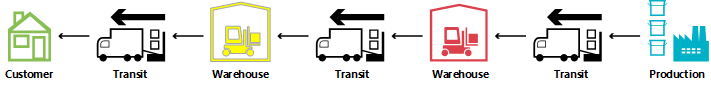
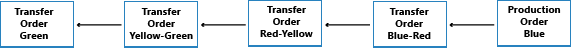
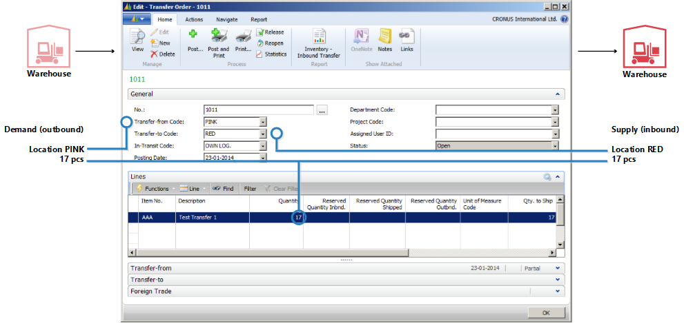
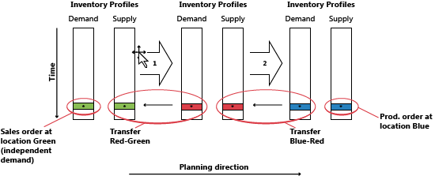
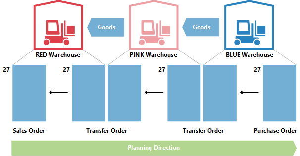
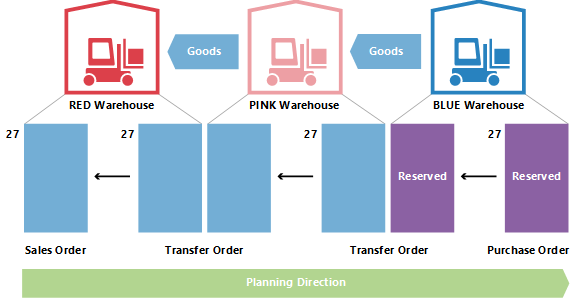
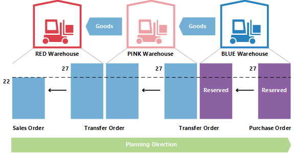
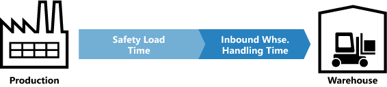
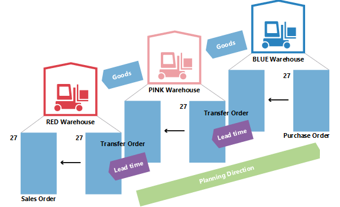

# Design Details: Transfers in Planning
Transfer orders are also a source of supply when working at the SKU level. When using multiple locations (warehouses), the SKU replenishment system can be set to Transfer, implying that the location is replenished by transferring goods from another location. In a situation with more warehouses, companies might have a chain of transfers where supply to GREEN location is transferred from YELLOW, and supply to YELLOW is transferred from RED and so on. In the beginning of the chain, there is a replenishment system of Prod. Order or Purchase.  

  

When comparing the situation where a supply order is directly facing a demand order to a situation where the sales order is supplied through a chain of SKU transfers, it is obvious that the planning task in the latter situation can become very complex. If demand changes, it might cause a ripple effect through the chain, because all transfer orders plus the purchase/production order in the opposite end of the chain will have to be manipulated to reestablish balance between demand and supply.  

  

## Why is Transfer a Special Case?  
A transfer order looks much like any other order in application. However, behind the scene it is very different.  

One fundamental aspect that makes transfers in planning different from purchase and production orders is that a transfer line represents demand and supply at the same time. The outbound part, which is shipped from the old location, is demand. The inbound part, which is to be received at the new location, is supply at that location.  

  

This means that when the system manipulates the supply side of the transfer, it must make a similar change on the demand side.  

## Transfers are Dependent Demand  
The related demand and supply has some resemblance with components of a production order line, but the difference is that components will be on the next planning level and with a different item, whereas the two parts of the transfer is situated on the same level, for the same item.  

An important similarity is that just as components are dependent demand, so is the transfer demand. The demand from a transfer line is dictated by the supply side of the transfer in the sense that if the supply is changed, the demand is directly affected.  

Unless the planning flexibility is None, a transfer line should never be treated as independent demand in planning.  

In the planning procedure, the transfer demand should only be taken into account after the supply side has been processed by the planning system. Before this, the actual demand is not known. The sequence of the changes made is therefore very important when it comes to transfer orders.  

## Planning Sequence  
The following illustration shows what a string of transfers could look like.  

  

In this example, a customer orders the item at location GREEN. Location GREEN is supplied through transfer from the central warehouse RED. The central warehouse RED is supplied by transfer from production on location BLUE.  

In this example, the planning system will start at the customer demand and work its way backwards through the chain. The demands and supplies will be processed one location at a time.  

  

## Transfer Level Code  
The sequence in which the locations are processed in the planning system is determined by the transfer level code of the SKU.  

The transfer level code is an internal field which is automatically calculated and stored on the SKU when SKU is created or modified. The calculation runs across all SKUs for a given combination of Item/Variant and uses the location code and the transfer-from code to determine the route the planning will have to use when traversing through the SKUs to ensure that all demands are processed.  

The transfer level code will be 0 for SKUs with replenishment system Purchase or Prod. Order and will be -1 for the first transfer level, -2 for the second and so on. In the transfer chain described above, the levels would therefore be -1 for RED and -2 for GREEN, as shown in the following illustration.  

  

When updating a SKU, the planning system will detect if SKUs with replenishment system Transfer are set up with circular references.  

## Planning Transfers without SKU  

Even if the SKU feature is not used, it is possible to use locations and make manual transfers between locations. For companies with less advanced warehouse setup, the planning system supports scenarios where existing inventory is transferred manually to another location, for example to cover a sales order at that location. At the same time, the planning system should react to changes in the demand.  

To support manual transfers, the planning will analyze existing transfer orders and then plan the order in which the locations should be processed. Internally, the planning system will operate with temporary SKUs carrying transfer level codes.  

  

If more transfers to a given location exist, the first transfer order will define the planning direction. Transfers running in the opposite direction will be canceled.  

## Changing Quantity with Reservations  
When changing quantities on existing supply, the planning system takes reservations into account in the sense that the reserved quantity represents the lower limit for how much the supply can be reduced.  

When changing the quantity on an existing transfer order line, keep in mind that the lower limit will be defined as the highest reserved quantity of the outbound and inbound transfer line.  

For example, if a transfer order line of 117 pieces is reserved against a sales line of 46 and a purchase line of 24, it is not possible to reduce the transfer line below 46 pieces even though this might represent excess supply on the inbound side.  

  

## Changing Quantity in a Transfer Chain  
In the following example, the starting point is a balanced situation with a transfer chain supplying a sales order of 27 on location RED with a corresponding purchase order on location BLUE, transferred via location PINK. Therefore, apart from sales and purchase, there are two transfer orders: BLUE-PINK and PINK-RED.  

  

Now the planner at PINK location chooses to reserve against the purchase.  

  

This usually means that the planning system will ignore the purchase order and the transfer demand. As long as there is balance, there is no problem. But what happens when the customer at RED location partly regrets his order and changes it to 22?  

  

When the planning system runs again, it should get rid of excess supply. However, the reservation will lock the purchase and the transfer to a quantity of 27.  

  

The PINK-RED transfer has been reduced to 22. The inbound part of the BLUE-PINK transfer is not reserved, but because the outbound part is reserved it is not possible to reduce the quantity below 27.  

## Lead Time Calculation  
When calculating the due date of a transfer order different kinds of lead time will be taken into account.  

The lead times that are active when planning a transfer order are:  

* Outbound Warehouse Handling Time  
* Shipping Time  
* Inbound Warehouse Handling Time  
* On the planning line, the following fields are used to provide information about the calculation.  
* Transfer Shipment Date  
* Starting Date  
* Ending Date  
* Due Date  

The shipment date of the transfer line will be shown in the Transfer Shipment Date field, and the receipt date of the transfer line will be shown in the Due Date field.  

The starting and ending dates will be used to describe the actual transportation period.  

The following illustration shows the interpretation of the starting date-time and ending date-time on planning lines related to transfer orders.  

  

In this example, it means that:  

* Shipment date + Outbound handling = Starting Date  
* Starting Date + Shipping time = Ending Date  
* Ending Date + Inbound Handling = Receipt Date  

## Safety Lead Time  
The Default Safety Lead Time field in the Manufacturing Setup page and the related Safety Lead Time field on the item card will not be taken into account in the calculation of a transfer order. However, the safety lead time will still influence the total plan like it will affect the replenishment order (purchase or production) in the beginning of the transfer chain when the items are put on the location from which they will be transferred.  

  

On the production order line, the Ending Date + Safety Lead Time + Inbound Warehouse Handling Time = Due Date.  

On the purchase order line, the Planned Receipt Date + Safety Lead Time + Inbound Warehouse Handling Time = Expected Receipt Date.  

## Reschedule  
When rescheduling an existing transfer line, the planning system must look up the outbound part and change the date-time on this. It is important to note that if lead time has been defined, there will be a gap between the shipment and the receipt. As mentioned, the lead time can consist of more elements, such as transportation time and warehouse handling time. On a time line, the planning system will move back in time while it balances the elements.  

  

Therefore, when changing the due date on a transfer line, the lead time must be calculated in order to update the outbound side of the transfer.  

## Serial/Lot Numbers in Transfer Chains  
If the demand carries serial/lot numbers, and the planning engine is run, it will give rise to some directly created transfer orders. For more information about this concept, see Item Attributes. If, however, serial/lot numbers are removed from the demand, the created transfer orders in the chain will still carry the serial/lot numbers and will therefore be ignored by planning (not deleted).  

## Order-to-Order Links  
In this example, BLUE SKU is set up with the Order reordering policy, while PINK and RED use Lot-for-Lot. When a sales order of 27 is created on location RED, it will lead to a chain of transfers with the last joint at location BLUE being reserved with binding. In this example, the reservations are not hard reservations created by the planner at PINK location, but bindings created by the planning system. The important difference is that the planning system can change the latter.  

  

If demand is changed from 27 to 22, the system will lower the quantity down through the chain, with the binding reservation also being reduced.  

## See Also  
[Design Details: Planning Parameters](design-details-planning-parameters.md)   
[Design Details: Planning Assignment Table](design-details-planning-assignment-table.md)   
[Design Details: Handling Reordering Policies](design-details-handling-reordering-policies.md)   
[Design Details: Demand at Blank Location](design-details-demand-at-blank-location.md)   
[Design Details: Central Concepts of the Planning System](design-details-central-concepts-of-the-planning-system.md)   
[Design Details: Balancing Demand and Supply](design-details-balancing-demand-and-supply.md)   
[Design Details: Supply Planning](design-details-supply-planning.md)
