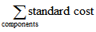
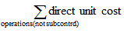
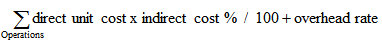
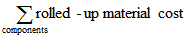
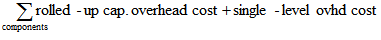
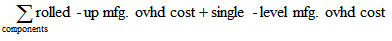

# Design Details: Variance
Variance is defined as the difference between the actual cost and the standard cost, as described in the following formula.  

 actual cost – standard cost = variance  

 If the actual cost changes, for example, because you post an item charge on a later date, then the variance is updated accordingly.  

> [!NOTE]  
>  Revaluation does not affect the variance calculation, because revaluation only changes the inventory value.  

## Example  
 The following example illustrates how variance is calculated for purchased items. It is based on the following scenario:  

1.  The user purchases an item at LCY 90.00, but the standard cost is LCY 100.00. Accordingly, the purchase variance is LCY –10.00.  
2.  LCY 10.00 is credited to the purchase variance account.  
3.  The user posts an item charge of LCY 20.00. Accordingly, the actual cost is increased to LCY 110.00, and the value of the purchase variance becomes LCY 10.00.  
4.  LCY 20.00 is debited to the purchase variance account. Accordingly, the net purchase variance becomes LCY 10.00.  
5.  The user revalues the item from LCY 100.00 to LCY 70.00. This does not affect the variance calculation, only the inventory value.  

 The following table shows the resulting value entries.  

   

## Determining the Standard Cost  
 The standard cost is used when calculating variance and the amount to capitalize. Since the standard cost can be changed over time because of manual update calculation, you need a point in time when the standard cost is fixed for variance calculation. This point is when the inventory increase is invoiced. For produced or assembled items, the point when standard cost is determined is when the cost is adjusted.  

 The following table shows how different cost shares are calculated for produced and assembled items when you use the Calculate Standard Cost function.  

|Cost Share|Purchased Item|Produced/Assembled Item|  
|----------------|--------------------|------------------------------|  
|**Standard Cost**||Single-Level Material Cost + Single-Level Capacity Cost + Single-Level Subcontrd. Cost + Single-Level Cap. Ovhd. Cost + Single-Level Mfg. Ovhd. Cost|  
|**Single-Level Material Cost**|Unit Cost||  
|**Single-Level Capacity Cost**|Not applicable||  
|**Single-Level Subcontrd. Cost**|Not applicable||  
|**Single-Level Cap. Ovhd Cost**|Not applicable||  
|**Single-Level Mfg. Ovhd Cost**|Not applicable|(Single-Level Material Cost + Single-Level Capacity Cost + Single-Level Subcontrd. Cost) * Indirect Cost % / 100 + Overhead Rate|  
|**Rolled-up Material Cost**|Unit Cost||  
|**Rolled-up Capacity Cost**|Not applicable||  
|**Rolled-Up Subcontracted Cost**|Not applicable||  
|**Rolled-up Capacity Ovhd. Cost**|Not applicable||  
|**Rolled-up Mfg. Ovhd. Cost**|Not applicable||  

## See Also  
 [Design Details: Inventory Costing](design-details-inventory-costing.md)   
 [Design Details: Costing Methods](design-details-costing-methods.md)
 [Managing Inventory Costs](finance-manage-inventory-costs.md)  
 [Finance](finance.md)  
 [Working with [!INCLUDE[d365fin](includes/d365fin_md.md)]](ui-work-product.md)
