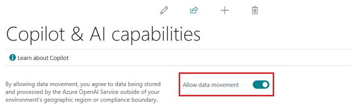
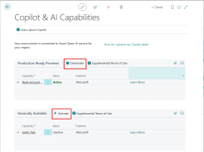

# Configure Copilot and AI capabilities 

<!--[!INCLUDE[ai-preview](includes/ai-preview.md)]-->

<!--This article explains how you can control the ability to create AI-powered item marketing text with Copilot for your organization. This task is done by an admin. There are two requirements that you must fulfill to make the feature available to users:-->

This article explains how to control Copilot and other AI capabilities in Business Central. This task is done by an admin. Copilot is a system feature and an integral part of Business Central. Similar to most system features, you don't grant access to individual users nor can you toggle Copilot on or off. However, Copilot offers data governance controls and the option to deactivate individual Copilot and AI capabilities for each environment. There are different levels of access control to AI capabilities, depending on the feature:

- Allow data movement across geographical regions

  This task is only required if your Business Central environment is in a different geography than the Azure OpenAI Service it uses. [Learn more](#allow-data-movement-across-geographies)

- Activate the feature on the **Copilot & AI Capabilities** page. [Learn more](#activate-features)

- Enable the specific feature, if it's still governed by **Feature Management**.

  In 2023 release wave 2, both the marketing text suggestions and bank account reconciliation assist features are included under **Feature Management**. [Learn more](#enable-feature-in-feature-management)

If any of these requirements aren't fulfilled, the feature isn't available for use.

## Prerequisites

- You're using Business Central online, version 23.1 or later. <!--[preview version](ai-preview-getstarted.md) of Business Central that's enabled for Copilot.-->
- You have admin or super permissions in Business Central.  <!--For more information, go to [Configure AI-powered item marketing text with Copilot](enable-ai.md).-->

## Allow data movement across geographies

This task applies only if the **Allow data movement** switch appears near the top of the **Copilot & AI Capabilities** page. If the link **How do I govern my copilot data?** is shown instead of the **Allow data movement** switch, skip this step.

The **Allow data movement** switch indicates that your Business Central environment location&mdash;that is, the geography where data is processed and stored&mdash;isn't the same as the Azure OpenAI Service geography used by Copilot. If you want to enable Copilot, you must allow data movement between geographies. To learn more about data movement, go to [Copilot data movement across geographies](ai-copilot-data-movement.md). 

To allow data movement outside of your geographical region, complete the following steps:

1. In Business Central, search for and open the **Copilot & AI Capabilities** page.
1. Turn on the **Allow data movement** switch.

You can opt out by turning off the  **Allow data movement** switch. Once an Azure OpenAI Service becomes available in your Business Central environment geography, your environment is automatically connected to it, and the switch is no longer available. 

<!--
| Australia, United Kingdom, United States | Within the respective geographical region |
| Europe, France, Germany, Norway, Switzerland  | Sweden or Switzerland |
| Asia Pacific, Brazil, Canada, India, Japan, Singapore, South Africa, South Korea, United Arab Emirates  | United States |-->

<!--Note

If your environment is hosted in North America, Copilot will use an Azure OpenAI endpoint in North America to process your data.
If your environment is hosted in Europe, Copilot will use an Azure OpenAI endpoint in Europe to process your data.
If your environment is hosted anywhere else, Copilot will use an Azure OpenAI endpoint outside of the region in which the environment is hosted.
To opt in 

Copilot and other AI capabilities use Azure OpenAI Service.  and are provided by default to only those customers with environments that have United States as their geography for data processing and storage. While the Azure OpenAI Service is available in multiple geographies including Australia, Canada, United States, France, Japan and UK, Copilot does not follow the same regional rollout schedule.

Meanwhile, customers with environments outside the United States can use Copilot AI features by opting in to share relevant data with the Azure OpenAI Service in United States or Switzerland.

The information in the following table outlines the Azure OpenAI service that's used by the Copilot services based on the geography of their Dynamics 365 environment when they opt-in to share data.-->
## Activate features

All Copilot and AI capabilities are active by default when they are made available in preview or become generally available. Using the **Copilot & AI Capabilities** page, you can turn individual features off or on again for all users.

1. In Business Central, search for and open the **Copilot & AI Capabilities** page.

1. The page lists all available Copilot and AI related features and their current status, which can be either active or inactive. The features are divided into two sections&mdash;one section for features in preview and another for features that are generally available. 

   

   - To turn on a feature, select it in the list, then select the **Activate** action.
   - To turn off a feature, select it, and then select **Deactivate** action. 

## Enable feature in Feature Management

When individual Copilot capabilities are released in Business Central minor updates, these capabilities are optional until the next major update. **Feature Management** is used to turn on or off features that are in preview, like bank reconciliation, and some features that are generally available, like marketing text suggestions. [Learn more about feature management](/dynamics365/business-central/dev-itpro/administration/feature-management).

1. In Business Central, search for and open the **Feature Management** page.
2. To enable a feature, set the **Enabled for** column to **All users**. To disable a feature, set the **Enabled for** column to **None**. Use the following table to help you determine the switch that applies to the Copilot and AO capability you want to enable:

   - **Feature Preview: Bank account reconciliation with Copilot** pertains to the bank account reconciliation assist feature.
   - **Feature preview: Create AI-powered product descriptions with Copilot** pertains to the marketing text suggestions feature.

   For more information about feature management in general, go to [Feature Management](/dynamics365/business-central/dev-itpro/administration/feature-management).

## Granting user access 

Copilot and AI capabilities may offer functionality intended for any users across your organization or for specific user roles. Most Copilot and AI capabilities offer access control using permissions and permission sets in Business Central´s permission management system. [Learn more about permissions and permission sets](ui-define-granular-permissions.md).

To grant or deny access to specific Copilot and AI capabilities, consult the documentation or publisher of that feature to identify which permissions are required. 

## Next steps

After you enable and consent to the features, you're ready to try them out. Go to:

- [Add marketing text to items](item-marketing-text.md) 
- [Reconcile using bank account reconciliation assist](bank-reconciliation-with-copilot.md) 

## See also

[Troubleshoot Copilot and AI capabilities](ai-copilot-troubleshooting.md)  
[Marketing text suggestions overview](ai-overview.md)   
[FAQ for marketing text suggestions](faqs-marketing-text.md)  
