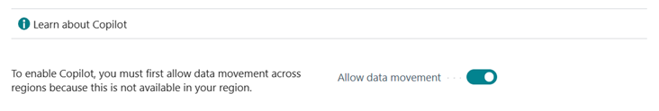

# Configure Copilot and AI capabilities 

<!--[!INCLUDE[ai-preview](includes/ai-preview.md)]-->

<!--This article explains how you can control the ability to create AI-powered item marketing text with Copilot for your organization. This task is done by an admin. There are two requirements that you must fulfill to make the feature available to users:-->

This article explains how to control users' access to Copilot and other AI capabilities in Business Central. This task is done by an admin. There are three levels of access control to Copolit and AI capabilities, depending on the feature:

- Consent to the Azure OpenAI [preview](https://dynamics.microsoft.com/legaldocs/supp-dynamics365-preview/) and [privacy](https://go.microsoft.com/fwlink/?LinkId=521839) terms and conditions.

   This consent is required for any Copilot or AI capability to work for users. The consent is global for all users and applies to all Copilot and AI features. [Learn more](#consent-to-preview-and-privacy-terms)

- Allow data movement across geographical regions

  This task is only required if your environment is outside the United States or Europe. [Learn more](#allow-data-movement-across-geographical-regions)

- Enable the specific feature, if it's still governed by **Feature Management**.

  In 2023 release wave 2, both the marketing text suggestions and bank account reconciliation assist features are included under **Feature Management**. However, marketing text suggestions is enabled by default. [Learn more](#enable-feature-in-feature-management)

- Activate the feature on the **Copilot & AI Capabilities** page. [Learn more](#activate-the-feature)

If any of these requirements aren't fulfilled, the feature isn't available for use.

## Prerequisites

- You're using Business Central online, version 23.1 or later. <!--[preview version](ai-preview-getstarted.md) of Business Central that's enabled for Copilot.-->
- You have admin or super permissions in Business Central.  <!--For more information, go to [Configure AI-powered item marketing text with Copilot](enable-ai.md).-->

## Consent to preview and privacy terms

Consent to the terms and conditions of [preview](https://dynamics.microsoft.com/legaldocs/supp-dynamics365-preview/) and [Microsoft Privacy Statement](https://go.microsoft.com/fwlink/?LinkId=521839) on behalf of the organization. Unlike privacy notices for other features and services, only admins can consent the use of Azure OpenAI, which they do on behalf of the organization. Users can't decide for themselves.   

1. In Business Central, search for and open the **Privacy Notices Status** page.
2. In the **Integration Name** column, select **Azure OpenAI**, then read the terms and conditions that are presented to you.
3. In the **Azure OpenAI** row, select the **Agree for everyone** checkbox to consent or the **Disagree for everyone** checkbox to reject.

## Enable feature in Feature Management

**Feature Management** is used to turn on or off features that are in preview, like bank reconciliation, and some features that are generally available, like item marketing suggestion. [Learn more about feature management](/dynamics365/business-central/dev-itpro/administration/feature-management).

1. In Business Central, search for and open the **Feature Management** page.
2. To enable a feature, set the **Enabled for** column to **All users**. To disable a feature, set the **Enabled for** column to **None**. Use the following table to help you determine the switch that applies to the Copilot and AO capability you want to enable:

   - **Feature Preview: Bank account reconciliation with Copilot** pertains to the bank account reconciliation assist feature.
   - **Feature preview: Create AI-powered product descriptions with Copilot** pertains to the marketing text suggestions feature.

   For more information about feature management in general, go to [Feature Management](/dynamics365/business-central/dev-itpro/administration/feature-management).

## Allow data movement across geographies

> [!NOTE]
> This task applies only if the **Allow data movement** switch appears near the top of the **Copilot & AI Capabilities** page. 

Copilot is available in all supported [Business Central geographic regions](/dynamics365/business-central/dev-itpro/compliance/apptest-countries-and-translations). However, Copilot uses Microsoft Azure OpenAI Service, which is available only in Australia, Sweden, Switzerland, United Kingdom, and United States. This means that if your environment is located elsewhere, data from the Copilot and generative AI features (like data in prompts or returned in completions) must be transmitted outside of your geographical region. In this case, you must opt in to allow data movement to an Azure OpenAI Service in another geography. For a list of geographies, refer to the [Azure OpenAI Service geographies](#azure-openai-service-geographies) section that follows. If your environment is in one of the regions listed previously, it automatically connects to Azure OpenAI Service, so no extra action is required. <!--To learn where your environment's Azure OpenAI Service resides, refer the [Azure OpenAI Service geographies](#azure-openai-service-geographies) section that follows.-->

To allow data movement outside of your geographical region, complete the following steps:

1. In Business Central, search for and open the **Copilot & AI Capabilities** page.
1. Turn on the **Allow data movement** switch.

   ](allow-data-movement.png)

### Azure OpenAI Service geographies

The following table shows the Azure OpenAI Service's geography used by Copilot, based on the Business Central environment's geography. This information is important when deciding whether to opt in for data movement across geographies.

| Business Central environment geography | Azure OpenAI Service geography|
| - | - |
|Asia Pacific|United States|
|Australia| Australia |
|Brazil (South America) |United States|
|Canada|United States|
|Europe|Sweden or Switzerland |
|France|Sweden or Switzerland |
|Germany|Sweden or Switzerland |
|France|Sweden or Switzerland |
|India|United States|
|Japan|United States|
|(South) Korea|United States|
|Norway|Sweden or Switzerland |
|Singapore|United States|
|South Africa|United States|
|Switzerland |Switzerland|
|United Arab Emirates|United States|
|United Kingdom|United Kingdom|
|United States|United States|

<!--
| Australia, United Kingdom, United States | Within the respective geographical region |
| Europe, France, Germany, Norway, Switzerland  | Sweden or Switzerland |
| Asia Pacific, Brazil, Canada, India, Japan, Singapore, South Africa, South Korea, United Arab Emirates  | United States |-->

<!--Note

If your environment is hosted in North America, Copilot will use an Azure OpenAI endpoint in North America to process your data.
If your environment is hosted in Europe, Copilot will use an Azure OpenAI endpoint in Europe to process your data.
If your environment is hosted anywhere else, Copilot will use an Azure OpenAI endpoint outside of the region in which the environment is hosted.
To opt in 

Copilot and other AI capabilities use Azure OpenAI Service.  and are provided by default to only those customers with environments that have United States as their geography for data processing and storage. While the Azure OpenAI Service is available in multiple geographies including Australia, Canada, United States, France, Japan and UK, Copilot does not follow the same regional rollout schedule.

Meanwhile, customers with environments outside the United States can use Copilot AI features by opting in to share relevant data with the Azure OpenAI Service in United States or Switzerland.

The information in the following table outlines the Azure OpenAI service that's used by the Copilot services based on the geography of their Dynamics 365 environment when they opt-in to share data.-->
## Activate features

Using the **Copilot & AI Capabilities** page, you can turn individual features on or off for all users.

1. In Business Central, search for and open the **Copilot & AI Capabilities** page.

1. The page lists all available Copilot and AI related features and their current status, which can be either active or inactive. The features are divided into two sections&mdash;one section for features in preview and another for features that are generally available. 

   

   - To turn on a feature, select it in the list, then select the **Activate** in the ribbon.
   - To turn off a feature, select it, and then select **Deactivate** in the ribbon. 

## Next steps

After you enable and consent to the features, you're ready to try them out. Go to:

- [Add marketing text to items](item-marketing-text.md) 
- [Reconcile using bank account reconciliation assist](bank-reconciliation-with-copilot.md) 

## See also

[Marketing text suggestions overview](ai-overview.md)   
[FAQ for marketing text suggestions](faqs-marketing-text.md)  
