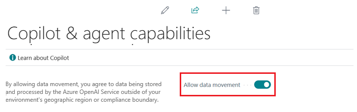
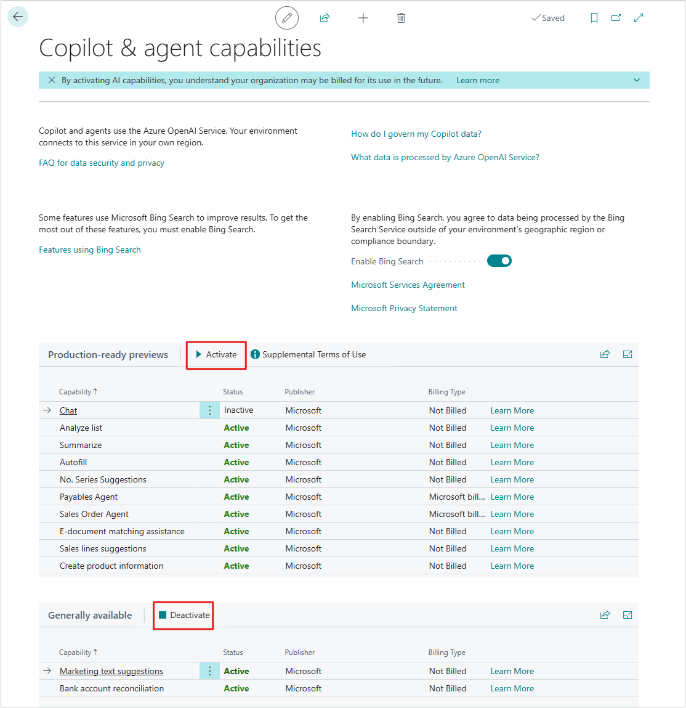

# Configure Copilot and agent capabilities

This article explains how to control Microsoft Copilot and agent capabilities in [!INCLUDE [prod_short](includes/prod_short.md)]. An administrator must complete these tasks.

Copilot is a system feature and an integral part of [!INCLUDE [prod_short](includes/prod_short.md)]. Like most system features, you can't turn Copilot on or off. However, [!INCLUDE [prod_short](includes/prod_short.md)] provides extensive transparency and control for administrators, including:

- Understand which Copilot and agent capabilities are available to your environment.
- Deactivate individual capabilities.
- Grant or deny access to individual users for each capability.
- Use data governance controls.

There are different levels of access control for agent capabilities, depending on the feature:

- Allow data movement across geographical regions.

    This task is required only if your [!INCLUDE [prod_short](includes/prod_short.md)] environment is in a different geography than the Azure OpenAI Service it uses. Learn more in [Allow data movement across geographies](#allow-data-movement-across-geographies).

- Activate the feature on the **Copilot & agent capabilities** page. Learn more in [Activate features](#activate-features).

If any of these requirements aren't met, the feature isn't available for use.

> [!IMPORTANT]
> Starting with Business Central version 29, the **Chat** capability controls whether the Microsoft Copilot in Business Central experience is available instead of the legacy Chat with Copilot feature.
>
> The **Allow data movement** setting described in the next section applies to geographic processing for Business Central Copilot and agent capabilities that use Microsoft-managed AI resources through Business Central. It doesn't configure Microsoft Copilot tenant-level privacy, data residency, or geographic processing. For those subjects, see [Data, Privacy, and Security for Microsoft Copilot](/microsoft-365/copilot/microsoft-365-copilot-privacy).

> [!IMPORTANT]
> **GPT-5.3-chat is now the default model for agents** — From May through June, agents in [!INCLUDE [prod_short](includes/prod_short.md)] are moving to GPT-5.3-chat as the default language model for version 28 and onwards. This change rolls out gradually to environments across all regions. Environments in the UK, India, and Australia are excluded from this initial rollout and will receive the update at a later date.
>
> Along with this update, new model management capabilities are available:
>
> - **Model visibility and selection in agent design experience** - Administrators can review which language model their agents use and select their preferred model from the available options in the agent configuration page.
> - **Model control for coded agents** — New methods in the agent SDK allow developers to control model selection from code, giving programmatic control over which model a coded agent uses.
>
> The model update and the model selection UI as well as the new methods roll out independently. Some environments might receive GPT-5.3-chat before the model selection option appears. Copilot continues to work normally during this transition.
>
> To change the model for designed agents after the selection UI is available, go to the **Agents** page in Business Central. For coded agents, refer to the updated SDK documentation for the new model selection methods. For those of you who are on the journey of designing and coding agents, we highly recommend that you reevaluate your agents when the model has updated because agent behavior, as well as accuracy, might be affected. Learn more in [AI models for agents](/dynamics365/business-central/dev-itpro/ai/ai-agent-models).

## Prerequisites

- You use [!INCLUDE [prod_short](includes/prod_short.md)] online.
- You're an [administrator](#requirements-for-being-an-administrator) in [!INCLUDE [prod_short](includes/prod_short.md)].

## Allow data movement across geographies

This section applies only if the **Allow data movement** toggle switch appears near the top of the **Copilot & agent capabilities** page. If the **How do I govern my copilot data?** link appears instead of the **Allow data movement** option, skip this task.

The **Allow data movement** toggle appears when one or more copilot and agent capabilities might process data in a different Azure geography from the Business Central environment. Learn more in [Copilot data movement across geographies](ai-copilot-data-movement.md).

Turning off the toggle prevents affected capabilities from processing data across geographies, making those capabilities unavailable.

1. In [!INCLUDE [prod_short](includes/prod_short.md)], [!INCLUDE [open-search-lowercase](includes/open-search-lowercase.md)], enter **Copilot & agent capabilities**, and then choose the related link.
1. Switch the **Allow data movement** toggle on or off as desired.

After an Azure OpenAI Service becomes available in the geography of your [!INCLUDE [prod_short](includes/prod_short.md)] environment, your environment automatically connects to it. At that point, the **Allow data movement** toggle no longer appears on the **Copilot & agent capabilities** page.

For Microsoft Copilot tenant settings, data access controls, privacy, and data
residency, see:

- [Manage Microsoft Copilot scenarios in the Microsoft 365 admin center](/microsoft-365/copilot/microsoft-365-copilot-page)
- [Data, Privacy, and Security for Microsoft Copilot](/microsoft-365/copilot/microsoft-365-copilot-privacy)
- [Data Residency for Microsoft 365 Copilot](/microsoft-365/enterprise/m365-dr-service-copilot)

## Activate features

Copilot and agent capabilities are active by default when they're available in preview or generally available. Use the **Copilot & agent capabilities** page to turn individual features off or on for all users:

1. In [!INCLUDE [prod_short](includes/prod_short.md)], [!INCLUDE [open-search-lowercase](includes/open-search-lowercase.md)], enter **Copilot & agent capabilities**, and then choose the related link.
1. The page lists all available Copilot and AI-related features and their status (*Active* or *Inactive*). The features are divided into two sections: preview and generally available.

    - To turn on a feature, select it in the list, and then select **Activate**.
    - To turn off a feature, select it in the list, and then select **Deactivate**.

    

## Granting user access

Copilot and agent capabilities provide functionality for everyone in your organization or for specific user roles. Most Copilot and agent capabilities use permissions and permission sets in the [!INCLUDE [prod_short](includes/prod_short.md)] permission management system for access control. Learn more about permissions and permission sets in [Assign permissions to users and groups](ui-define-granular-permissions.md).

The following table lists the permissions needed to use the different Copilot and agent features in [!INCLUDE [prod_short](includes/prod_short.md)].

| Copilot or agent | Required permissions |
|---|---|
| Analysis assist | <ul><li>**Copilot Sys Features** permission set or execute permission on system object 9710 **Allow Copilot Analysis Assist**.</li><li>**Data Analysis - Exec.** permission set or include execute permission on the system object for permission to analysis mode.</li><li>**Add Related Fields** permission set for permission to add fields from related tables. |
| Autofill | **Copilot Sys Features** permission set or execute permission on system object 9700 **Allow Copilot Autofill**. |
| Bank reconciliation assist | Permission on page 7250 **Bank Acc. Rec. AI Proposal** and page 7252 **Trans. To GL Acc. AI Proposal**. |
| Chat |**Copilot Sys Features** permission set or execute permission on system object 9690 **Allow Copilot Chat**. |
|Expense Agent|Learn more in [Manage Expense Agent permissions and user access](expense-management/expense-agent-configuration-page.md#manage-agent-permissions-and-user-access).|
|No. series suggestions|No permissions or permission sets control access to this Copilot feature. Users who can set up number series can use Copilot for assistance when the **No. series suggestions** feature is activated.  |
| Suggest substitute items| Permission on page 7410 **Item Subst. Suggestion** and page 7411 **Item Subst. Suggestion Sub**.|
| Summarize |**Copilot Sys Features** permission set or execute permission on system object 9680 **Allow Copilot Summary**. |
| Map e-documents | Permission on page 6166 **E-Doc. PO Copilot Prop**. |
| Marketing text suggestions | Permission on page 5836 **Copilot Marketing Text**. |
|Payables Agent|Learn more in [Manage Payables Agent permissions and user access](payables-agent-setup.md#manage-agent-permissions-and-user-access).|
| Sales line suggestions | Permission on page 7275 **Sales Line AI Suggestions** and page 7276 **Sales Line AI Suggestions Sub**. |
|Sales Order Agent|Learn more in [Manage agent permissions and user access](sales-order-agent-setup.md#understand-permissions-and-access).|
| Custom Agent (preview) | Learn more in [Designing and coding agents (preview)](/dynamics365/business-central/dev-itpro/ai/ai-development-toolkit-overview). To learn more about how to resolve a request for another permission set in [Resolve a permission request](supervise-agent-tasks.md#resolve-a-permission-request). |

To grant or deny access to specific non-Microsoft Copilot and agent capabilities, consult the feature's documentation or publisher for the required permissions.

## Enable Bing Search for enhanced results

Some features support Bing Search to improve Copilot's results, like giving answers in Chat about add-on apps and extensions installed in [!INCLUDE [prod_short](includes/prod_short.md)]. When you enable Bing Search, Copilot searches the web to find more comprehensive information for an inquiry.

To enable Bing Search, turn on the **Enable Bing Search** toggle on the **Copilot & agent capabilities** page.

Learn more about which Copilot features support Bing Search and how it's used in [Searching the web with Copilot (preview)](ai-search-web-copilot.md).

## Turn off feedback on AI-generated content

Users can provide feedback to Microsoft directly from the Copilot window by using the **Like** and **Dislike** controls. This feedback is anonymous and helps improve the service. Feedback is enabled by default.

Administrators can turn off the ability for users to provide Copilot feedback. To do that, follow these steps:

1. Open the Power Platform admin center for your tenant.
1. In the left navigation pane, select **Copilot**.
1. Select **Settings**, and then under **Power Platform**, choose **Copilot feedback**.
1. Configure the feedback options:  
    - **Basic Copilot feedback** - Turn off this toggle to disable the **Like** and **Dislike** controls.
    - **Additional Copilot feedback** - Turn off this toggle to prevent users from sharing prompts, questions, responses, content samples, and log files when they submit feedback.
1. Choose **Save**.

Changes take effect when users sign out and sign back in.

## Roll out changes to all users of the environment

On the **Copilot and agent capabilities** page, when you adjust any toggles or activate or deactivate a capability, your changes can take time to affect users in that environment. Some AI features take effect immediately, while others require users to sign out and sign in again. To enforce your changes quickly, ask users to sign out and sign in again, or cancel user sessions from the [!INCLUDE [prod_short](includes/prod_short.md)] administration center. Learn more in [Cancel sessions in Business Central administration center](/dynamics365/business-central/dev-itpro/administration/tenant-admin-center-manage-sessions#cancel-sessions).

## Requirements for being an administrator

You need **SUPER** permission in your Business Central user account or one of the following [!INCLUDE [prod_short](includes/prod_short.md)] licenses:

- Delegated Admin agent - Partner
- Delegated Helpdesk agent - Partner
- Internal Admin
- Internal BC Administrator
- Dynamics 365 Administrator

[!INCLUDE [prod_short](includes/prod_short.md)] doesn't yet offer granular, object-level permissions so that only specific administrators can configure Copilot.

## Next steps

For agents, you need to complete a few more steps before the agent is ready to use. Learn more in:

- [Set up Sales Order Agent](sales-order-agent-setup.md#configure-and-activate-sales-order-agent)
- [Set up Payables Agent](payables-agent-setup.md)

For other Copilot features, you're ready to try them out. Learn more in the following articles:

- [Add marketing text to items with Copilot](item-marketing-text.md)
- [Analyze list data with Copilot](analysis-assist.md)
- [Autofill fields with Copilot](autofill-fields-with-copilot.md)
- [Chat with Copilot](chat-with-copilot.md)
- [Map e-documents to purchase order lines with Copilot](map-edocuments-with-copilot.md)
- [Process sales quotes and orders with Sales Order Agent](sales-order-agent-process.md)
- [Reconcile bank accounts with Copilot](bank-reconciliation-with-copilot.md)
- [Suggest lines on sales orders with Copilot](sales-suggest-sales-lines-with-copilot.md)
- [Suggest substitute items with Copilot](suggest-item-substitutions-copilot.md)
- [Suggest number series with Copilot](suggest-number-series-copilot.md)
- [Summarize with Copilot](summarize-with-copilot.md)

## Related information

[Troubleshoot Copilot and agent capabilities](ai-copilot-troubleshooting.md)  
[FAQ for analysis assist](faqs-analysis-assist.md)  
[FAQ for autofill with Copilot](faqs-autofill.md)  
[FAQ for bank reconciliation assist](faqs-bank-reconciliation.md)  
[FAQ for chat with Copilot](faqs-chat-with-copilot.md)  
[FAQ for mapping e-documents with purchase orders](faqs-map-edocuments.md)  
[FAQ for marketing text suggestions](faqs-marketing-text.md)  
[FAQ for sales line suggestions](faq-sales-suggest-sales-lines-with-copilot.md)  
[FAQ for suggest substitute items](faq-suggest-item-substitutions-with-copilot.md)  
[Marketing text suggestions overview](ai-overview.md)  
