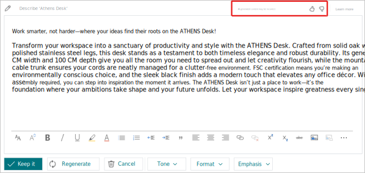

# FAQ for marketing text suggestions with Copilot

These frequently asked questions (FAQ) describe the AI impact of the [!INCLUDE[feature-marketing-text-suggestions](includes/feature-marketing-text-suggestions.md)] feature in [!INCLUDE[prod_short](includes/prod_short.md)].

## What is item marketing text suggestions?

Copilot provides writing assistance for users responsible for authoring marketing text (also known as copy) on items in [!INCLUDE[prod_short](includes/prod_short.md)]. This feature is known as [!INCLUDE[feature-marketing-text-suggestions](includes/feature-marketing-text-suggestions.md)]. The [!INCLUDE[feature-marketing-text-suggestions](includes/feature-marketing-text-suggestions.md)] feature provides writing assistance for users responsible for authoring marketing text (also known as *copy*) on items in [!INCLUDE[prod_short](includes/prod_short.md)].

The feature is available on any item card in [!INCLUDE[prod_short](includes/prod_short.md)]. To use it, just open an item and then select **Marketing Text** > **Draft with Copilot**. This action automatically generates a text suggestion that's engaging, creative, and specific to the item that's shown. Suggestions are based on various inputs, including:

- The item's attributes, category, and name.
- Personal writing style preferences, like tone of voice, emphasized quality, format and length.

You can change the value of these input options to influence the outcome of the AI-generated text. Before you save a suggestion, you can easily review and edit it for accuracy or try another suggestion.

Some key benefits of this feature include:

- Decreases the time used on copy writing, which can accelerate time-to-market for items being sold in online shops.
- Unlocks creativity to provide more engaging product descriptions.
- Improves consistency of marketing material for product lines.

## What are the system's capabilities?

The [!INCLUDE[feature-marketing-text-suggestions](includes/feature-marketing-text-suggestions.md)] feature uses Microsoft's Azure OpenAI Service to access powerful language models that analyze and generate natural language. These models have been trained on a wide body of text datasets. As a result, Copilot can generate suggested, personalized responses in English based on a minimal amount of input data, like an item's attributes, category, or description. Learn more about Azure OpenAI Service at [Microsoft's Azure OpenAI Service](/azure/cognitive-services/openai/overview).

## What is the system's intended use?

This feature is intended to assist users in creating marketing text for items in [!INCLUDE[prod_short](includes/prod_short.md)]. Writers use the feature to quickly get compelling and engaging text suggestions, which are then reviewed and edited for accuracy. 

## How was item marketing text evaluated? What metrics are used to measure performance?

- The feature underwent extensive testing where numerous texts in different languages were evaluated by language experts against various criteria. Testing was based on [!INCLUDE[prod_short](includes/prod_short.md)]'s demonstration data and other fictitious product catalogs.
- This feature is built in accordance with Microsoft's Responsible AI Standard. Learn more about responsible AI from Microsoft at [Empowering responsible AI practices](https://aka.ms/RAI).

## How does Microsoft monitor the quality of generated content?

Microsoft has various systems in place to ensure Copilot capabilities remain operational and generate content of the highest quality.

- Users have the opportunity to provide feedback to report inappropriate content and improve the functionality.

  - If you encounter inappropriate generated content, report it to Microsoft by using this feedback form: [Report abuse](https://go.microsoft.com/fwlink/?linkid=2249810). 

    Microsoft might disable the Copilot-driven features for selected customers if abuse of the functionality is detected. 

  - We track user feedback on [!INCLUDE[feature-marketing-text-suggestions](includes/feature-marketing-text-suggestions.md)] to help us improve suggestions. 

    You provide feedback by using the like (thumbs up) or dislike (thumbs down) icon on the **Copilot** page in [!INCLUDE[prod_short](includes/prod_short.md)]. We gather the telemetry of these gestures for each AI output that you submit feedback for.

    

- The Azure OpenAI Service stores prompts and completions from the service to monitor for abusive use and to develop and improve the quality of Azure OpenAI's content management systems. Learn more about our content management and filtering at [Content filtering](/azure/cognitive-services/openai/concepts/content-filter). Your company data isn't used to train AI models in the Azure OpenAI service.

   Authorized Microsoft employees can access prompt and completion data that has triggered our automated systems for the purposes of investigating and verifying potential abuse; for customers using [!INCLUDE[prod_short](includes/prod_short.md)] in the European Union, the authorized Microsoft employees are located in the European Union. This data may be used to improve our content management systems. In the event of a confirmed policy violation, we may ask you to take immediate action to remediate the issue and to prevent further abuse. Failure to address the issue may result in suspension or termination of Azure OpenAI resource access.

   Learn more at [Data, privacy, and security for Azure OpenAI Service](/legal/cognitive-services/openai/data-privacy#abuse-and-harmful-content-generation).

## Is there a logging and human review process as part of Azure OpenAI Service, and if so, can I opt out?  

As part of providing the Azure OpenAI service, Microsoft will process and store customer data submitted to the service, as well as output content, for purposes of monitoring for and preventing abusive or harmful uses or outputs of the service; and for developing, testing, and improving capabilities designed to prevent abusive use of or harmful outputs from the service.

Authorized Microsoft personnel may review data that has triggered our automated systems to investigate and verify potential abuse, and may engage in limited random sampling of terms that aren't flagged by our automated systems to ensure the systems are working properly. Authorized Microsoft personnel may also access and use this data to improve our systems that monitor for and prevent abusive or harmful uses or outputs of the service. Learn more at [preview terms](https://go.microsoft.com/fwlink/?linkid=2189520).

For Microsoft to safeguard the service and its customers, it's not possible to opt out of logging and human review processes.

[!INCLUDE[ai-data-collection](includes/ai-data-collection.md)]

## What are the limitations of [!INCLUDE[feature-marketing-text-suggestions](includes/feature-marketing-text-suggestions.md)]? How can users minimize the impact of the [!INCLUDE[feature-marketing-text-suggestions](includes/feature-marketing-text-suggestions.md)] limitations when using the system?

- Because the underlying technology behind the feature uses AI that has been trained on a wide range of sources, the generated content isn't always factual or suitable. Some suggestions may even include questionable or inappropriate content. It's your responsibility to review and edit generated suggestions to ensure it's accurate and appropriate.

- Available languages
  
   [!INCLUDE[copilot-language-support.md](includes/copilot-language-support.md)]

## What operational factors and settings allow for effective and responsible use of the system?

There are a few things you can do to get the most out of the feature:

- Add more attributes to an item to promote the specific features and characteristics you're interested in.
- Change the options for tone of voice and emphasis of quality to match your personal preferences.
- Improve the item's description.
- Make sure the item is assigned the most suitable category.

Learn more in [Improve and tailor text suggestions](item-marketing-text.md#improve-and-tailor-text-suggestions).

> [!TIP]
> Always review the suggestions for accuracy before saving them and publishing them for public consumption.

## Related information

[Marketing text suggestions](ai-overview.md)

[!INCLUDE[footer-include](includes/footer-banner.md)]
