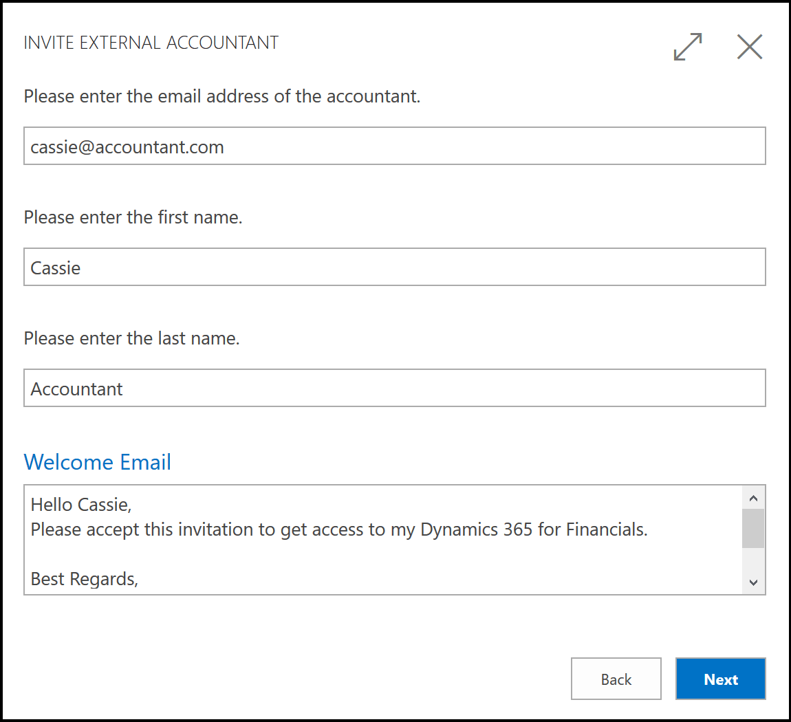

# Accountant Experiences in [!INCLUDE[d365fin_long](includes/d365fin_long_md.md)]
Any business must do its books and sign off on the accounting. Some businesses employ an external accountant, and others have an accountant on staff. No matter which type of accountant you are, you can use the **Accountant** Role Center as your Home in [!INCLUDE[d365fin](includes/d365fin_md.md)]. From here, you can access all pages that you need in your work.  

## Accountant Role Center
The Role Center is a dashboard with activity tiles that show you real-time key figures and give you quick access to data. In the ribbon at the top of the page, you have access to more actions, such as opening the most commonly used financial reports and statements in Excel. In the navigation bar at the top, you can quickly switch between the lists you use most often. Here, you will see other areas, such as **Posted Documents** with the various types of documents that the company has posted.  

If you are new to [!INCLUDE[d365fin](includes/d365fin_md.md)], you can launch a list of videos right from your Role Center. You can also launch a **Getting Started** tour that points out key areas.  

## Inviting Your External Accountant to Your [!INCLUDE[d365fin](includes/d365fin_md.md)]
If you use an external accountant to manage your books and financial reporting, your administrator can invite them to your [!INCLUDE[d365fin](includes/d365fin_md.md)] so they can work with you on your fiscal data. [!INCLUDE[d365fin](includes/d365fin_md.md)] includes three licenses of type External Accountant. For more information about licensing, see the [Microsoft Dynamics 365 Business Central Licencing Guide](https://go.microsoft.com/fwlink/?LinkId=871590).

Once your accountant has gained access to your [!INCLUDE[d365fin](includes/d365fin_md.md)], they can use the **Accountant** Role Center that gives easy access to the most relevant pages for their work.  

We have made it easy for you to invite your external accountant. Simply open the **Users** page, and then choose the **Invite External Accountant** action in the ribbon. An email is made ready for you, just add your accountant's work email, and send the invitation.  

> [!Note]  
> This requires that you have set up SMTP email. For more information, see [Set Up Email](admin-how-setup-email.md).   

<!-- -->

> [!IMPORTANT]  
> The accountant's email address must be a work address that is based on Azure Active Directory. If the accountant uses another type of email, then the invitation cannot be sent. 
> 
> This task requires access to managing users and licenses in Azure Active Directory, the user who sends this invitation must be assigned the **Global admin** role or **User admin** role in the Office 365 admin center. For more information, see [About admin roles](/office365/admin/add-users/about-admin-roles) in the Office 365 admin content.  

### Adding your accountant to your Office 365 via Azure Portal

If your administrator or reselling partner do not want to use the **Invite External Accountant** guide, they can add an external user in the Azure Portal and assign this user the External Accountant license. For more information, see [Quickstart: Add guest users to your directory in the Azure portal](/azure/active-directory/b2b/b2b-quickstart-add-guest-users-portal).

#### To add your accountant as a guest user

1. Open the [Azure portal](https://portal.azure.com/).
2. In the left pane, select **Azure Active Directory**.
3. Under **Manage**, select **Users**.
4. Select **New guest user**.
5. On the **New user** page, select **Invite user** and then add information about your external accountant.  

   Optionally, include a personal welcome message to the accountant to let them know that you are adding them to your [!INCLUDE [prodshort](includes/prodshort.md)].

6. Select **Invite** to automatically send the invitation. A notification appears in the upper right with the message **Successfully invited user**. 
7. After you send the invitation, the user account is automatically added to the directory as a guest.

Next, you must assign the new guest user a license to [!INCLUDE [prodshort](includes/prodshort.md)].

#### To give your accountant access to your [!INCLUDE [prodshort](includes/prodshort.md)]

1. In the Azure portal, on the newly added user, choose **Profile**, and then choose **Edit**
2. Update the **Usage Location** field to the relevant country, and then choose **Save**.
3. Choose **Licenses**, and then open **Assignments**.
4. Choose the **Dynamics 365 Business Central External Accountant** license.  

    If this license is not available, you must use an available **Dynamics 365 Business Central for IWs** license instead.
5. Save the assignment.

If successful, the license is assigned to the guest user, and the guest account is created.

### Importing the new user into [!INCLUDE [prodshort](includes/prodshort.md)]

The accountant will receive an email that notifies them that they have been given access to your Active Directory. Next, you must give them access to the right company in [!INCLUDE [prodshort](includes/prodshort.md)].

#### To add the accountant to the right company

1. Open the [!INCLUDE [prodshort](includes/prodshort.md)] company that you want to give the accountant access to at [https://businesscentral.dynamics.com](https://businesscentral.dynamics.com).
2. Choose the  icon, enter **Users**, and then chose the related link.  
3. Choose the **Get New Users from Office 365** action.

This imports the user account that you created in the Azure portal to the company. For more information, see [To add a user in Business Central](ui-how-users-permissions.md#adduser).  

If you want to give access to multiple companies, then you must log into each company and repeat this process. Alternatively, you can update the permission groups for the accountant's user profile in [!INCLUDE [prodshort](includes/prodshort.md)], such as assigning them the *D365 Bus Premium* user group. For more information, see [Assign Permissions to Users and Groups](ui-define-granular-permissions.md).  

## Accountant Hub

If you are an accountant with several clients, you can use [!INCLUDE[d365acc_long](includes/d365acc_long_md.md)] for a better overview of your clients. From there, you can access each client's tenant in [!INCLUDE[d365fin](includes/d365fin_md.md)] and use the Accountant Role Center as described above. For more information see [Welcome to [!INCLUDE[d365acc_long](includes/d365acc_long_md.md)]](/dynamics365/accountants/index).  

> [!NOTE]
> [!INCLUDE [d365acc_long_md](includes/d365acc_long_md.md)] is currently in public preview in a limited number of markets.

## See Also

[Finance](finance.md)  
[Setting Up Finance](finance-setup-finance.md)  
[The General Ledger and the Chart of Accounts](finance-general-ledger.md)  
[Closing Years and Periods](year-close-years-periods.md)  
[Working with Dimensions](finance-dimensions.md)  
[Analyzing Financial Statements in Excel](finance-analyze-excel.md)  
[Working with [!INCLUDE[d365fin](includes/d365fin_md.md)]](ui-work-product.md)  
[Setting Up Cash Flow Analysis](finance-setup-cash-flow-analyses.md)  
[Welcome to [!INCLUDE[d365acc_long](includes/d365acc_long_md.md)]](/dynamics365/accountants/index)  
[Dynamics 365 - Accountant Hub on Microsoft.com](https://www.microsoft.com/dynamics365/financial-insights-for-accountants)  
