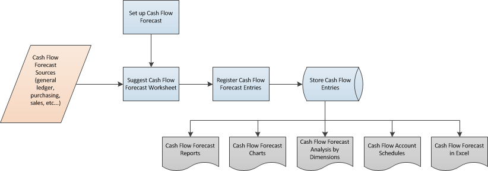

# Cash flow overview

Understanding cash inflows and outflows are the key to running a successful business. You can use cash flow to easily create a short-term forecast that predicts how and when you expect money to be received and paid out by your business. It's important to know that your business will have enough cash to pay creditors and expenses when they're due.

## Definition of cash flow

The term *cash flow* is used to designate cash receipts minus cash payments over a selected period. It's an estimate of the amount of money that you expect to flow in and out of your business, and it includes all your forecasted income and expenses.

## Work with cash flow

The following illustration shows an overview of how you can work with cash flow.

- You set up a cash flow forecast.  

- You get cash flow forecast sources from the following areas:  

  - General ledger – Information about the liquid funds and the budgeted revenues and expenses of your company.  
  - Purchasing – Information about the current payables and any forecasted debts from open purchase orders.  
  - Sales – Information about the current receivables and any forecasted receipts from open sales orders.  
  - Service – Information about open service orders.  
  - Fixed assets – Information about planned disposal and budgeted purchases of fixed assets.  
  - Manual revenues and expenses – Manage manual revenues and expenses and include them in the cash flow forecast.  
- You use a batch job to transfer information from the areas of general ledger, sales, purchasing, service, and fixed assets to the worksheet Then, you register worksheet lines to make a cash flow forecast.  
- You use various pages, reports, and charts to analyze and print a cash flow forecast that relates to availability and timeline overviews.  

## Making a cash flow forecast

Based on the registered worksheet lines, you can periodically make a cash flow forecast. The following layout is a frequently used layout for a cash flow forecast. The layout has three sections:

- Cash receipts  
- Cash disbursements  
- Net cash flow or cash-in-hand  

Cash receipts provide details of the income that the business receives.

*total cash receipts* = *receivables* + *open sales orders* + *open service orders* + *fixed assets disposals* + *manual revenues* + *budgeted revenues*

> [!NOTE]
> Manual revenues can be rental income, interest from financial assets, or new private capital. You can plan manual revenues for a period of time and use them in the calculation of cash flow forecast.

Cash disbursements provide details of the payments made by the business.

*total cash disbursements* = *payables* + *open purchase orders* + *fixed asset investment* + *manual expenses* + *budgeted expenses*

> [!NOTE]
> Manual expenses can be salaries, interest on credit, or private consumptions. You can plan manual expenses for a period of time and use them in the calculation of cash flow forecast.

Net cash flow or cash-in-hand is calculated as total receipts minus total disbursements at the end of each period.

*net cash flow* = *total cash receipts* – *total cash disbursements* + *liquid funds*

You can use the forecast as an internal management decision-making tool that helps you plan ahead and make important strategic decisions about the operation of the business.

## Related information

[Setting Up Cash Flow Analysis](finance-setup-cash-flow-analyses.md)  
[Analyze Cash Flow](finance-analyze-cash-flow.md)  
[Forecast your cash flow in Dynamics 365 Business Central](/training/modules/forecast-cash-flow-dynamics-365-business-central/index)  
[Set up cash flow forecasts using Azure AI in Dynamics 365 Business Central](/training/modules/setup-cash-flow-forecasts/)  

[!INCLUDE[footer-include](includes/footer-banner.md)]
