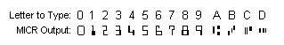
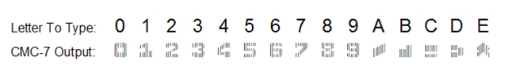

# Select a check layout

You can design your checks to conform with the standards set by the local authorities. Check images can be printed in English, French, or Spanish.

Checks are designed to print in both the United States and Canadian check image formats in either a check-stub-check format or a stub-stub-check format.

## To select a check layout

1. Choose the  icon, enter **Report Selections Bank Account**, and then choose the related link.
2. On the **Report Selection - Bank Acc.** page, in the **Usage** field, select **Check**.
3. Select one of the following report IDs.

| Report ID | Report Name | Description |
| --- | --- | --- |
| 1401 |Check |This report is the default report. |
| 10411 |Check (Stub/Stub/Check) |This report is designed to print checks in a stub/stub/check format. |
| 10412 |Check (Stub/Check/Stub) |This report is designed to print checks in a stub/check/stub format. |
| 10413 |Three Checks per Page |This report is designed to print three checks on each page. |

After you set up check layouts, you can print checks from the **Payment Journal** page. Learn more in [Work with Checks](payables-how-work-checks.md).

To change one of these default check layouts, use either the Word or the RDLC integration to do so. Learn more in [Create and Modify Custom Report Layouts](ui-how-create-custom-report-layout.md).

## Use MICR and security fonts

The online version of [!INCLUDE[prod_short](includes/prod_short.md)] contains preinstalled fonts on the servers that can be used when defining check layouts. The following outlines which fonts are available and have links to detailed information by the 3rd-party suppliers of the fonts.

> [!Important]
> MICR and check security fonts in [!INCLUDE[prod_short](includes/prod_short.md)] are licensed in a font package from IDAutomation.com, Inc. These products may only be used as part of and in connection with [!INCLUDE[prod_short](includes/prod_short.md)].

In update 15.3 and later, Magnetic Ink Character Recognition (MICR) fonts are installed and available to use. Both the E-13B and the CMC-7 standards are supported. Special security fonts are also available to generate text, names, amounts, and the currency symbols such as Dollar, Euro, Pound, and Yen, which are hard to tamper with once a check is printed.

> [!NOTE]
> - For security and legal reasons, you cannot upload custom fonts to the [!INCLUDE[prod_short](includes/prod_short.md)] online environment.
> - With [!INCLUDE[prod_short](includes/prod_short.md)] on-premises, the MICR and check security fonts from IDAutomation.com aren't available by default. You must purchase them from IDAutomation.com or another supplier. Once you have the fonts, install them on the computer that runs the [!INCLUDE[server](includes/server.md)]. As a minimum, install the fonts for the user that runs the [!INCLUDE[server](includes/server.md)] instance, that is, the service account. To install the fonts, follow the instructions from the font supplier or refer to [Add a Font](https://support.microsoft.com/en-us/office/add-a-font-b7c5f17c-4426-4b53-967f-455339c564c1).

### MICR E-13B specifications

The following illustration summarizes specifications for the MICR E-13B fonts that can be useful when calibrating fonts to be on check layouts with specific MICR printers.

### Delimiter characters

The full specification of MICR E-13B fonts can be found in the supplier's documentation here: (https://www.idautomation.com/micr-fonts/e13b/).

### MICR CMC-7 specifications

The following CMC-7 fonts are available in [!INCLUDE[prod_short](includes/prod_short.md)] online:

- IDAutomationCMC7
- IDAutomationCMC7n10
- IDAutomationCMC7n25
- IDAutomationCMC7n40

The following illustration summarizes specifications for the MICR CMC-7 fonts that can be useful when calibrating fonts to be on check layouts with specific MICR printers.

### Delimiter characters

The full specification of MICR CMC-7 fonts can be found in the supplier's documentation here: (http://www.idautomation.com/micr-fonts/cmc7/).

### Secure font specifications

The following illustration summarizes specifications for check security fonts that can be useful when calibrating fonts to be on check layouts with specific MICR printers.

The full specification of check security fonts can be found in the supplier's documentation here: (https://www.idautomation.com/security-fonts/).

Fonts for other purposes are also available in [!INCLUDE[prod_short](includes/prod_short.md)]. Learn more in [Available Fonts](ui-fonts.md)

## Related information

[Get started creating report layouts](ui-get-started-layouts.md)  
[Fonts in Business Central](ui-fonts.md)  
[Managing payables](payables-manage-payables.md)  
[Reconciling bank accounts](bank-manage-bank-accounts.md)  
[Completing period-end processes](year-how-complete-period-end-processes.md)  
[Work with Business Central](ui-work-product.md)  
[General business functionality](ui-across-business-areas.md)

[!INCLUDE[footer-include](includes/footer-banner.md)]
