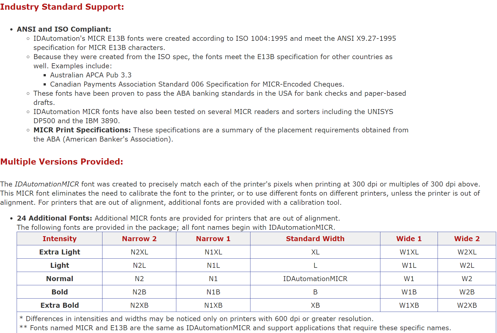
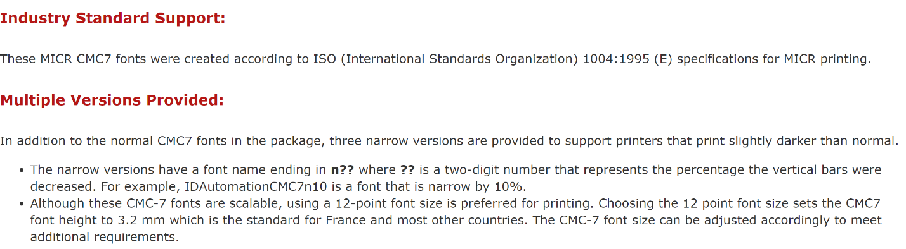
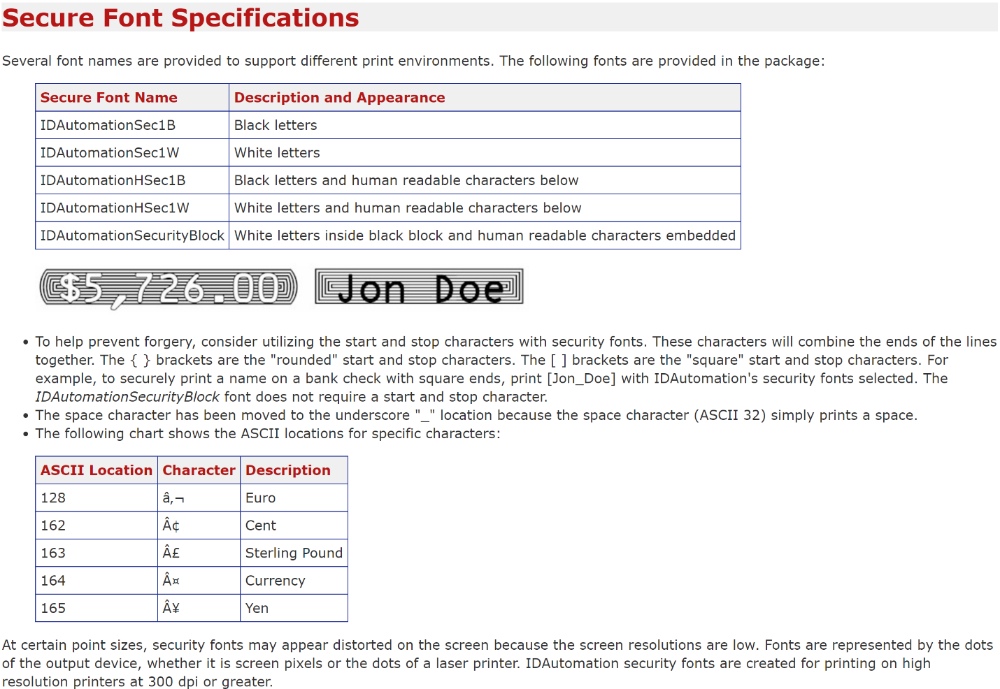

# Select a Check Layout
You can design your checks to conform with the standards set by the local authorities. Check images can be printed in English, French, or Spanish.

Checks are designed to print in both the United States and Canadian check image formats in either a check-stub-check format or a stub-stub-check format.

## To select a check layout
1. Choose the  icon, enter **Report Selections Bank Account**, and then choose the related link.
2. On the **Report Selection - Bank Acc.** page, in the **Usage** field, select **Check**.
3. Select one of the following report IDs.

| Report ID | Report Name | Description |
| --- | --- | --- |
| 1401 |Check |This is the default report. |
| 10411 |Check (Stub/Stub/Check) |This report is designed to print checks in a stub/stub/check format. |
| 10412 |Check (Stub/Check/Stub) |This report is designed to print checks in a stub/check/stub format. |
| 10413 |Three Checks per Page |This report is designed to print three checks on each page. |

When you have set up check layouts, you can print checks from the **Payment Journal** page. For more information, see [Work with Checks](payables-how-work-checks.md).

To change one of these default check layouts, use either the Word or the RDLC integration to do so. For more information, see [Create and Modify Custom Report Layouts](ui-how-create-custom-report-layout.md).

## Using MICR and Security Fonts
The online version of [!INCLUDE[d365fin](includes/d365fin_md.md)] contains pre-installed fonts on the servers that can be used when defining check layouts. The following outlines which fonts are available and has links to detailed information by the 3rd-party suppliers of the fonts.

> [!Important]
> MICR and check security fonts in Microsoft Dynamics [!INCLUDE[d365fin](includes/d365fin_md.md)] are licensed in a font package from IDAutomation.com, Inc. These products may only be used as part of and in connection with Microsoft Dynamics [!INCLUDE[d365fin](includes/d365fin_md.md)].

In update 15.3 and newer, Magnetic Ink Character Recognition (MICR) fonts are installed and available to use. Both the E-13B and the CMC-7 standards are supported. In addition to MICR fonts, special security fonts are available to generate text, names, amounts, and the currency symbols Dollar, Euro, Pound, and Yen, which are hard to tamper with once a check has been printed.

> [!NOTE]
> For security and legal reasons, you cannot upload custom fonts to the [!INCLUDE[d365fin](includes/d365fin_md.md)] environment.

### MICR E-13B Specifications
The following summarizes specifications for the MICR E-13B fonts that may be useful when calibrating fonts to be on check layouts with specific MICR printers.

The full specification of MICR E-13B fonts can be found in the supplier's documentation here: (https://www.idautomation.com/micr-fonts/e13b/).

### MICR CMC-7 Specifications
The following CMC-7 fonts are available in [!INCLUDE[d365fin](includes/d365fin_md.md)] online:

- IDAutomationCMC7
- IDAutomationCMC7n10
- IDAutomationCMC7n25
-	IDAutomationCMC7n40

The following summarizes specifications for the MICR CMC-7 fonts that may be useful when calibrating fonts to be on check layouts with specific MICR printers.

The full specification of MICR CMC-7 fonts can be found in the supplier's documentation here: (http://www.idautomation.com/micr-fonts/cmc7/).

### Secure Font Specifications
The following summarizes specifications for check security fonts that may be useful when calibrating fonts to be on check layouts with specific MICR printers.

The full specification of check security fonts can be found in the supplier's documentation here: (https://www.idautomation.com/security-fonts/).

Fonts for other purposes are also available in [!INCLUDE[prodshort](includes/prodshort.md)]. For more information, see [Available Fonts](ui-fonts.md)

## See Also
[Create and Modify Custom Report Layouts](ui-how-create-custom-report-layout.md)  
[Fonts in Business Central](ui-fonts.md)  
[Managing Payables](payables-manage-payables.md)  
[Reconciling Bank Accounts](bank-manage-bank-accounts.md)   
[Completing Period-End Processes](year-how-complete-period-end-processes.md)  
[Working with [!INCLUDE[prodshort](includes/prodshort.md)]](ui-work-product.md)  
[General Business Functionality](ui-across-business-areas.md)
