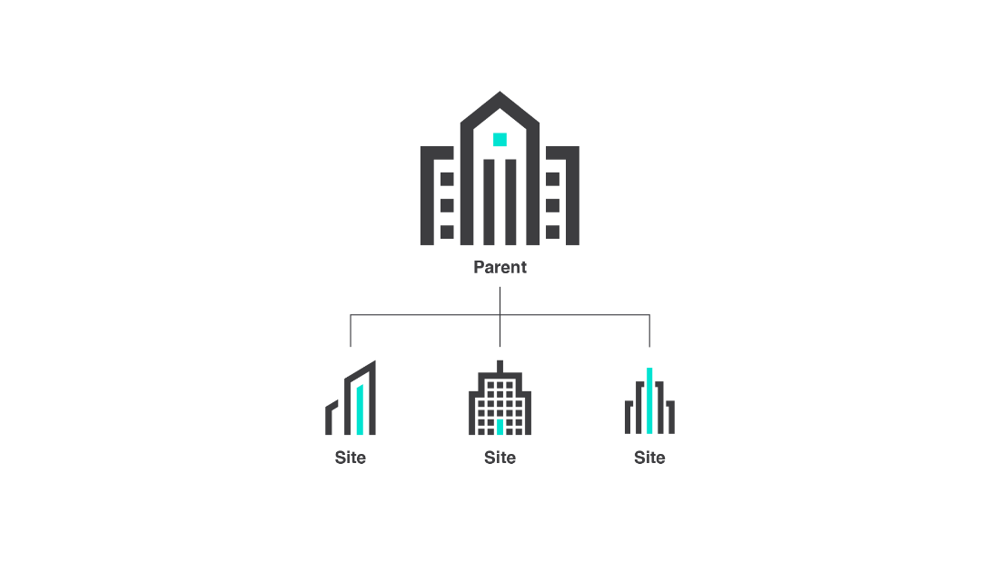
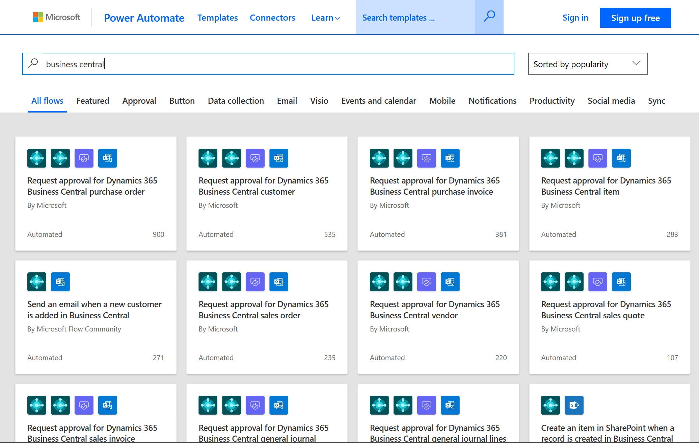

# Business Central for multi-site and international organizations

Organizations that have multiple sites often use a hub-and-spoke business model where a parent company, or headquarters, manages the overall operations of the business while each site functions as a single, standalone entity. Sites are often geographically distributed and have different needs for sharing information with the headquarter company. Additionally, sites typically don't need the same level of complexity, and often lack the resources to maintain a large system.

[!INCLUDE[prod_short](includes/prod_short.md)] gives small and mid-sized businesses a business management solution that's easy-to-use and maintain at a low cost of ownership.

This article introduces some of the ways in which [!INCLUDE[prod_short](includes/prod_short.md)] supports a hub-and-spoke business model.

## Integrating the headquarter company and the sites

[!INCLUDE[prod_short](includes/prod_short.md)] can integrate with the headquarter company's accounting system while meeting the varying needs of different sites, regardless of size, location, or type of business.

The following diagram is an example of different sites integrated with a headquarter company.

## Meet the Needs of Domestic and International Sites

Business needs at sites often differ based on industry, business methods, or their relationship to the headquarter company. [!INCLUDE[prod_short](includes/prod_short.md)] can be easily adapted and extended for various types of businesses and locales. Microsoft AppSource offers a wealth of apps from Microsoft and our partners, and partners can quickly deploy [!INCLUDE[prod_short](includes/prod_short.md)] with minimal disruption to daily operations.

For multi-national organizations, [!INCLUDE[prod_short](includes/prod_short.md)] supports local legal requirements and business practices.

* For online versions, there are more than [40 localized country/region versions](/dynamics365/business-central/dev-itpro/compliance/apptest-countries-and-translations?toc=/dynamics365/business-central/toc.json) that you can install as extensions from Microsoft AppSource.  
* For on-premises versions, [country/region versions](/azure/architecture/solution-ideas/articles/business-central) are available either as Microsoft-localized versions or partner-led add-on localizations.

A network of more than 4,000 Microsoft partners world-wide provides local expertise.

| **Business requirement** | **How Business Central supports it** | **Learn more** |
|-------------------------|-------------------------|-------------------------|
| Tailor the system to fit the business. | Enjoy a system that was designed from the start for mid-sized businesses. | [Overview]( https://www.microsoft.com/dynamics-365/products/business-central/) |
| Address regulatory and local practices. | Comply with local legal requirements and business practices. | [Local Functionality](about-localization.md) |
| Access multiple companies from a single page. | Get quick access to any Business Central company in your organization. | [Company Hub](ui-extensions-company-hub.md) |
| Handle multiple languages and currencies. | Support for multiple languages and currencies helps meet local needs. | [Multi-language capabilities](about-locale-language.md)  [Multi-currency capabilities](finance-how-setup-additional-currencies.md) |

## Consolidate financial data

A core facet of the hub-and-spoke business model is the ability for the headquarter company and sites to exchange financial data. This requirement must be met, even when the headquarter company and sites use different systems, accounting structures, languages, and currencies.

| **Business requirement** | **How Business Central supports it** | **Learn more** |
|-------------------------|-------------------------|-------------------------|
| Consolidate financial data from sites. | Consolidate financial statements for sites, regardless of whether they're running Business Central or another application, into a single business entity (company). | [Consolidating Financial Data from Multiple Companies](finance-consolidated-company-reporting.md) |
| Integrate accounting structures. | Transfer consolidation data from different accounting structures to your own. | [Importing Business Data from Other Finance Systems](across-import-data-configuration-packages.md)  [Prepare general ledger accounts for consolidation](finance-consolidated-company-reporting-setup.md#glacc) |
| Transact in multiple currencies. | Help ensure that financial statements in different currencies are accurate and use correct exchange rates. | [Update Currency Exchange Rates](finance-how-update-currencies.md) |

## Share Business Insight with Integrated Analytics

Align the organization with your business goals by providing a common understanding of the current reality. Integrated analytics can help people base their decisions on the same set of facts.

| **Business requirement** | **How Business Central supports it** | **Learn more** |
|-------------------------|-------------------------|-------------------------|
| Share insights with sites without extensive IT support. | Create KPIs and business intelligence dashboards in Power BI based on your data. | [Connect to Power BI from Business Central on-premises](across-working-with-business-central-in-powerbi.md) |
| Develop custom financial reports. | Generate parameter-based financial reports. | [Business Intelligence](bi.md) |
| Align on the facts. | Generate, view, and share reports with internal and external stakeholders. | [Financial Reports](finance-reports.md) |
| Analyze data in Excel. | Fact-find, troubleshoot, and do unplanned analyses in Microsoft Excel. | [Analyze Financial Statements in Excel](finance-analyze-excel.md) |

## Exchange Data Using APIs and XMLports

APIs and XMLports simplify the process of connecting instances of [!INCLUDE[prod_short](includes/prod_short.md)], including instances that are customized for each site.

| **Business requirement** | **How Business Central supports it** | **Learn more** |
|-------------------------|-------------------------|-------------------------|
| Connect customized versions among sites and the headquarter company. | API Pages can expose any representation of an entity, including its customizations. | [Enabling APIs for Business Central](/dynamics-nav/enabling-apis-for-dynamics-nav) |
| Versioning and security. | APIs use ODataV4, which provides versioning, and webhooks and change tracking. | [Security and protection](/dynamics365/business-central/dev-itpro/security/security-and-protection) |
| Post and import XML documents. | Codeunits can be exposed as unbound actions to support posting and ingestion of XML documents. For processing XML documents, XMLports can be applied. Unbound actions are also capable of generating an XML or JSON document. | [XMLport Objects](/dynamics365/business-central/dev-itpro/developer/devenv-xmlport-object) |
| Make maintenance easier through electronic data exchange. | An electronic data exchange solution can be added to serve as an integration layer between the headquarter company and sites. | [Data Exchange Framework](across-about-the-data-exchange-framework.md) |
| Exchange data between different systems. | Use XMLports to create XML documents, which can then be exchanged between a headquarter company that uses one system and sites that use [!INCLUDE [prod_short](includes/prod_short.md)]. | [XMLport Overview](/dynamics365/business-central/dev-itpro/developer/devenv-xmlport-overview) |
| Orchestrate complex data exchanges. | Use a combination of XMLports with [!INCLUDE [prod_short](includes/prod_short.md)] and Microsoft BizTalk Server to meet unique needs at your sites.   For complex needs, use an electronic data exchange solution based on BizTalk Server and Commerce Gateway in [!INCLUDE [prod_short](includes/prod_short.md)] in combination with the XMLports. | [Work with Reports, Batch Jobs, and XMLports](ui-work-report.md) |
| Connect to non-Microsoft solutions and services. | APIs establish a point-to-point connection between [!INCLUDE [prod_short](includes/prod_short.md)] and non-Microsoft solutions and services. | [API v2.0](/dynamics-nav/api-reference/v2.0/) |

## Promote an efficient intercompany supply chain

Sites often need access to the supply chain, and the ability to manage certain aspects of it. For example, sites might use the same vendor, but manage their assets and physical locations separately.

| **Business requirement** | **How Business Central supports it** | **Learn more** |
|-------------------------|-------------------------|-------------------------|
| Treat inter-divisional transactions as normal sales and purchase transactions. | Use inter-company postings to create sales and purchase documents and general ledger entries for entire workflows, and for more than one company at a time to eliminate duplicate data entry. | [Managing Inter-company Transactions](intercompany-manage.md) |
| Use paperless processes. | Avoid the cost of sending, receiving, and printing documents. | [Incoming Documents](across-income-documents.md)   [Manage Attachments, Links, and Notes on Cards and Documents](ui-how-add-link-to-record.md) |

## Respond Quickly to New Business Conditions

The headquarter company must be able to react quickly to business changes at each site. Combined with Power Automate, [!INCLUDE[prod_short](includes/prod_short.md)] can serve as an early warning mechanism.

| **Business requirement** | **How Business Central supports it** | **Learn more** |
|-------------------------|-------------------------|-------------------------|
| Automatically generate email alerts. | Set up alerts in Power Automate that generate emails to inform you of critical business conditions at sites or supply chain partners. | [Business Central and Power BI](admin-powerbi.md) |
| Use standard or custom alerts. | Use 12 different templates included for Business Central or set up your own alerts to suit your business. | [Use Business Central in an Automated Workflow](across-how-use-financials-data-source-flow.md) |

## Related information

[Administration of Business Central Online](/dynamics365/business-central/dev-itpro/administration/tenant-administration)  
[Work with [!INCLUDE[prod_short](includes/prod_short.md)]](ui-work-product.md)  

[!INCLUDE[footer-include](includes/footer-banner.md)]
