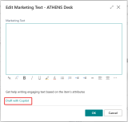

# Add marketing text to items

For any item registered in Business Central, you can write *marketing text* about the item. Although marketing text is a kind of description, it's different than an item's **Description** field. The **Description** field is typically used as a concise display name to quickly identify the product. The marketing text, on the other hand, is a more rich and descriptive text. Its purpose is to add marketing and promotional content, also known as *copy*. This text can then be published with the item if it's published on a web shop, like Shopify.

There are two ways to create the marketing text. The easiest way to get started is to use Copilot, which suggests AI-generated text for you. The other way is to start from scratch. 

## Create AI-generated marketing text (preview) with Copilot

[!INCLUDE[ai-preview](includes/ai-preview.md)]

With Copilot, you quickly get a text suggestion that's automatically generated for you. The AI-generated text is tailored to the item and provides a good starting point. The text is based in part on the following information:

- Attributes defined for the item—for example, the description, color, dimensions, material, and so on.
- Selectable style preferences like tone of voice, format, and length.

Copilot is designed to save you time and help you write creative and engaging text that reflects your brand and is consistent across your product line. Start by generating a suggestion, then change the suggested text as needed.

> [!NOTE]
> In the preview version of Business Central, AI-generated text is in English only.

### Prerequisites

- You're using a [preview version](ai-preview-getstarted.md) of Business Central that's enabled for Copilot. Enabling Copilot is done by an admin. For more information, go to [Configure AI-powered item marketing text with Copilot](enable-ai.md).
- The language you're using in Business Central must be English. Any of the available English locales will work, like English (United States), English (United Kingdom), or English (South Africa).

   To change the language, in the upper-right corner, select the **Settings** icon  > **My Settings** > **Language**. For more information, go to [Change Basic Settings](ui-change-basic-settings.md#language).
- Review the [Copilot FAQ](ai-faq.md) to learn more about AI-generated text suggestions from Copilot and how you should use them.

### Create first draft with Copilot

1. In Business Central, open the item that you want to modify. To open an item, do the following:

   1. In the upper-right corner, select the  icon, enter **Items**, and then choose the related link to show a list of available items.
   2. To open the item, double-click it or select its value in the **No.** column.

   For information on how to create an item, go to [Register new items](inventory-how-register-new-items.md).

2. From the item card, there are two ways to get started writing marketing text with Copilot:

   - Use the **Marketing Text** pane in the FactBox on the right side of the page, select **Draft with Copilot**.
   
      

   - At the top of the item card page, select the **Marketing Text** action, then select **Draft with Copilot** on the **Edit Marketing Text** window.
   
      

     From the **Create with Copilot** page, select **Create with Copilot** to get the first suggestion. You can then get more suggestions, try to improve the suggestions you get, edit text, and more. Go to [Review, edit, and save](#review-edit-and-save-text) for details.

   > [!TIP]
   > [Where does the suggestion come from?](ai-faq.md#how-does-copilot-work-where-does-the-suggested-text-come-from)

### Review, edit, and save text

Once you have the first draft, you must review it and make changes to the text to get it ready for publishing. This work is done from the **Create with Copilot** page. The current text is shown in the **Marketing Text** box. The page lets you get more suggestions, change preferences to influence the suggestions, and manually make changes and style the text.

> [!IMPORTANT]
> The AI-generated text from Copilot is only a suggestion and it can have mistakes. It requires human oversight and review to ensure it's accurate and appropriate. Review any suggested text and edit as needed before you save and publish it for public consumption.

Use the following guidelines to finalize and save the marketing text.

1. Make changes to text directly in the **Marketing Text** box. Use the tool bar along the bottom of the box to format and style text, add links, and more.
2. To get a new suggestion, select **Create draft**.
3. If you're not satisfied with the suggestions, enhance the text suggestions based on your preferences.

   Select **More Settings**, change the options that are shown under **Choose how Copilot creates suggestions**, then select **Create draft** to get a new suggestion.

   For guidelines on improving suggestions, go to the [Improve and tailor text suggestions](#improve-and-tailor-text-suggestions).

4. If you want to go back to previous suggestion, select **Undo**.
5. Carefully review the text for accuracy and appropriateness, then select **OK** to save it.

### Improve and tailor text suggestions

There are a few steps you can do to improve the text suggestions and tweak them to suit your personal or company's preferences.

1. Use the options at the top of the **Create with Copilot** page to influence the outcome of the AI-generated text: 

   |Option|Description|
   |-|-|
   |Attributes to include|Use this option to base the suggestions, in part, on the attributes assigned to the item. Choose the attributes that best align with the characteristics that you want to promote. The more relevant attributes you include, the richer the outcome will be. If you feel you're missing some key attributes, add more. For more information about attributes, go to [Work with item attributes](inventory-how-work-item-attributes.md) |
   |Emphasize a quality|Use this option to choose from a list of predefined qualities that you want to emphasize in the text. Choose a quality that best aligns with the type of item you're writing about. The qualities don't directly correspond to the item's attributes, description, or category. For example, **Quality** could be a good choice for both a bike or desk, while **Speed** would suit a bike, but not a desk.|
   |Tone of voice|Use this option to influence what kind of words, phrases, and punctuation are used to engage the target audience. You can choose from several predefined tones of voice, ranging from **Formal** (which results in a business tone) to **Creative** (which results in an informal tone). |
   |Format and length|Use this option to control the general structure of the text, which consists of three parts, covered by four different options: <ul><li>**Tagline** - A catchy phrase or short sentence that identifies the item or brand.</li><li>**Paragraph** - A single paragraph of fluent and verbose text, consisting of several complete sentences.</li><li>**Tagline + Paragraph** - A tagline followed by a paragraph</li><li>**Brief** - An introductory sentence, similar to a tagline, followed by a bulleted list of key points of interest.</li></ul> |

2. Improve the **Description** field on the item card.

   The text in the **Description** field will be used as-is in many places in the suggested text, so it's important that the description best portrays how you want the item referenced in the marketing text. 

3. Make sure the **Item Category Code** field on the item card is set to a proper category.

   Copilot will find words and phrases that are related to the category and work them into the suggested text.

## Create marketing text from scratch

1. In Business Central, open the item that you want to modify as follows:

    1. In the upper-right corner, select the  icon, enter **Items**, and then choose the related link  to show a list of available items.
    2. To open the item, double-click it or select its number in the  **No.** field.

2. Do one of the following:

   - In the **Marketing Text** pane of the FactBox on the right side of the page, select **Edit**.
   - Select the **Marketing Text** action.
3. Make changes to text directly in the **Marketing Text** box. Use the tool bar along the bottom of the box to format and style text, add links, and more.
4. Select **OK** when done to save the text.

## See also

[Overview of AI-powered item marketing text with Copilot](ai-overview.md)  
[Configure AI-powered item marketing text with Copilot](enable-ai.md)  
[AI-powered item marketing text with Copilot FAQ](ai-faq.md)  
[Register New Items](inventory-how-register-new-items.md)  
