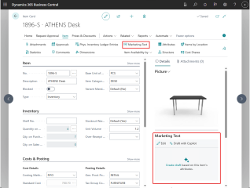
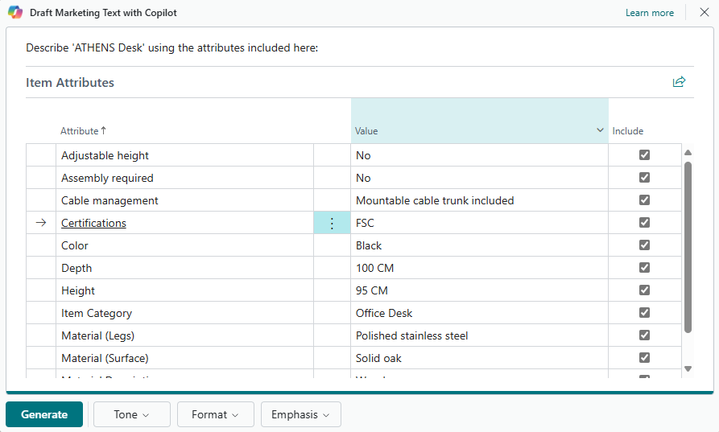
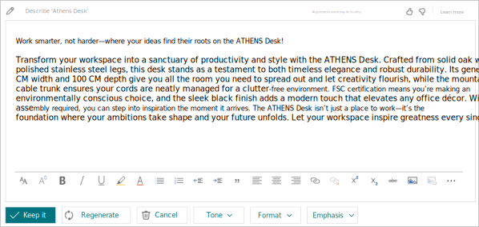

# Add marketing text to items

For any item registered in Business Central, you can write *marketing text* about the item. Although marketing text is a kind of description, it's different than an item's **Description** field. The **Description** field is typically used as a concise display name to quickly identify the product. The marketing text, on the other hand, is a more rich and descriptive text. Its purpose is to add marketing and promotional content, also known as *copy*. This text can then be published with the item if it's published on a web shop, like Shopify, or pasted into emails or other communications with your customers.

There are two ways to create the marketing text. The easiest way to get started is to use Copilot, which suggests AI-generated text for you. The other way is to start from scratch. 

## Get marketing text suggestions with Copilot

With Copilot, you quickly get a text suggestion that's automatically generated for you. The AI-generated text is tailored to the item and provides a good starting point. The text is based in part on the following information:

- Attributes defined for the item&mdash;for example, the description, color, dimensions, material, and so on. Learn more about item attributes in [Work with item attributes](inventory-how-work-item-attributes.md).
- The item’s **Description** field.
- The item category. [Learn more about categorizing items](inventory-how-categorize-items.md).
- Selectable style preferences like tone of voice, format, and length.

Copilot is designed to save you time and help you write creative and engaging text that reflects your brand and is consistent across your product line. Start by generating a suggestion, then change the suggested text as needed.

### Supported languages

[!INCLUDE[copilot-language-support](includes/copilot-language-support.md)]

### Prerequisites

- The **Marketing text suggestions** capability is activated by an administrator. Learn more in [Configure Copilot & agent capabilities](enable-ai.md).

### Create first draft with Copilot

Complete the following steps to add marketing text to an existing item. Learn how to create a new item in [Register new items](inventory-how-register-new-items.md).

1. In Business Central, open the item that you want to modify by completing the following steps:

   - In the upper-right corner, select the  icon, enter **Items**, and then choose the related link to show a list of available items.

   - Double-click the item or select its value in the **No.** column.

1. From the item card, there are two ways to get started writing marketing text with Copilot: from the **Marketing Text** FactBox or using the **Marketing text** action. These methods are indicated in the following figure of an item card.  

   

   To create the first draft for an item, do one of the following steps:

   - In the **Marketing Text** pane in the FactBox on the right side of the page, select **Draft with Copilot**. 

     Copilot starts to draft the marketing text.

   - At the top of the page, select the **Marketing Text** action, then select **Draft with Copilot** on the **Edit Marketing Text** window.  The **Draft Marketing Text with Copilot** windows appears and lists all available attributes for the item.
1. Select the attributes you want Copilot base suggestions on, then select **Generate**. You can change the selected attributes and other options later. Copilot starts to draft the marketing text. 

   

1. When Copilot completes the draft, the text appears in the Copilot editor window for you to review and edit.

   

   You can now get more suggestions, try to improve the suggestions you get, edit text, and more. Go to [Review, edit, and save](#review-edit-and-save-text) for details.

### Review, edit, and save text

Once you have the first draft, you must review it and make changes to the text to get it ready for publishing. This work is done from the Copilot editor, which lets you get more suggestions, change preferences to influence the suggestions, and manually make changes and style the text.

> [!IMPORTANT]
> The AI-generated text from Copilot is only a suggestion and it can have mistakes. It requires human oversight and review to ensure it's accurate and appropriate. Review any suggested text and edit as needed before you save and publish it for public consumption.

Use the following guidelines to finalize and save the marketing text.

1. Make changes to text directly in the text box. Use the tool bar along the bottom of the box to format and style text, add links, and more.
1. To get a new suggestion, select **Regenerate**.
1. If you're not satisfied with the suggestions, enhance the text suggestions using the **Tone**, **Format**, and **Emphasis** preference options.

   <!--Select **More Settings**, change the options that are shown under **Choose how Copilot creates suggestions**, then select **Create draft** to get a new suggestion.-->

   For guidelines on improving suggestions, go to the [Improve and tailor text suggestions](#improve-and-tailor-text-suggestions).

1. To go back and forth through suggestions, use the previous and next links at the top of the page (*x* **of** *y*). <!-- or select the **...** (More formatting options) along the bottom of the window, then select **Undo**. Select **Redo** to go back.-->
1. Carefully review the text for accuracy and appropriateness:

   - If you want to save the text, select **Keep it**. 
   - If you don't want to save, select the discard button (trash can) .

### Improve and tailor text suggestions

There are a few steps you can do to improve the text suggestions and tweak them to suit your personal or company's preferences.

1. Change the item attributes used by Copilot.

   Copilot suggestions are based, in part, on the attributes assigned to the item. To view the available attributes and current settings, select the edit  icon in the upper-left corner. In the **Item Attributes** page, choose the attributes that best align with the characteristics that you want to promote. The more relevant attributes you include, the richer the outcome becomes. If you feel you're missing some key attributes, add more. For more information about attributes, go to [Work with item attributes](inventory-how-work-item-attributes.md)
1. Change your preference settings for  **Tone**, **Format**, and **Emphasis** options.

   |Option|Description|
   |-|-|
   |Tone |Use this option to influence what kind of words, phrases, and punctuation are used to engage the target audience. You can choose from several predefined tones of voice, ranging from **Formal** (which results in a business tone) to **Creative** (which results in an informal tone). |
   |Format and length|Use this option to control the general structure of the text, which consists of three parts, covered by four different options: <ul><li>**Tagline** - A catchy phrase or short sentence that identifies the item or brand.</li><li>**Paragraph** - A single paragraph of fluent and verbose text, consisting of several complete sentences.</li><li>**Tagline + Paragraph** - A tagline followed by a paragraph</li><li>**Brief** - An introductory sentence, similar to a tagline, followed by a bulleted list of key points of interest.</li></ul> |
   |Emphasis|Use this option to choose from a list of predefined qualities that you want to emphasize in the text. Choose a quality that best aligns with the type of item you're writing about. The qualities don't directly correspond to the item's attributes, description, or category. For example, **Quality** could be a good choice for both a bike or desk, while **Speed** would suit a bike, but not a desk.|

1. Improve the **Description** field on the item card.

   The text in the **Description** field is used as-is in many places in the suggested text, so it's important that the description best portrays how you want the item referenced in the marketing text. 

1. Make sure the **Item Category Code** field on the item card is set to a proper category.

   Copilot finds words and phrases that are related to the category and work them into the suggested text.

### Working with multiple languages 

Text is always generated in the language defined by your user [settings](ui-change-basic-settings.md#language). If your organization operates and enters data into Business Central using a different language, or if Business Central is connected to your online store such as with Shopify, this might result in publishing content that doesn't match similar marketing content.

## Create text from scratch

1. In Business Central, open the item that you want to modify as follows:

    1. In the upper-right corner, select the  icon, enter **Items**, and then choose the related link to show a list of available items.
    1. To open the item, double-click it or select its number in the  **No.** field.

1. Do one of the following steps:

   - In the **Marketing Text** pane of the FactBox on the right side of the page, select **Edit**.
   - Select the **Marketing Text** action.
1. Make changes to text directly in the **Marketing Text** box. Use the tool bar along the bottom of the box to format and style text, add links, and more.
1. Select **OK** when done to save the text.

## Related information

[Marketing text suggestions overview](ai-overview.md)  
[Troubleshoot Copilot and agent capabilities](ai-copilot-troubleshooting.md)  
[FAQ for marketing text suggestions](faqs-marketing-text.md)  
[Configure Copilot and agent capabilities](enable-ai.md)  
[Register new items](inventory-how-register-new-items.md)  
