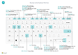
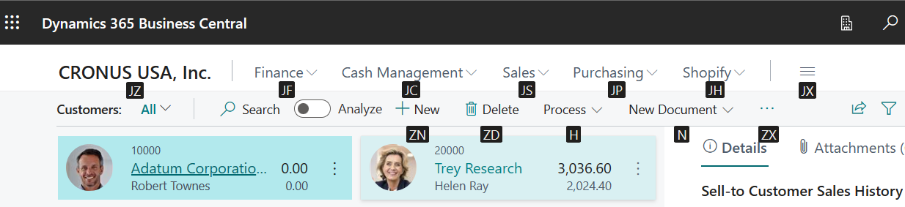

# Keyboard shortcuts

This article provides an overview of key combinations (keyboard shortcuts) that you can use when you work with [!INCLUDE[prod_short](includes/prod_short.md)].

You can find an overview of the most popular keyboard shortcuts in [Keyboard shortcuts (PC only)](keyboard-shortcuts-cheatsheet.md).

> [!TIP]
> For a graphical view of the most-used keyboard shortcuts, select the following image, and download the PDF file.
>
> 

## Overview of keyboard shortcuts

Keyboard shortcuts aid accessibility and can make it easier and more efficient to navigate to different areas and elements on a page. Most web browsers support these shortcuts. However, the behavior might vary slightly.

> [!NOTE]
> The keyboard shortcuts that this article describes refer to the English (United States) keyboard layout. The layout of keys on other keyboards doesn't correspond exactly to the layout on a United States English keyboard.

Most of the keyboard shortcuts are the same, regardless of whether the operating system is Windows or macOS. However, some shortcuts differ for macOS. These shortcuts are enclosed in parentheses in the following sections.

> [!NOTE]
> [!INCLUDE [prod_short](includes/prod_short.md)] supports only a single character set for data. Therefore, some characters might not be supported in your environment, and you might experience issues if you try to retrieve data that was entered by using a different character set. For example, if your environment supports only English and Russian characters, data might not be stored correctly if you enter it in a language that uses different characters. This issue can also apply to keyboard shortcuts. You should contact your system administrator to ensure that you know which languages your instance of [!INCLUDE [prod_short](includes/prod_short.md)] supports.
>
> In addition to the global keyboard shortcuts that this article describes, some business-specific shortcuts are available. For example, in the generic version of [!INCLUDE[prod_short](includes/prod_short.md)], the <kbd>F9</kbd> key posts a document, and <kbd>Ctrl</kbd>+<kbd>F7</kbd> shows the ledger entries for a record when you open the record in a card. This article includes some of the more common business-specific shortcuts. Be aware that the shortcuts might differ in your solution. In the user interface, the tooltip for an action shows the keyboard shortcut to use.

## General keyboard shortcuts

The following table describes the keyboard shortcuts for navigating and accessing different elements of a page. Elements include things like actions, dropdown lists, and lookups. Learn about the shortcuts for navigating records when you're inside a list in the [Keyboard shortcuts in lists](#lists) section.

| Select these keys (these keys in macOS) | To do this |
|---|---|
| <kbd>Alt</kbd> | Show access keys for selecting actions in the action bar and on the navigation menu of the page. Learn more in the [Access keys for action bar and navigation menu](#access-keys-for-action-bar-and-navigation-menu) section. |
| <kbd>Alt</kbd>+<kbd>Down arrow</kbd> | Open a dropdown list or look up a value for a field. |
|<kbd>Ctrl</kbd>+<kbd>Alt</kbd><kbd>Down Arrow</kbd>|Open a related record's card or list page filtered to the value in the lookup or assist edit field|
| <kbd>Ctrl</kbd>+<kbd>Option</kbd>+<kbd>Down arrow</kbd> | Open a related record's card or list page, which is filtered to the value in the lookup or assist-edit field. |
| <kbd>Alt</kbd>+<kbd>Up arrow</kbd> | Show the tooltip for a field or a column header of a table. If the field has validation errors, select <kbd>Alt</kbd>+<kbd>Up arrow</kbd> to show the validation error. Select the <kbd>Esc</kbd> key or <kbd>Alt</kbd>+<kbd>Up arrow</kbd> to close the tooltip. |
| <kbd>F2</kbd> | Switch between selecting the entire field value and placing the cursor at the end of the field value. |
| <kbd>Alt</kbd>+<kbd>F2</kbd> | Show and hide the FactBox pane. |
| <kbd>Alt</kbd>+<kbd>Shift</kbd>+<kbd>F2</kbd> | Switch between **Details** and **Attachments** in the FactBox pane. |
| <kbd>Alt</kbd>+<kbd>O</kbd> | Add a new note for the selected record, even if the FactBox pane isn't open. |
| <kbd>Alt</kbd>+<kbd>Q</kbd> (<kbd>Ctrl</kbd>+<kbd>Option</kbd>+<kbd>Q</kbd>) | Open the **Tell Me** window. Learn more in [Finding pages and information with Tell Me](ui-search.md). |
| <kbd>Ctrl</kbd>+<kbd>Alt</kbd>+<kbd>Q</kbd> (<kbd>Ctrl</kbd>+<kbd>Option</kbd>+<kbd>Cmd</kbd>+<kbd>Q</kbd>) | Open the **Find Entries** page, so that you can look for documents and entries that are related to each other, based on common information like the document number or posting date. Learn more in [Finding Related Entries for Documents](ui-find-entries.md). |
| <kbd>Alt</kbd>+<kbd>N</kbd> | Open a page where you can create a new record. (The effect is similar to the effect of selecting the **New** or **+** action.) |
| <kbd>Alt</kbd>+<kbd>Shift</kbd>+<kbd>N</kbd> | Close a newly created page, and then open a new one where you can create a new record. The effect of <kbd>Alt</kbd>+<kbd>F9</kbd> is similar. It posts a document and creates a new one. |
| <kbd>Alt</kbd>+<kbd>T</kbd> | Open the **My Settings** page. |
| <kbd>Alt</kbd>+<kbd>Right arrow</kbd> | Look up additional information or underlying values for a field that contains the  button. This keyboard shortcut is used when the usual dropdown button (<kbd>Alt</kbd>+<kbd>Down arrow</kbd>) in the same field is used for another purpose. |
| <kbd>Ctrl</kbd>+<kbd>Alt</kbd>+<kbd>Shift</kbd>+<kbd>C</kbd> | Show information in the company badge. As of the Business Central 2022 release wave 2 (version 21), this keyboard shortcut is no longer supported. Its replacement is <kbd>Ctrl</kbd>+<kbd>O</kbd>. |
| <kbd>Ctrl</kbd>+<kbd>Alt</kbd>+<kbd>F1</kbd> | Open and close the page inspection pane. The page inspection pane shows information about the page, such as its source table, fields, filters, and extensions. Learn more in [Inspecting pages in Business Central](across-inspect-page.md). |
| <kbd>Ctrl</kbd>+<kbd>C</kbd> | Copy the value of a field. If the field is in focus, and specific text in the field isn't selected, the entire value is copied. If any text in the field is selected, only that text is copied. |
| <kbd>Ctrl</kbd>+<kbd>F1</kbd> | Open either the [help pane](product-help-and-support.md#help-pane) or a Business Central help article on [Microsoft Learn](/dynamics365/business-central/), depending on your Business Central version. |
| <kbd>Ctrl</kbd>+<kbd>F12</kbd> | Switch between wide and narrow layout views. |
| <kbd>Ctrl</kbd>+<kbd>F5</kbd> | Reload the [!INCLUDE[prod_short](includes/prod_short.md)] application. (The effect is similar to the effect of selecting the **Refresh** or **Reload** button in the browser.)|
| <kbd>Ctrl</kbd>+select | Navigate during personalization or customization when the action is highlighted with an arrowhead. Learn more in [Personalize your workspace](ui-personalization-user.md). |
| <kbd>Ctrl</kbd>+<kbd>Shift</kbd>+<kbd>F1</kbd> | Open the **Help & Support** page. Learn more in [Help & Support page](product-help-and-support.md#help--support-page). |
| <kbd>F5</kbd> | Update the data on the current page. Use this keyboard shortcut to ensure that the data on the page is updated with any changes that other users make while you're working. |
| <kbd>Ctrl</kbd>+<kbd>O</kbd> | Open the **Available Companies** pane, where can use to switch to another company or environment. Learn more in [Switching to Another Company or Environment](ui-organization-switch.md). |
| <kbd>Enter</kbd> | Enable or access the element or control that is in focus. |
| <kbd>Esc</kbd> | Close the current page or dropdown list. |
| <kbd>Tab</kbd> | Move focus to the next control or element on a page, such as an action, button, field, or list heading. |
| <kbd>Shift</kbd>+<kbd>Tab</kbd> | Move focus to the previous control or element on a page, such as an action, button, field, or list heading. |
| <kbd>Y</kbd> and <kbd>N</kbd> | 
Activate the **Yes** and **No** buttons in dialog boxes.

**Note:** The actual keys vary, depending on your current language. You specify your language on the **My Settings** page. For example, if your current language is German, you select <kbd>J</kbd> to activate the **Ja** ("Yes") button and <kbd>N</kbd> to activate the **Nein** ("No") button. |

## Keyboard shortcuts in lists

The following table describes the keyboard shortcuts that you can use on a list page. The shortcut actions vary slightly, depending on whether the page is shown in the list view or the tile view.

### General

| Select these keys (these keys in macOS) | To do this in a list view | To do this in a tile view |
|---|---|---|
| <kbd>Alt</kbd>+<kbd>F7</kbd> | Sort the selected column in ascending or descending order. | Not applicable. |
| <kbd>Alt</kbd>+<kbd>N</kbd> | Insert a new line into an editable list, such as the list on the **G/L Budgets** page. | The same. |
| <kbd>Shift</kbd>+<kbd>F9</kbd> | Post and print a document. | The same. |
| <kbd>Shift</kbd>+<kbd>F10</kbd> | Open a menu of options that are available for the selected row. | The same. |
| <kbd>Alt</kbd>+<kbd>D</kbd> | Open the dimension set entries. | The same. |
| <kbd>Ctrl</kbd>+<kbd>F7</kbd> | Open ledger entries, log entries, cost entries, and other types of entries. | |
| <kbd>Ctrl</kbd>+<kbd>F9</kbd> | Release a document. | The same. |
| <kbd>F7</kbd> | Open statistics. | The same. |
| <kbd>F9</kbd> | Post, issue, register, or reverse a document. | The same. |
| <kbd>Shift</kbd>+<kbd>Ctrl</kbd>+<kbd>F</kbd> | Send suggested lines on the **Cash Flow Worksheet** page. | Not applicable. |
| <kbd>Shift</kbd>+<kbd>Ctrl</kbd>+<kbd>I</kbd> | View serial and lot numbers that are assigned to the line item in the document or journal. | Not applicable. |

### Navigate between rows and columns

Many page types in [!INCLUDE[prod_short](includes/prod_short.md)] contain grids that consist of rows and columns. Examples include list pages and **Lines** parts in documents. Movement from one cell to another in a grid is fully keyboard-enabled.

| Select these keys (these keys in macOS) | To do this in a list view | To do this in a tile view |
|---|---|---|
| <kbd>Ctrl</kbd>+<kbd>Home</kbd> (<kbd>Fn</kbd>+<kbd>Ctrl</kbd>+<kbd>Left arrow</kbd>) | Select the first row in the list. The focus remains in the same column. | Move to the first tile in the first row. |
| <kbd>Ctrl</kbd>+<kbd>End</kbd> (<kbd>Fn</kbd>+<kbd>Ctrl</kbd>+<kbd>Right arrow</kbd>) | Select the last row in the list. The focus remains in the same column. | Move to the last tile in the last row. |
| <kbd>Home</kbd> (<kbd>Fn</kbd>+<kbd>Left arrow</kbd>) | Move to the first field in the row. | Move to the first tile in the row. |
| <kbd>End</kbd> (<kbd>Fn</kbd>+<kbd>Right arrow</kbd>) | Move to the last field in the row. | Move to the last tile in the row. |
| <kbd>Enter</kbd> | 
Open the record that is associated with the field.

This keyboard shortcut is relevant only if a card page is associated with the record.
 | 
Open the record.

This keyboard shortcut is relevant only if a card page is associated with the record.
 |
| <kbd>Ctrl</kbd>+<kbd>Enter</kbd> | Move focus to the next element outside the list. | The same. |
| <kbd>Page up</kbd> (<kbd>Fn</kbd>+<kbd>Up arrow</kbd>) | Scroll to show the set of rows above the rows that are currently in view. | Scroll to show the set of tiles above the tiles that are currently in view. |
| <kbd>Page down</kbd> (<kbd>Fn</kbd>+<kbd>Down arrow</kbd>) | Scroll to show the set of rows below the rows that are currently in view. | Scroll to show the set of tiles below the tiles that are currently in view. |
| <kbd>Down arrow</kbd> | Move to the field that is one row down within the same column. | Move to the tile that is one row down within the same column. |
| <kbd>Up arrow</kbd> | Move to the field that is one row up within the same column. | Move to the tile that is one row up within the same column. |
| <kbd>Right arrow</kbd> | 
In a view-only list, move to the field that is one column to the right within the same row.

In an editable list, move to the right within the current field.
 | Move to the tile that is one column to the right within the same row. |
| <kbd>Left arrow</kbd> | 
In a view-only list, move to the field that is one column to the left within the same row.

In an editable list, move to the left within the current field.
 | Move to the tile that is one column to the left within the same row. |
| <kbd>Tab</kbd> | In an editable list, move to the field that is one column to the right within the same row. | Not applicable. | 
| <kbd>Shift</kbd>+<kbd>Tab</kbd> | In an editable list, move to the field that is one column to the left within the same row. | Not applicable. |

### Select, copy, and paste

| Select these keys (these keys in macOS) | To do this in a list view | To do this in a tile view |
|---|---|---|
| <kbd>Ctrl</kbd>+select (<kbd>Cmd</kbd>+select) | Extend the selection of rows to include the row that you select. | Not applicable. |
| <kbd>Shift</kbd>+select | 
Extend the selection of rows to include the row that you select and all the rows in between.

You can use this keyboard shortcut after you use <kbd>Ctrl</kbd>+<kbd>Up arrow</kbd> or <kbd>Ctrl</kbd>+<kbd>Down arrow</kbd> to extend your selection.
 | Not applicable. |
| <kbd>Ctrl</kbd>+<kbd>Up arrow</kbd> (<kbd>Ctrl</kbd>+<kbd>Cmd</kbd>+<kbd>Up arrow</kbd>) | Move focus to the previous row, but keep the current row selected. | Not applicable. |
| <kbd>Ctrl</kbd>+<kbd>Down arrow</kbd> (<kbd>Ctrl</kbd>+<kbd>Cmd</kbd>+<kbd>Down arrow</kbd>) | Move focus to the next row, but keep the current row selected. | Not applicable. |
| <kbd>Ctrl</kbd>+<kbd>Spacebar</kbd> (<kbd>Ctrl</kbd>+<kbd>Cmd</kbd>+<kbd>Space</kbd>) | 
Extend the selection of rows to include the row that has focus.

You can use this keyboard shortcut after you use <kbd>Ctrl</kbd>+<kbd>Up arrow</kbd> or <kbd>Ctrl</kbd>+<kbd>Down arrow</kbd> to extend your selection.
 | Not applicable. |
| <kbd>Ctrl</kbd>+<kbd>A</kbd> | Select all rows. | Not applicable. |
| <kbd>Ctrl</kbd>+<kbd>C</kbd> (<kbd>Cmd</kbd>+<kbd>C</kbd>) | Copy the selected rows to the clipboard. | Copy a single selected tile to the clipboard. |
| <kbd>Ctrl</kbd>+<kbd>V</kbd> (<kbd>Cmd</kbd>+<kbd>V</kbd>) | 
Paste the selected rows from the clipboard into the current page or external document, such as an Excel file or Outlook email.

You can use this keyboard shortcut only for editable lists.
 | Not applicable. |
| <kbd>Shift</kbd>+<kbd>Up arrow</kbd> | Extend the selection of rows to include the previous row. | Not applicable. |
| <kbd>Shift</kbd>+<kbd>Down arrow</kbd> | Extend the selection of rows to include the next row. | Not applicable. |
| <kbd>Shift</kbd>+<kbd>Page up</kbd> (<kbd>Shift</kbd>+<kbd>Fn</kbd>+<kbd>Up arrow</kbd>) | Extend the selection of rows to include all visible rows above the current selection of rows. | Not applicable. |
| <kbd>Shift</kbd>+<kbd>Page down</kbd> (<kbd>Shift</kbd>+<kbd>Fn</kbd>+<kbd>Down arrow</kbd>) | Extend the selection of rows to include all visible rows below the current selection of rows. | Not applicable. |
| <kbd>F8</kbd> | 
Copy the field that is one row up within the same column, and paste it into the current row.
You can use this keyboard shortcut only in editable lists.

By using this keyboard shortcut and then selecting the <kbd>Tab</kbd> key, you can quickly fill in the fields for line items that you want to have the same values as the previous row.
 | Not applicable. |

### Search and filter lists

| Select these keys (these keys in macOS) | To do this |
|---|---|
| <kbd>F3</kbd> | 
Toggle the search field.
<ul><li>If the search isn't already activated, activate it so that you can start to enter your search text.</li><li>If the search box is already activated, return to the list without clearing the search text.</li><ul> |
| <kbd>Shift</kbd>+<kbd>F3</kbd> | 
Open and close the filter pane.
<ul><li>If the filter pane isn't already open, open it, and move focus to the **+&nbsp;Filter** action under **Filter list by**. You can then start to add a field filter just by selecting the <kbd>Enter</kbd> key.</li><li>If the filter pane is already open, close it, but don't clear any filters that you added.</li></ul> |
| <kbd>Ctrl</kbd>+<kbd>Shift</kbd>+<kbd>F3</kbd> | 
Open and close the filter pane.
<ul><li>If the filter pane isn't already open, open it, and move focus to the **+&nbsp;Filter** action under **Filter total by**. You can then start to add a totals filter just by selecting the <kbd>Enter</kbd> key.</li><li>If the filter pane is already open, close it, but don't clear any filters that you added.</li></ul> |
| <kbd>Alt</kbd>+<kbd>F3</kbd> | 
Toggle filtering to the selected value.
<ul><li>If the column isn't already filtered, apply a column filter on the selected field value in the list. In this case, the keyboard shortcut has the same effect as selecting **Filter to this value** for a column heading. It opens the filter pane and sets the filter to the selected value, but focus remains on the cell in the list.</li><li>If the column is already filtered, clear the filter on it.</li></ul> |
| <kbd>Shift</kbd>+<kbd>Alt</kbd>+<kbd>F3</kbd> | 
Open the filter pane, and add a filter on the selected column in the list. Focus is moved to the new filter field so that you can immediately start to enter the filter criteria.

This keyboard shortcut has the same effect as selecting **Filter** for the column heading.

If there's already a filter on the field, a new filter is added.
 |
| <kbd>Ctrl</kbd>+<kbd>Shift</kbd>+<kbd>Alt</kbd>+<kbd>F3</kbd> | 
Reset filters. This keyboard shortcut has the same effect as selecting **Reset filters** in the filter pane. It applies to field and totals filters.

Filters return to the default filters for the current view. If the current view is **All**, a filter reset is equivalent to returning to an unfiltered view that shows all records.
 |
| <kbd>Ctrl</kbd>+<kbd>Enter</kbd> | Move focus from the filter pane back to the list. |

## Keyboard shortcuts in cards and documents

The following keyboard shortcuts are available on card pages, such as **Customer Card**, and document pages, such as **Sales Order**. They're used to show and modify records.

| Select these keys (these keys in macOS) | To do this |
|---|---|
| <kbd>Alt</kbd>+<kbd>D</kbd> | Open the dimension set entries. |
| <kbd>Alt</kbd>+<kbd>F6</kbd> | Collapse or expand the current FastTab or part (subpage). |
| <kbd>Alt</kbd>+<kbd>F9</kbd> | Create a new document, and post it. |
| <kbd>Alt</kbd>+<kbd>I</kbd> | en the **Find Entries** page, so that you can look for entries that are related to the posted document. This keyboard shortcut also works for lists. |
| <kbd>Alt</kbd>+<kbd>G</kbd> | Open the **Find Entries** page, so that you can look for entries that are related to the posted document. This keyboard shortcut also works for lists. |
| <kbd>Alt</kbd>+<kbd>N</kbd> | Open a page where you can create a new record. This keyboard shortcut has the same effect as selecting the **New** action. |
| <kbd>Alt</kbd>+<kbd>Shift</kbd>+<kbd>N</kbd> | Close a page, and then open a new one where you can create a new record. This keyboard shortcut has the same effect as selecting the **OK & New** action. |
| <kbd>Alt</kbd>+<kbd>Shift</kbd>+<kbd>W</kbd> | Open the current card or document in a new window. Learn more in [Multitasking Across Multiple Pages](ui-enter-data.md#multitasking-across-multiple-pages). |
| <kbd>Ctrl</kbd>+<kbd>Enter</kbd> | Save and close the page. |
| <kbd>Ctrl</kbd>+<kbd>Down arrow</kbd> | Open the next record for an entity. |
| <kbd>Ctrl</kbd>+<kbd>Up arrow</kbd> | Open the previous record for an entity. |
| <kbd>Ctrl</kbd>+<kbd>Insert</kbd> | Insert a new line in documents. |
| <kbd>Ctrl</kbd>+<kbd>Delete</kbd> | Delete the line in documents, journals, and worksheets. |
| <kbd>Ctrl</kbd>+<kbd>F7</kbd> | Open ledger entries, log entries, cost entries, and other types of entries. |
| <kbd>Ctrl</kbd>+<kbd>F9</kbd> | Release a document. |
| <kbd>Ctrl</kbd>+<kbd>Shift</kbd>+<kbd>F12</kbd> | Maximize the line items part on a document page. Select this keyboard shortcut again to return to the normal display. Learn more in [Focusing on Line Items](ui-enter-data.md#Focus). |
| <kbd>F6</kbd> | Move to the next FastTab or part (subpage). |
| <kbd>F7</kbd> | Open statistics. |
| <kbd>F9</kbd> | Post, issue, register, or reverse a document. |
| <kbd>Shift</kbd>+<kbd>Ctrl</kbd>+<kbd>F9</kbd> | Post, print, and put away a warehouse receipt. |
| <kbd>Shift</kbd>+<kbd>F6</kbd> | Move to the previous FastTab or part (subpage). |
| <kbd>Shift</kbd>+<kbd>F9</kbd> | Post and print a document. |
| <kbd>Shift</kbd>+<kbd>F11</kbd> | Apply entries, get source documents, or get warehouse documents. |

## Keyboard shortcuts to autofill fields with Copilot (preview)

[!INCLUDE [preview-banner](~/../shared-content/shared/preview-includes/preview-banner.md)]

[!INCLUDE [preview-note](~/../shared-content/shared/preview-includes/preview-note-d365.md)]

<!--[!INCLUDE [preview-note](~/../shared-content/shared/preview-includes/production-ready-preview-dynamics365.md)]-->

These shortcuts apply to fields on card and document pages when the Autofill fields with Copilot feature is activated. Learn more in [Autofill fields with Copilot](autofill-fields-with-copilot.md).

| Select these keys (these keys in macOS) | To do this |
|---|---|
| <kbd>Alt</kbd>+<kbd>I</kbd> |On a selected field that shows the  icon, ask Copilot to suggest a value for the field and other editable fields in the FastTab.|
| <kbd>Alt</kbd>+<kbd>Up arrow</kbd> |On a selected field that includes a suggestion, show details about the suggestion. The shortcut does the same as selecting the  icon.|
|<kbd>Backspace</kbd>, <kbd>Delete</kbd>, or <kbd>Escape</kbd>|Discard the suggestion on a selected field to return to the value.|
|<kbd>F2</kbd>|Edit a suggestion for a selected field.|

<!--
Shortcut What it does
*** Alt+I:** When used on fields that display the [sparkle] icon, this shortcut asks Copilot to provide suggestions for the current field and adjacent fields.
When a suggestion is displayed, this shortcut displays information about the suggestion.

Escape, Delete, Backspace. Discard the suggestion. The field returns to its previous value.
Tab: Move to the next page control without affecting the field suggestion.
*** Enter**: Accept and save the suggestion, and move to the next field. If fields use QuickEntry, Enter moves to the next QuickEntry field on the page.
F2: Edit the suggestion.-->

## Quick entry shortcuts for fields

The following keyboard shortcuts are related to the Quick Entry feature on cards, documents, and list pages. For list pages, you can't use these shortcuts when the list is in the tile view. Learn more about Quick Entry in [Accelerating Data Entry Using Quick Entry](ui-enter-data.md#QuickEntry).

| Select these keys (these keys in macOS) | To do this |
|---|---|
| <kbd>Enter</kbd> | Confirm the value in the current field, and go to the next Quick Entry field. |
| <kbd>Shift</kbd>+<kbd>Enter</kbd> | Confirm the value in the current field, and go to the previous Quick Entry field. |
| <kbd>Ctrl</kbd>+<kbd>Shift</kbd>+<kbd>Enter</kbd> | 
Confirm the value in the current column, and go to the next Quick Entry field outside the list.

This keyboard shortcut applies to embedded lists on a page, such as the list of line items on a sales order. You can use it to quickly get out of the list and continue to enter data in other fields on the page.
 |

## Keyboard shortcuts in the calendar (date picker)

To set a date field, you can manually enter the date, or you can open a calendar (date picker) where you can select the date that you want. The following table describes the keyboard shortcuts for the calendar.

| Select these keys | To do this |
|---|---|
| <kbd>Ctrl</kbd>+<kbd>Home</kbd> | 
Open a closed calendar.

**Note:** This keyboard shortcut doesn't work if the date field is in a grid. In that case, <kbd>Ctrl</kbd>+<kbd>Home</kbd> jumps to the first row of the grid.
 |
| <kbd>Ctrl</kbd>+<kbd>Home</kbd> (<kbd>Cmd</kbd>+<kbd>Home</kbd>) | Move to the current month and the current day. |
| <kbd>Left arrow</kbd> (<kbd>Left arrow</kbd>) | Move to the previous day. |
| <kbd>Right arrow</kbd> (<kbd>Right arrow</kbd>) | Move to the next day. |
| <kbd>Up arrow</kbd> (<kbd>Up arrow</kbd>) | Move to the same day of the week in the previous week. |
| <kbd>Down arrow</kbd> (<kbd>Down arrow</kbd>) | Move to the same day of the week in the next week. |
| <kbd>Enter</kbd> | Select the date that has focus. |
| <kbd>Ctrl</kbd>+<kbd>End</kbd> (<kbd>Cmd</kbd>+<kbd>End</kbd>) | Close the calendar, and delete the current date. |
| <kbd>Esc</kbd> | Close the calendar without making a selection, and keep the current date. |
| <kbd>Page down</kbd> | Move to the next month. |
| <kbd>Page up</kbd> | Move to the previous month. |

## Keyboard shortcuts in date fields

| Select these keys (these keys in macOS) | To do this |
|---|---|
| <kbd>t</kbd> | Enter the current date. The *t* stands for "today." |
| <kbd>w</kbd> | Enter the work date. Learn more in [Work date](ui-change-basic-settings.md#work-date). |

## Keyboard shortcuts in the report preview

| Select these keys (these keys in macOS) | To do this |
|---|---|
| <kbd>Down arrow</kbd> | Scroll down the page. |
| <kbd>Up arrow</kbd> | Scroll up the page. |
| <kbd>Ctrl</kbd>+<kbd>0</kbd> (zero) (<kbd>Cmd</kbd>+<kbd>0</kbd>) | Fit the entire page on the page. |
| <kbd>Ctrl</kbd>+<kbd>Home</kbd> (<kbd>Cmd</kbd>+<kbd>Home</kbd>) | Go to the first page of the report. |
| <kbd>Ctrl</kbd>+<kbd>End</kbd> (<kbd>Cmd</kbd>+<kbd>End</kbd>) | Go to the last page of the report. |
| <kbd><kbd>Left arrow</kbd></kbd> | Scroll horizontally to the left. |
| <kbd>Right arrow</kbd> | Scroll horizontally to the right. |
| <kbd>Page down</kbd> (<kbd>Fn</kbd>+<kbd>Down arrow</kbd>) | Go to the next page of the report. |
| <kbd>Page up</kbd> (<kbd>Fn</kbd>+<kbd>Up arrow</kbd>) | Go to the previous page of the report. |

## Keyboard shortcuts for zooming in and out

| Select these keys | To do this |
|---|---|
| <kbd>Ctrl</kbd>+<kbd>+</kbd> | Zoom in on the current page. |
| <kbd>Ctrl</kbd>+<kbd>-</kbd> | Zoom out on the current page. |
| <kbd>Ctrl</kbd>+<kbd>0</kbd> | Zoom in or out to 100% on the current page. |

## Keyboard shortcuts for the role explorer

The role explorer gives you an overview and quick access to all the business features that are available for your role. Learn more in [Finding pages and reports with the role explorer](ui-role-explorer.md).

| Select these keys (these keys in macOS) | To do this |
|---|---|
| <kbd>Shift</kbd>+<kbd>F12</kbd> | Open the role explorer. |
| <kbd>F3</kbd> | Open the **Find** box in the role explorer, so that you can look for features based on a given search word or term. |
| <kbd>Shift</kbd>+<kbd>F3</kbd> or <kbd>Ctrl</kbd>+<kbd>Down arrow</kbd> | Move focus to the next found feature in the role explorer. After you reach the last found feature, select the <kbd>F3</kbd> key to move focus to the **Find** box. |
| <kbd>Shift</kbd>+<kbd>F3</kbd> or <kbd>Ctrl</kbd>+<kbd>Up arrow</kbd> | Move focus to the previous found feature in the role explorer. |
| <kbd>Ctrl</kbd>+<kbd>Shift</kbd> | Expand or collapse all subnodes, in addition to top-level nodes, when you select the **Expand** or **Collapse** action. |

## Numeric keypad shortcuts

The following table describes the keyboard shortcuts on a numeric keypad.

| Select these keys (these keys in macOS) | To do this |
|---|---|
| <kbd>Alt</kbd>+<kbd>Decimal separator</kbd> | Switch the output of the <kbd>Decimal separator</kbd> key between a period (.) and the character that is determined by the **Region** setting on the **My Settings** page. Learn more in [Setting the decimal separator used by numeric keyboards](ui-enter-data.md#decimal). |

## Access keys for action bar and navigation menu

Access keys are keyboard shortcuts you can use to select specific actions in the action bar and on the navigation menu for easier navigation. They're similar to the access keys in Excel and Word. Access keys are available in the Business Central web client only when the display language is set to one of the [supported languages](#supported-languages).

To use access keys on a page, first select the <kbd>Alt</kbd> key to show *key tips*. Key tips are letters in small boxes next to the actions in the action bar and on the navigation menu. 

 

To select an action, select the key combination that is shown in the key tip, such as <kbd>H</kbd> or <kbd>J</kbd>+<kbd>F</kbd>.

- If the action has a submenu of other actions, the keys tips for the submenu are shown. You can then continue to use access keys if you want.
- If the action opens a different page, key tips are turned off. To show them on the new page, select the <kbd>Alt</kbd> key.

### Supported languages

Access keys are available only when the **Language** option on the **My Settings** page is set to one of the following languages:

- English
- Danish
- Dutch
- Italian
- French
- German
- Spanish
- Portuguese
- Swedish
- Finnish
- Norwegian
- Polish
- Czech
- Icelandic

Learn how to change the display language in [Language](ui-change-basic-settings.md#language).

## Related information

[Keyboard quick reference - PC only](keyboard-shortcuts-cheatsheet.md)  
[Accessibility and Keyboard Shortcuts](ui-accessibility.md)  
[Get ready for doing business](ui-get-ready-business.md)  
[Work with [!INCLUDE[prod_short](includes/prod_short.md)]](ui-work-product.md)  
[Frequently Asked Questions about using Business Central](across-faq.yml)  
[Finding Related Entries for Documents](ui-find-entries.md)

[!INCLUDE[footer-include](includes/footer-banner.md)]
