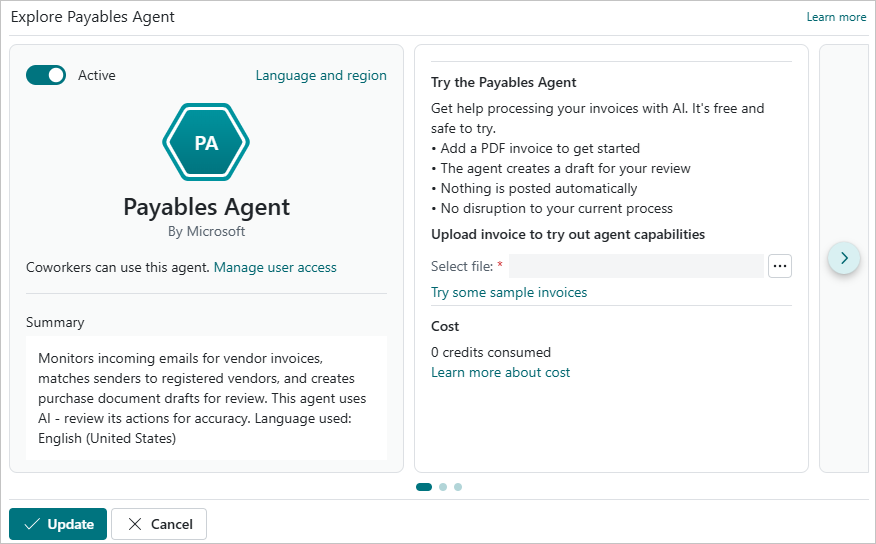

# Set up Payables Agent

The Payables Agent in Business Central automates processing of vendor invoices received from vendors through email as PDF documents. This article explains how to set up, activate, configure the Payables Agent, and manage user access.

Learn more about the agent in [Payables Agent overview](payables-agent.md).

## Prerequisites

Before configuring and activating the Payables Agent, ensure the following prerequisites are met:

- The Business Central environment is a country/region version supported by the Payables Agent as listed in [Feature availability by country/region and language](/dynamics365/business-central/copilot-agents-region-language-availability#feature-availability-by-countryregion-and-language).

- You have permissions to configure the Payables Agent. You can configure the agent if you meet one of these conditions:
  - You're listed in the agent's user access list with **Can Configure** selected.
  - You have the **Configure All Agents** system permission (ID 9665).

  Learn more in [Manage agent permissions and user access](#manage-agent-permissions-and-user-access).
- An email account is set up to receive vendor invoice PDF documents.

   The Payables Agent monitors incoming emails to this mailbox. The email account must be a **Microsoft 365** type (user mailbox or shared mailbox) in your organization. Learn more at [Set up email](admin-how-setup-email.md).

   If you have multiple Business Central companies, you can configure each company's agent to use a separate dedicated mailbox, or you can use a shared mailbox with different folder monitoring per company. Configure Outlook rules to route invoices to company-specific subfolders, then set each company's agent to monitor its designated subfolder.

   > [!IMPORTANT]
   > To activate and configure the agent, you need **Read and manage (Full Access)** permission on the mailbox, unless it's your personal mailbox. As an Exchange admin, delegate these permissions to all users who need to activate and configure the agent. Learn more in [Use the Exchange admin center to edit shared mailbox delegation](/microsoft-365/admin/email/create-a-shared-mailbox#use-the-eac-to-edit-shared-mailbox-delegation).
   >
   > When a user activates the agent, it runs as a background task in the context of that user and needs access to the shared mailbox to process emails. It might take a few hours for Exchange to propagate the permissions to the selected users.
- Billing for agent capabilities is configured for the Business Central environment in the Business Central admin center.

   Agents use Microsoft Copilot Studio messages when activated, which your company is charged for. However, if you use trial mode, the first 50 invoices are processed free of charge without consuming billable AI credits. Learn more in [Manage consumption-based billing](/dynamics365/business-central/dev-itpro/administration/tenant-admin-center-manage-consumption-billing) and [Try Payables Agent with free trial mode](#try-payables-agent-with-free-trial-mode).

- (Sandbox environments only) The **Allow HttpClient Requests** toggle in the **Payables Agent** extension settings is turned on.

   Open the [Extension management](https://businesscentral.dynamics.com/?page=2500) page, select **Payables Agent**, and then turn on the **Allow HttpClient Requests** toggle.

## Turn on Payables Agent capability for environment

The agent capability is on if the  **Payables Agent** icon appears in the top navigation menu of the role center.

If the icon isn't present, turn it on from the **Copilot & agent capabilities** page, like other Copilot features in Business Central. The Payables Agent is listed under **Generally available**. Learn more in [Configure Copilot and AI agent capabilities](enable-ai.md).

Next, configure and activate the agent so it can process vendor invoices.

## Try Payables Agent with free trial mode

Before fully activating the Payables Agent, you can try it free of charge with trial mode. Trial mode lets you process up to 50 invoices without consuming billable AI credits. Trial mode is available only in production environments when you haven't activated the agent yet.

During trial mode:

- The agent processes PDF invoices you upload or receive via email without billing your organization
- You can test all agent capabilities, including draft creation and review workflows
- Nothing is posted automatically - you review and approve all drafts before posting
- The setup wizard displays your progress (for example, "Invoices processed in trial mode: 5 of 50")

After you process 50 invoices, the trial ends automatically and the agent transitions to full mode. The agent continues processing invoices without interruption but starts consuming billable AI credits as described in the prerequisites. No additional configuration is required for this transition.

When the trial ends, the **Payables Agent Trial** section is removed from the configuration page and replaced with the **Cost** section. The **Cost** section displays the total number of Copilot credits consumed by the agent.

### Start the agent with trial mode

1. In the navigation bar at the upper right of the role center, select  **Payables Agent** > **Activate**.
1. On the **Configure the Payables Agent** assisted setup guide, in the **Try the Payables Agent** section, select **Select file** to upload a PDF invoice, or select **Try some sample invoices** to use demo invoices.
1. After uploading an invoice, the agent activates automatically in trial mode and begins processing.

The agent task pane on the right-hand side displays the invoice processing progress.

## Configure and activate Payables Agent

Configure and activate the Payables Agent for your company. Only one Payables Agent is allowed per company, but you can give access to many users.

If you start with trial mode, the agent is already active and automatically transitions to full mode after 50 invoices. Use the following steps to adjust settings or set up the agent without using trial mode.

1. In the navigation bar at the upper right of the role center, select  **Payables Agent** > **Activate** (or  **Configure Payables Agent** if already in trial mode).
1. On the **Configure the Payables Agent** assisted setup guide, turn on the **Active** toggle.

   

1. Select **Manage user access** to specify the users who can manage or interact with the agent. You can add more users now or later. Learn more in [Manage user access to the Payables Agent](#manage-agent-permissions-and-user-access).
1. Turn on the **Monitor incoming information** toggle, select the **Mailbox** checkbox, and then set the **Mailbox** field to the email account you want the agent to monitor.
1. (Optional) Set the **Folder** field to specify a specific mailbox folder the agent should monitor. Leave this field blank to monitor the entire mailbox.

   > [!TIP]
   > Use the **Folder** field to support multiple Business Central companies sharing the same mailbox. Set up email rules in Outlook to route invoices for each company into separate subfolders, then configure each company's agent to monitor its designated subfolder. This setup prevents invoices from being processed by the wrong company's agent.

1. Ensure the Payables Agent's language is set to a supported language.

   When you first configure the agent, it uses the same language as the display language of your workspace. You can change the language later from the **Payables Agent** card page. Learn more about these settings in [Change language and regional settings](#change-language-and-regional-settings).

1. On the right side of the page, select the **Go to next card** arrow to configure more options that determine how the agent behaves.

   The options are spread across multiple cards. Use the **Go to next card** and **Go to previous card** arrows to go back and forth between the cards and set the various options. Each tab that follows describes a group of related options:

   ## [Document processing](#tab/documents)

   These options specify how the agent processes incoming vendor invoices and creates purchase documents.

   - **Review email:** Select this checkbox to require users to review the incoming emails before the agent creates purchase document drafts.
   - **Configure additional fields:** Select the link to choose more fields from matched purchase invoice history to populate automatically when the agent finalizes purchase document drafts to become purchase invoice documents. This feature ensures that purchase invoice line fields that aren't visible in the purchase document draft can be populated in the same process when matched with historic data. It's the way the generic **Purchase document draft** experience supports fields from customizations and add-on apps.

   ## [Get sample invoices](#tab/samples)

   This option provides easy access to demo invoices so you can try the agent without needing to produce your own invoices.

   

   - **Get sample invoices:** This option shows in evaluation companies only and provides demo invoices that work well with the Contoso Coffee demo data. The assisted setup guide lets you send the sample invoices to the monitored mailbox, in which case they're sent from the same mailbox. The assisted setup guide also lets you download the sample invoices so you can send them from your own mailbox to the monitored mailbox.

      > [!TIP]
      > If you let the agent send the sample invoices, they show up in the agent task pane as coming from the same mailbox as is being monitored. Basically, it sends an email to itself with the prepared samples.

   ---
1. Select **Update** to complete the setup.

The **Payables Agent** icon changes to , indicating the agent is active and ready to handle incoming vendor invoices sent to the mailbox.

> [!TIP]
> Refer to [Payables Agent process flow](payables-agent.md#payables-agent-process-flow) to understand the agent in more detail and learn how it works.

> [!NOTE]
> The  icon indicates the agent is configured with a mailbox, but it's not active. To activate it, select the icon, then select  **Configure Payables Agent** to reopen the configuration page. From there, turn on the **Active** toggle.

## Monitor and manage Copilot credit consumption

Payables Agent requires Copilot Credits to process incoming vendor invoices. You can monitor credit consumption in the **Cost** section of the configuration page, which displays the total number of Copilot credits the agent consumes.

To view credit consumption:

1. Select  **Payables Agent** >  **Configure**.
1. In the **Cost** section, view the total Copilot credits consumed.
1. Select **Learn more about cost** to access detailed information about consumption-based billing.

### What happens when credits run out

When your organization's Copilot Credit quota is depleted, the agent stops processing new invoices from the monitored mailbox. However, the agent remains active and continues to run its scheduled task.

When credits become available again (for example, at the start of a new billing period or when you purchase more capacity), the agent automatically resumes processing. It picks up all unread invoice emails that accumulated in the mailbox while credits were unavailable. Depending on the volume of accumulated emails, this action can consume a significant portion of your renewed credits quickly.

### Best practices for managing credits

- **Monitor your credit usage regularly.** Check the **Cost** section in the agent configuration or review Copilot Credit capacity and usage in the Power Platform admin center to stay ahead of quota limits. Learn more in [Manage consumption-based billing](/dynamics365/business-central/dev-itpro/administration/tenant-admin-center-manage-consumption-billing).
- **Use trial mode to evaluate.** Before committing to full mode, use the free trial to process up to 50 invoices and estimate your typical credit consumption pattern.
- **Deactivate the agent if you don't want automatic resumption.** If you're experimenting with the agent or running on limited credits, deactivate the agent before credits run out to prevent it from automatically processing a backlog of invoices when credits renew. To deactivate, turn off the **Active** toggle in the configuration page.
- **Manage unread emails before reactivating.** Before reactivating the agent after a credit shortage, consider clearing or archiving old invoice emails from the monitored mailbox that no longer need processing. This action prevents the agent from consuming credits on stale requests.

> [!NOTE]
> When you reactivate the agent after deactivating it, the agent processes unread emails from the mailbox starting from when it was deactivated. If you don't want the agent to process older emails, clear them from the monitored folder before reactivating.

## Manage agent permissions and user access

### Configure agent users

As an administrator, you can specify which users have permission to use or configure the Payables Agent. There are three ways to add and configure agent users:

#### [From Configure Payables Agent page](#tab/payablesagentconfig)

1. Open the **Configure Payables Agent** page by selecting  **Payables Agent** >  **Configure**.
1. Turn off the **Active** toggle.
1. Select **Manage user access**.
1. On the **Select users that can manage or interact with the Agent** page, you can do the following steps:

   - To add a user, select an empty line, select the **User Name** field, then select the user from the list.
   - To give a user permission to configure Payables Agent, select the **Can configure** check box.    The **Can configure** setting defines whether a user has access to update the agent configuration (for example, updating the designated mailbox, activating and deactivating the agent, and other settings) or only to work with the agent tasks (for example, reviewing and confirming agent steps).
   - To remove a user's access to the agent, select  **Show more options** next to the user name, and then select **Delete**.

#### [From Payables Agent card page](#tab/payablesagentpage)

1. To open the **Payables Agent** card page, search (<kbd>Alt</kbd>+<kbd>Q</kbd>) for  **Agents**, and then select **PAYABLES AGENT - [COMPANY]**.
1. Set **Status** to **Disabled** to deactivate the agent.
1. In the **User access** section, do the following steps:

   - To add a user, select an empty line, select the **User Name** field, then select the user from the list.
   - To give a user permission to configure Payables Agent, select the **Can configure** check box.
   - To remove a user's access to the agent, select  **Show more options** next to the user name, and then select **Delete**.

#### [Using permissions and licenses](#tab/perms)

The following system permissions are available for controlling user access to the agent's functionality:

- **Configure All Agents** (ID 9665): Grants a user access to manage the configuration settings of Payables Agent.
- **Manage Agent Tasks** (ID 9670): Allows a user to work with agent tasks displayed in the Copilot pane.

These system permissions are also included in the following permission sets, entitlements, and license types:

- The **SECURITY** permission set includes the **Configure All Agents** permission.
- The **System Execute - Basic** permission set includes the **Manage Agent Tasks** permission.
- The **System Tables - Basic** permission set includes all virtual tables used by the agent (labeled as `Agent *` tables).
- Essential and Premium license entitlements now include the **Manage Agent Tasks** permission.
- All license types include the **Configure All Agents** permission.

Users can configure Payables Agent if they have the **Configure All Agents** permission or are listed as an agent user with the **Can Configure** field selected.

Users can work with agent tasks in the Copilot pane if they have the **Manage Agent Tasks** permission (either explicitly or as part of their Essential or Premium license permissions) and are listed as an agent user.

---

> [!TIP]
> If users need to create or modify email accounts in Business Central (separate from the Exchange mailbox permissions above) or set up the Microsoft 365 document connector, assign them the **Payables Ag. - Adm.** permission set.

### Manage agent's permissions to objects, data, and UI elements

The Payables Agent has a user account in Business Central, similar to other users. To edit this account, search for and open the **Agents** page, and then select **PAYABLES AGENT - [COMPANY]** to open the agent card page.

The **Agent Permission Sets** section lists all the permission sets currently assigned to the agent. By default, the Payables Agent has the **PAYABLES AG. – RUN** permission set. This set restricts access to only the objects, data, and UI elements (such as pages, fields, and actions) necessary for processing vendor invoices.

You can't modify the **PAYABLES AG. – RUN** permission set directly, because it's a system permissions set. However, you can create a copy, modify the copy to suit your needs, then add it to **Agent Permission Sets** section, along with any other permission sets.

Before you can add or delete permission sets applied to the agent, change the **State** to disabled. When you're done making changes, set it back to **Enabled**.

## Change language and regional settings

[!INCLUDE[payables-agent-language-support](includes/payables-agent-language-support.md)]

1. To open the **Payables Agent** card page, search (<kbd>Alt</kbd>+<kbd>Q</kbd>) for  **Agents**, and then select **PAYABLES AGENT - [COMPANY]**.
1. Select **Agent User Settings**.
1. Set **Language** to a supported English locale.

## Next steps

- [Supervise agent activities](supervise-agent-tasks.md)

## Related information

[Payables Agent overview](payables-agent.md)  
[Configure Copilot and agent capabilities](enable-ai.md)  
