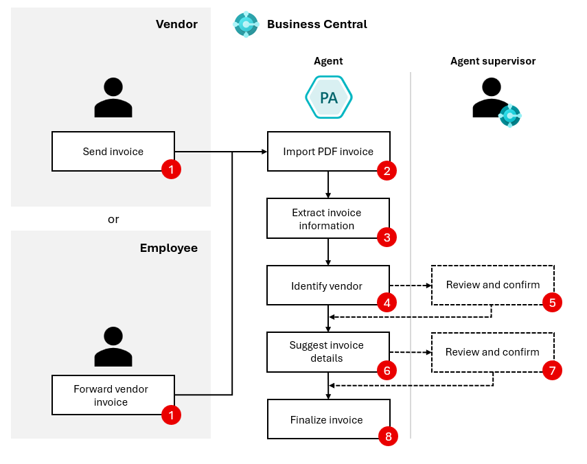

# Payables Agent overview (preview)

[!INCLUDE [preview-banner](~/../shared-content/shared/preview-includes/preview-banner.md)]

The Payables Agent solves a decade-old challenge: end-to-end processing of vendor invoices. Processing vendor invoices often creates bottlenecks and relies on accounting knowledge and mapping data and business rules to register invoices correctly.

The core goal for the Payables Agent is simple: get accounting skills and help register invoices correctly, ideally removing bottlenecks in accounts payable so finance support doesn't slow company growth. The agent needs almost no setup&mdash;just configuration and activation.

The Payables Agent monitors mailboxes for incoming vendor invoices, uses AI to analyze invoice content, and shows invoice drafts to agent supervisors for review. Ideally, users make few or no corrections before finalizing drafts, so invoices are ready for approval and posting.

> [!TIP]
> Watch a short video in the Dynamics Business Central channel on YouTube at [Get started with the Payables Agent for Dynamics 365 Business Central](https://www.youtube.com/watch?v=6icbmbLc_Og).

[!INCLUDE [preview-note](~/../shared-content/shared/preview-includes/production-ready-preview-dynamics365.md)]
<!--[!INCLUDE [limited-public-preview](includes/limited-public-preview.md)]-->

## Functionality in the preview

This preview doesn't represent the full vision of the Payables Agent. The Payables Agent is in its early stages, and more features and AI capabilities are coming.

The agent is designed to help with:

* Purchase order matching
* Approval flows
* Anomaly detection
* Other tasks that support accounts payable processes and accounting

## Payables Agent process flow

The end-to-end process handled by the Payables Agent is shown in the following figure. The actual flow can vary depending on factors like the clarity of analyzed invoice details, existing purchase invoice history, and blocking issues.

1. **Vendor or employee:** Sends an email to a mailbox monitored by the agent. Alternatively, an employee forwards a vendor invoice to the mailbox.
1. **Payables Agent:** Picks up PDF attachments from unread emails in the monitored mailbox and imports the PDF into **Inbound E-Documents** in Business Central.
1. **Payables Agent:** Extracts invoice information from the PDF using Azure Document Intelligence.
1. **Payables Agent:** Identifies a vendor in Business Central based on the extracted invoice information.
1. **Agent supervisor:** Can assist the agent with identifying the vendor if the agent can't confidently identify the right vendor.
1. **Payables Agent:** Uses AI to suggest invoice details based on the extracted invoice information.
1. **Agent supervisor:** Can review, confirm, or change the suggested invoice details in a purchase document draft, depending on agent configuration settings and the agent's confidence in the suggestions.
1. **Payables Agent:** Finalizes the purchase document draft into a purchase invoice. Users now see the invoice in the **Purchase Invoices** list.

### Email monitoring

The agent uses an internal email dispatcher running as a background task to continuously monitor a designated mailbox for incoming vendor invoices as PDF documents. The dispatcher triggers the agent to perform tasks and then imports the PDF document into **Inbound E-Documents**.

> [!NOTE]
> While the agent is in preview, use a designated mailbox for receiving vendor invoices. If multiple agents, like the Sales Order Agent, use the same mailbox, it can cause conflicts with ownership of incoming emails.

### Extraction of invoice data

For each imported PDF document that is a vendor invoice in **Inbound E-Documents**, the PDF is sent for OCR (Optical Character Recognition) data extraction with Azure Document Intelligence, and the result is stored in the same E-Document record. 

The agent helps categorize imported PDF documents when it's uncertain if the PDF is a vendor invoice. You can identify these documents in **Inbound E-Documents** using the **For review** view and the **For review** cue on the **Accounts Payables Administrator** and **Business Manager** role centers. 

### Suggesting invoice details

When the agent considers a PDF document a valid vendor invoice with high confidence, it starts by identifying the vendor to create the purchase invoice draft. In this process, the agent might need help from an agent supervisor if it can't confidently identify the correct vendor. 

After the agent identifies the vendor, it starts line-level processing of the invoice details. The agent uses different methods to suggest the best possible details. For example, it might use AI, vendor invoice history, mapping text to G/L accounts, Item References, Recurring Purchase Lines, and more. The agent records all suggestions for the specific vendor invoice in a **Purchase document draft** related to the **Inbound E-Document**. You can access this draft from the **Inbound E-Document** when not interacting with the agent, and it's also linked in the agent **Tasks** tab of the Copilot pane when an agent supervisor is involved. 

### Drafts of the suggested vendor invoice

The **Purchase document draft** is where the agent's suggestions are shown to the user and where the agent explains why it made certain suggestions. The draft helps users learn about the agent's reasoning and decide whether to adjust the suggestions before finalizing the draft.

Finalizing a purchase draft creates a purchase invoice based on the draft. After you finalize a draft, it's linked to the purchase invoice and is no longer editable. The draft remains as long as the purchase invoice exists.

> [!NOTE]
> Even though a regular purchase invoice entity in Business Central is a draft until it's posted, the **Purchase document draft** page is an intermediary stage to 1) let users make corrections before finalizing the draft into an unposted purchase invoice, and 2) provide a designated stage to review AI-generated content.

## Activation and configuration

The agent is available in the product. To activate it, see [Payables Agent Setup](payables-agent-setup.md) to learn how to set up the Payables Agent for the agent supervisor you want.

## Billing for use

The Payables Agent uses Microsoft Copilot Studio messages for AI interactions, which can incur charges based on interaction complexity. Before you use the agent, set up a billing model for your Business Central environment. Learn more in [Manage consumption-based billing](/dynamics365/business-central/dev-itpro/administration/tenant-admin-center-manage-consumption-billing).

## General agent operations

The Payables Agent runs autonomously in the background, using AI to do its tasks while keeping users informed about key steps and involving them when needed. Involvement might be needed in specific scenarios, like when users review suggested vendor invoice drafts, based on set preferences.

Conceptually, the agent interacts with Business Central features like a Business Central user. The agent gets general instructions in natural language that outline how to handle vendor invoices. It uses UI metadata, like captions, tooltips, and other properties, along with data on Business Central pages and its own instructions, to decide each step needed to finish the task. Starting from the designated Role Center, the agent goes through pages, selects UI actions, and enters data as a user does. This approach lets the agent stay flexible and adaptable because its interaction surface and steps aren't hardcoded. Instead, AI decides them based on the context of each step.

This flexibility lets the agent find and interact with relevant custom fields and actions. It can also try to automatically fix validation errors by processing displayed error messages and adjusting the input.

### Customer and Business Central user involvement

Agent supervisors can check the agent's steps, imported PDF invoices, and suggested purchase invoice drafts. They can easily see the data the agent enters compared to data from Business Central's business logic and imported OCR data, and change the purchase invoice draft if needed.

The agent involves designated Business Central users, called agent supervisors, if it isn't sure how to register the invoice. For example, if the vendor can't be identified with confidence.

## Permissions and profiles

The agent works within the permissions and profile (role) the admin assigns. Learn more in [Manage agent permissions and user access](payables-agent-setup.md#manage-agents-permissions-to-objects-data-and-ui-elements).

## Next steps

- [Set up the Payables Agent](payables-agent-setup.md)

## Related information

[Configure Copilot and agent capabilities](enable-ai.md)  
