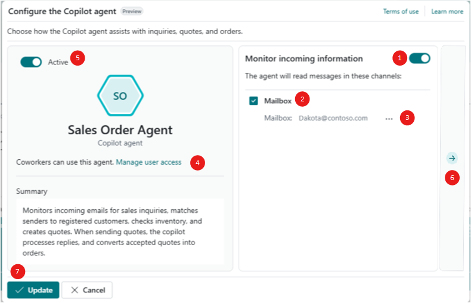

# Set up Sales Order Agent

Sales Order Agent in Business Central automates processing sales orders from customer email requests. This article explains how to set up, activate, configure Sales Order Agent, and manage user access.

Learn more about the agent in [Sales Order Agent overview](sales-order-agent.md).

## Prerequisites

Before configuring and activating Sales Order Agent, ensure the following prerequisites are met:

- Set up the email account for receiving incoming requests for sales quotes and orders.

   Sales Order Agent monitors incoming emails to this mailbox. The email account must be a **Microsoft 365** type (user mailbox or shared mailbox) in your organization. Learn more at [Set up email](admin-how-setup-email.md).

   > [!IMPORTANT]
   > To activate and configure the agent, you need **Read and manage (Full Access)** and **Send as** permission on the mailbox, unless it's your personal mailbox. As an Exchange admin, delegate these permissions to all users who need to activate and configure the agent. Learn more in [Use the Exchange admin center to edit shared mailbox delegation](/microsoft-365/admin/email/create-a-shared-mailbox#use-the-eac-to-edit-shared-mailbox-delegation).
   >
   > When a user activates the agent, it runs as a background task in the context of that user and needs access to the shared mailbox to process emails. It might take a few hours for Exchange to propagate the permissions to the selected users.

- Set up the Business Central environment for billing agent capabilities.

   Agents use Copilot Credits when a user runs it, which your company is charged for. Learn more in [Manage consumption-based billing](/dynamics365/business-central/dev-itpro/administration/tenant-admin-center-manage-consumption-billing).

- Turn on the **Allow HttpClient Requests** toggle in the **Sales Order Agent** extension settings (sandbox environments only).

   Open the [Extension management](https://businesscentral.dynamics.com/?page=2500) page, select **Sales Order Agent**, and then turn on the **Allow HttpClient Requests** toggle.

## Turn on Sales Order Agent capability for environment

The agent capability is on if the  **Sales Order Agent** icon appears in the top navigation menu of the role center.

If the icon isn't present, turn it on from the **Copilot & agent capabilities** page, like other Copilot features in Business Central. Sales Order Agent is listed under **Production ready previews**. Learn more in [Configure Copilot and AI agent capabilities](enable-ai.md).

Next, configure and activate the agent so it can process customer sales orders.

## Configure and activate Sales Order Agent

Configure and activate Sales Order Agent for your company. Only one Sales Order Agent is allowed per company, but you can give access to many users.

1. In the navigation bar at the upper right of the role center, select  **Sales Order Agent**  > **Activate**.
1. On the **Configure the Copilot agent** page, turn on the **Active** toggle.

   

1. Select **Manage user access** to specify the users who can manage or interact with the agent. You can add more users now or later. Learn more in [Manage user access to the Sales Order Agent](#manage-agent-permissions-and-user-access).
1. Turn on the **Monitor incoming information** toggle, select the **Mailbox** checkbox, and then set the **Mailbox** field to the email account you want the agent to monitor.
1. Set the **Default language** field to specify the language the agent uses for:

   - Outgoing emails to customers or contacts. If a customer or contact card has a language specified, the agent uses that language instead of the default.
   - Messages about tasks to users in the **Tasks** pane.

   When you first configure the agent, the field is set to the same language as the display language of your workspace. You can change the language later from the **Sales Order Agent** card page. Learn more about these settings in [Change language, region, and other settings](#change-agent-language-region-and-other-settings).

1. On the right side of the page, select the **Go to next card** arrow to configure more options that determine how the agent behaves.

   The options are spread across multiple cards. Use the **Go to next card** and **Go to previous card** arrows to go back and forth between the cards and set the various options. Each tab that follows describes a group of related options:

   ## [Respond to inquiries](#tab/inquiries)

   These options specify how the agent engages in conversations related to price and availability of products and services.

   |Option|Description|Default|
   |-|-|-|
   |Messages from already registered senders|Specifies the type of review required for incoming messages from already registered senders.|All|
   |Messages from unregistered senders|Specifies the type of review required for incoming messages from unregistered senders.|All|
   |Select only available items|Specifies whether the agent considers item availability when searching for the customer's requested items.  When on, the agent checks inventory to determine whether the customer's requested item quantity is available based on their requested delivery date and location code. If there aren't enough items, the agent prepares the reply to the user that the requested items aren't available, even in situations when fewer items are available.   When off, the agent includes the customer's requested item quantity regardless of availability. That is, quotes can be created for the items that aren't available and their availability can become negative.  Learn more about item availability in [Get an availability overview](inventory-how-availability-overview.md) or open the [Item Availability page](https://businesscentral.dynamics.com?page=4410).|On|
   |Include capable to promise|Specifies whether the agent includes in the search results items that are currently unavailable but can be ordered for a later shipment date.  Learn more in [Calculating delivery dates using capable-to-promise](sales-order-agent.md#calculating-delivery-dates-using-capable-to-promise).|Off|

   ## [Create sales documents](#tab/documents)

   These options specify how you interact with the agent to create sales quotes and make orders from quotes in response to the incoming requests.

   |Option|Description|Default|
   |-|-|-|
   |Review quotes when created and updated|When on, the agent adds a review step for a Business Central user to review and confirm the sales quote before creating an outgoing email with the quote details and attachment.   When off, the agent creates or modifies sales quotes as requested and then automatically proceeds with creating an outgoing email with the quote as an attachment. The user must review and confirm the email before the agent sends it to the customer. |Off|
   |Make orders from quotes|When on, the agent converts confirmed sales quotes into orders after the customer agrees to the quote via email and the Business Central user confirms the email.  When off, you have to create the order manually.|On|
   |Review orders when created and updated|When on, the agent adds a review step for a Business Central user to review and confirm the sales order before creating an outgoing email with the order details and attachment.   When off, the agent creates the sales order as requested and then automatically proceeds with creating an outgoing email with the order as an attachment. The user must review and confirm the order before the agent sends it to the customer. |Off|

   ## [Manage mailbox](#tab/mailbox)

   Use these options to configure the email mailbox the agent monitors for incoming emails and how it handles mails.

   |Option|Description|Default|
   |-|-|-|
   |Account|This option is the same as the **Mailbox** field on the first configuration page. It specifies the email account the agent monitors. The email account must be a **Microsoft 365** type (user mailbox or shared mailbox) in your organization. Learn more at [Set up email](admin-how-setup-email.md).|None|
   |Folder|Specifies the email account's mailbox that the agent monitors. You need **Read and manage (Full Access)** permission on the mailbox to set this option. Learn more in [Use the Exchange admin center to edit shared mailbox delegation](/microsoft-365/admin/email/create-a-shared-mailbox#use-the-eac-to-edit-shared-mailbox-delegation)|None (Inbox)|
   |Analyze attachments|Specifies whether the agent analyzes attachments on incoming emails for request information. The agent only supports these file formats: PDF, PNG, JPG.|Enabled|
   |Daily email limit|Species how many incoming emails per day the agent can handle. The agent issues an alert when the limit is reached. The emails received after the daily limit is exceeded are automatically processed on the next day.|100|

   ## [Format outgoing message](#tab/outgoing)

   Instead the generic default signature on emails the agent creates, you can add a custom signature by following these steps:

   1. Select the **Include a custom signature in the replies** checkbox.
   1. Select the **Edit signature** link.
   1. In the **Edit mail signature** window, type or paste the text you want the agent use as the signature on emails.

      Use the toolbar along the bottom of the window to format the text, like changing the font and font color or adding an image or link.

   1. Select **OK** when done.

      To turn off the custom signature and use the default again, clear the **Include a custom signature in the replies** checkbox.

      ---
1. Select **Update** to complete the setup.

The **Sales Order Agent** icon changes to , indicating the agent is active and ready to handle incoming quote requests to the mailbox.

When Sales Order Agent is active, a scheduled task added to job queue runs every 20 seconds on the mailbox. This task monitors new unread messages in the mailbox. If a new unread message is found, Sales Order Agent imports the message into Business Central and verifies whether there's already a task for the mail thread. If a task for the thread already exists, Sales Order Agent incorporates the new message into the existing task. Otherwise, it creates a new task for the message.

> [!NOTE]
> The  icon indicates the agent is configured with the mailbox, but it's not active. To activate, select the icon, then select  **Configure Sales Order Agent** to reopen the configuration page. From there, turn on the **Active** toggle.

## Manage agent permissions and user access

### Add agent users

As an administrator, you can specify which users have permission to use or configure Sales Order Agent. There are three ways to add and configure agent users:

#### [From Configure Sales Order Agent](#tab/soaconfig)

1. Open the **Configure Sales Order Agent** page by selecting  **Sales Order Agent** >  **Configure**.
1. Turn off the **Active** toggle.
1. Select **Manage user access**.
1. On the **Select users that can manage or interact with the Agent** page, you can do the following steps:

   - To add a user, select an empty line, select the **User Name** field, then select the user from the list.
   - To give a user permission to configure Sales Order Agent, select the **Can configure** checkbox.    The **Can configure** setting defines whether a user has access to update the agent configuration (for example, updating the designated mailbox, activating and deactivating the agent, and other settings) or only to work with the agent tasks (for example, reviewing and confirming agent steps).
   - To remove a user's access to the agent, select  **Show more options** next to the user name, and then select **Delete**.

#### [From Sales Order Agent card page](#tab/soapage)

1. To open the **Sales Order Agent** card page, search (<kbd>Alt</kbd>+<kbd>Q</kbd>) for **Agents**, and then select **SALES ORDER AGENT - [COMPANY]**.
1. Set **Status** to **Disabled** to deactivate the agent.
1. In the **User access** section, you can do the following steps:

   - To add a user, select an empty line, select the **User Name** field, and then select the user from the list.
   - To give a user permission to configure Sales Order Agent, select the **Can configure** checkbox.
   - To remove a user's access to the agent, select  **Show more options** next to the user name, and then select **Delete**.

#### [Using permissions and licenses](#tab/perms)

The following system permissions are available for controlling user access to the agent's functionality:

- **Configure All Agents** (ID 9665): Grants a user access to manage the configuration settings of Sales Order Agent.
- **Manage Agent Tasks** (ID 9670): Allows a user to work with agent tasks displayed in the Copilot pane.

These system permissions are also included in the following permission sets, entitlements, and license types:

- The **SECURITY** permission set includes the **Configure All Agents** permission.
- The **System Execute - Basic** permission set includes the **Manage Agent Tasks** permission.
- The **System Tables - Basic** permission set includes all virtual tables used by the agent (labeled as "Agent *" tables).
- Essential and Premium license entitlements now include **Manage Agent Tasks** permissions.
- All license types include **Configure All Agents** permissions.

Users can configure Sales Order Agent if they have the **Configure All Agents** permission or are listed as an agent user with the **Can Configure** field selected.

Users can work with agent tasks in the Copilot pane if they have the **Manage Agent Tasks** permission (either explicitly or as part of their Essential or Premium license permissions) and are listed as an agent user.

---

### Manage agent permissions to objects, data, and UI elements

Sales Order Agent has a user account in Business Central, similar to other users, which defines the permissions the agent has on objects and data. To access this account, search for and open the **Agents** page, and then select **SALES ORDER AGENT - [COMPANY]** to open the agent card page.

The **Agent Permission Sets** section lists the permission sets currently assigned to the agent. By default, Sales Order Agent has the **SOA AGENT – EDIT** permission set. This set restricts access to only the objects, data, and UI elements (such as pages, fields, and actions) necessary for handling sales quote requests.

You can't modify the **SOA AGENT – EDIT** permission set directly, because it's a system permissions set. However, you can create a copy of **SOA AGENT – EDIT** permission set, modify the copy to suit your needs, and then add it to the **Agent Permission Sets** section, along with any other permission sets.

Before you can add or delete permission sets applied to the agent, change the **State** to disabled. When you're done making changes, set it back to **Enabled**.

## Change agent language, region, and other settings

[!INCLUDE[soa-language-support](includes/soa-language-support.md)]

1. To open the **Sales Order Agent** card page, search (<kbd>Alt</kbd>+<kbd>Q</kbd>) for **Agents**, and then select **SALES ORDER AGENT - [COMPANY]**.
1. Select **Agent User Settings** and set the following fields:

   |Field|Description|
   |-|-|
   |Profile|Specifies the role that defines the agent's home page with links to the most common tasks.|
   |Region|Specifies the regional format used by the agent for dates, times, and numbers in outgoing emails and task details.|
   |Language|Specifies the language the agent uses for generated text in:<ul><li>Outgoing email messages to customers or contacts. If a customer or contact card has a language specified, the agent uses that language instead of the default.</li><li>Task details and descriptions in the agent **Tasks** pane and log.</li></ul> |
   |Time zone|Specifies the time zone used by the agent when displaying and processing date and time in tasks details.|

## Next steps

[Process sales quotes and orders with Sales Order Agent](sales-order-agent-process.md)

## Related information

[Sales Order Agent overview](sales-order-agent.md)  
[FAQ for Sales Order Agent](faqs-sales-order-taker-agent.md)  
[Configure Copilot and agent capabilities](enable-ai.md)  
