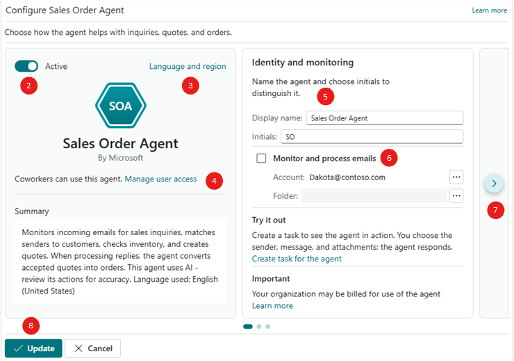

# Set up Sales Order Agent

Sales Order Agent in Business Central automates processing sales orders from customer email requests. This article explains how to set up, activate, configure Sales Order Agent, and manage user access.

Learn more about the agent in [Sales Order Agent overview](sales-order-agent.md).

## Prerequisites

Before configuring and activating Sales Order Agent, ensure the following prerequisites are met:

- You have permissions to configure the Sales Order Agent. You can configure the agent if you meet one of these conditions:
  - You're listed in the agent's user access list with **Can Configure** selected.
  - You have the **Configure All Agents** system permission (ID 9665).

  Learn more in [Manage agent permissions and user access](#manage-agent-permissions-and-user-access).
- An email account is set up for receiving incoming requests for sales quotes and orders.

   Sales Order Agent monitors incoming emails to this mailbox. The email account must be a **Microsoft 365** type (user mailbox or shared mailbox) in your organization. Learn more at [Set up email](admin-how-setup-email.md).

   > [!IMPORTANT]
   > To activate and configure the agent, you need **Read and manage (Full Access)** and **Send as** permission on the mailbox, unless it's your personal mailbox. As an Exchange admin, delegate these permissions to all users who need to activate and configure the agent. Learn more in [Use the Exchange admin center to edit shared mailbox delegation](/microsoft-365/admin/email/create-a-shared-mailbox#use-the-eac-to-edit-shared-mailbox-delegation).
   >
   > When a user activates the agent, it runs as a background task in the context of that user and needs access to the shared mailbox to process emails. It might take a few hours for Exchange to propagate the permissions to the selected users.

- Billing for agent capabilities is configured for the Business Central environment in the Business Central admin center.

   Agents use Copilot Credits when a user runs it, which your company is charged for. Learn more in [Manage consumption-based billing](/dynamics365/business-central/dev-itpro/administration/tenant-admin-center-manage-consumption-billing).

- (Sandbox environments only) The **Allow HttpClient Requests** toggle in the **Sales Order Agent** extension settings is turned on.

   Open the [Extension management](https://businesscentral.dynamics.com/?page=2500) page, select **Sales Order Agent**, and then turn on the **Allow HttpClient Requests** toggle.

## Turn on Sales Order Agent capability for environment

The agent capability is on if the  **Sales Order Agent** icon appears in the top navigation menu of the role center.

If the icon isn't present, turn it on from the **Copilot & agent capabilities** page, like other Copilot features in Business Central. Sales Order Agent is listed under **Generally available**. Learn more in [Configure Copilot and AI agent capabilities](enable-ai.md).

Next, configure, and then activate the agent so it can process customer sales orders.

## Configure and activate Sales Order Agent

Configure and activate Sales Order Agent for your company. You can set up multiple Sales Order Agent instances per company, each with its own mailbox, folder, email signature, and processing rules. Each instance tracks its own performance metrics independently.

1. In the navigation bar at the upper right of the role center, select  **Sales Order Agent**  > **Activate**.
1. On the **Configure the Copilot agent** page, turn on the **Active** toggle.

   

1. Select **Language and region** to specify the default language, region, and time zone the agent uses for:

   - Outgoing emails to customers or contacts. If a customer or contact card has a language specified, the agent uses that language instead of the default.
   - Messages about tasks to users in the **Tasks** pane.

   When you first configure the agent, it uses the same settings as your workspace (under **Settings** > **My Settings**). You can change the language later from the **Sales Order Agent** card page. Learn more about these settings in [Change language, region, and other settings](#change-agent-language-region-and-other-settings).

1. Select **Manage user access** to specify the users who can manage or interact with the agent. You can add more users now or later. Learn more in [Manage user access to the Sales Order Agent](#manage-agent-permissions-and-user-access).
1. If you want to change the agent's display name in the task pane and icon initials, set the **Display name** and **Initials** fields. These fields can't be blank.
1. Configure email monitoring:
   - Turn on the **Monitor and process emails** toggle.
   - Set the **Mailbox** field to the email account you want the agent to monitor for incoming sales quote and order requests.
   - If the mailbox has a subfolder you want to monitor, set the **Folder** field to the subfolder.
1. On the right side of the page, select the **Go to next card** arrow to configure more options that determine how the agent behaves.

   The options are spread across multiple cards. Use the **Go to next card** and **Go to previous card** arrows to go back and forth between the cards and set the various options. Each tab that follows describes a group of related options:

   ## [Respond to inquiries](#tab/inquiries)

   These options specify how the agent engages in conversations related to price and availability of products and services.

   |Option|Description|Default|
   |-|-|-|
   |Messages from already registered senders|Specifies the type of review required for incoming messages from already registered senders.|First message in a conversation|
   |Messages from unregistered senders|Specifies the type of review required for incoming messages from unregistered senders.|All|
   |Select only available items|Specifies whether the agent considers item availability when searching for the customer's requested items.  When on, the agent checks inventory to determine whether the customer's requested item quantity is available based on their requested delivery date and location code. If there aren't enough items, the agent prepares the reply to the user that the requested items aren't available, even in situations when fewer items are available.   When off, the agent includes the customer's requested item quantity regardless of availability. That is, quotes can be created for the items that aren't available and their availability can become negative.  Learn more about item availability in [Get an availability overview](inventory-how-availability-overview.md) or open the [Item Availability page](https://businesscentral.dynamics.com?page=4410).|On|
   |Include capable to promise|Specifies whether the agent includes in the search results items that are currently unavailable but can be ordered for a later shipment date.  Learn more in [Calculating delivery dates using capable-to-promise](sales-order-agent.md#calculating-delivery-dates-using-capable-to-promise).|Off|

   ## [Create sales documents](#tab/documents)

   These options specify how you interact with the agent to create sales quotes and make orders from quotes in response to the incoming requests.

   |Option|Description|Default|
   |-|-|-|
   |Review quotes when created and updated|When on, the agent adds a review step for a Business Central user to review and confirm the sales quote before creating an outgoing email with the quote details and attachment.   When off, the agent creates or modifies sales quotes as requested and then automatically proceeds with creating an outgoing email with the quote as an attachment. The user must review and confirm the email before the agent sends it to the customer. |Off|
   |Send quotes for confirmation|When on, the agent replies to the customer with the sales quote as a PDF attachment so the customer can confirm the quote by email. After the customer accepts, the agent can convert the quote into a sales order (when **Make orders from quotes** is on).  When off, the agent doesn't send the quote to the customer. Instead, when **Make orders from quotes** is on, it proceeds directly to converting the quote into a sales order.  This option works together with **Review quotes when created and updated**. When both options are off, the agent creates the quote without a review step, doesn't email it to the customer, and proceeds directly to making an order from the quote (when **Make orders from quotes** is on). |On|
   |Make orders from quotes|When on, the agent converts confirmed sales quotes into orders after the customer agrees to the quote via email and the Business Central user confirms the email.  When off, you have to create the order manually.|On|
   |Review orders when created and updated|When on, the agent adds a review step for a Business Central user to review and confirm the sales order before creating an outgoing email with the order details and attachment.   When off, the agent creates the sales order as requested and then automatically proceeds with creating an outgoing email with the order as an attachment. The user must review and confirm the order before the agent sends it to the customer. |Off|

   ## [Manage mailbox](#tab/mailbox)

   Use these options to configure the email mailbox the agent monitors for incoming emails and how it handles mails.

   |Option|Description|Default|
   |-|-|-|
   |Account|This option is the same as the **Mailbox** field on the first configuration page. It specifies the email account the agent monitors. The email account must be a **Microsoft 365** type (user mailbox or shared mailbox) in your organization. Learn more at [Set up email](admin-how-setup-email.md).|None|
   |Folder|Specifies the mailbox folder that the agent monitors. You must select a folder before you activate the agent. You need **Read and manage (Full Access)** permission on the mailbox to set this option. Learn more in [Use the Exchange admin center to edit shared mailbox delegation](/microsoft-365/admin/email/create-a-shared-mailbox#use-the-eac-to-edit-shared-mailbox-delegation)|None (required)|
   |Mark email as read|Specifies whether the agent marks processed emails as read in the mailbox. When enabled, team members can quickly identify the messages the agent handled.|On|
   |Analyze attachments|Specifies whether the agent analyzes attachments on incoming emails for request information. The agent supports PDF, PNG, and JPG files. PDF attachments can be up to 50 pages. A cumulative content limit of approximately 150,000 characters applies across all attachments in a single email. When the agent skips an attachment, the reason is shown on the **Attachments** page. For example, the agent might skip an attachment because it exceeds the page count limit, cumulative content length, or attachment count. Or, it doesn't support the attachment's format.|Enabled|
   |Daily email limit|Specifies how many incoming emails per day the agent can handle. The agent issues an alert when the limit is reached. The emails received after the daily limit is exceeded are automatically processed on the next day.|100|

   ## [Format outgoing message](#tab/outgoing)

   Instead the generic default signature on emails the agent creates, you can add a custom signature by following these steps:

   1. Select the **Include a custom signature in the replies** checkbox.
   1. Select the **Edit signature** link.
   1. In the **Edit mail signature** window, type or paste the text you want the agent use as the signature on emails.

      Use the toolbar along the bottom of the window to format the text, like changing the font and font color or adding an image or link.

   1. Select **OK** when done.

      To turn off the custom signature and use the default again, clear the **Include a custom signature in the replies** checkbox.

      ---
1. Select **Update** to complete the setup.

The **Sales Order Agent** icon changes to , indicating the agent is active and ready to handle incoming quote requests to the mailbox.

When Sales Order Agent is active, a scheduled task periodically monitors the configured mailbox folder. When it finds a new message that it hasn't processed, Sales Order Agent imports the message into Business Central and verifies whether there's already a task for the mail thread. If a task for the thread already exists, Sales Order Agent incorporates the new message into the existing task. Otherwise, it creates a new task for the message.

> [!NOTE]
> The  icon indicates the agent is configured with the mailbox, but it's not active. To activate, select the icon, then select  **Configure Sales Order Agent** to reopen the configuration page. From there, turn on the **Active** toggle.

## Try it out: Create tasks without sending email

You can test the Sales Order Agent without sending an actual email. The agent's setup page includes a **Try it out** section where you create a task by picking a sender, composing a message, and optionally attaching files. The agent processes the task exactly as if it received a real email.

1. On the **Configure Sales Order Agent** page, select **Create task** in the **Try it out** section.
1. On the **Create Task** page, set the **Sender** field to a contact or customer from your list, or type in an email address directly.
1. Compose the message text in the message body field.
1. Optionally, attach files using the **Attachments** subpage.
1. Select **Create** to submit the task to the agent.

To get started quickly, select the **Use sample message** link, which fills the page with one of two sample messages:

- A text-only message that references items from your item catalog.
- A message with a sample purchase order attachment generated as a PDF using your actual item data.

If the agent isn't enabled yet, you're prompted to enable it automatically when creating a task. Email monitoring isn't used for this flow, so the agent only processes your test task.

> [!NOTE]
> The sample messages use real data from your environment. If a sender is selected, the agent picks the top items by shipment frequency for that customer. Otherwise, it selects items with positive projected availability. Quantities are randomized between 1 and 10, capped at the available balance. The sample purchase order attachment is rendered from a Word template using your company information and the selected items, so you can use this feature on almost any environment with inventory data.

### Test with real customer emails

You can forward, copy, or move a customer email that was originally delivered to another mailbox into the folder that the agent monitors. The method you choose affects how the agent identifies the sender:

- **Forward the message:** The agent uses your email address as the sender, rather than the original customer's address. If your address isn't registered on a contact, the agent applies the configured review setting for messages from unregistered senders. During an incoming-message review, you can create a contact, select another contact for this message only, or associate your address with another contact for future messages.
- **Copy or move the message:** Depending on the Outlook client and the method you use, copying or moving the original message can preserve the customer's address as the sender. Verify that the message in the monitored folder still shows the customer's email address in the **From** field.

The agent retrieves messages based on their received date and time in Microsoft 365, not when they were copied or moved into the monitored folder. It processes messages from the agent's activation date. Therefore, copying or moving a message received before that date might not make it eligible for processing. Forwarding creates a new message with a new received date and time.

After the message reaches the monitored folder, wait for the agent's next scheduled run. You don't need to mark the message as unread.

## Manage agent when Copilot Credits run out

Sales Order Agent requires Copilot Credits to process incoming emails. When your organization's Copilot Credit quota is depleted, the agent stops retrieving and processing new emails from the monitored mailbox. However, the agent remains active and continues to run its scheduled task and sends any pending reply emails that were already prepared.

When credits become available again (for example, at the start of a new billing period or when you purchase more capacity), the agent automatically resumes processing. It picks up unprocessed emails that accumulated in the mailbox while credits were unavailable. Depending on the volume of emails, this restart can quickly consume a large portion of your renewed credits.

### Best practices for managing credits

- Deactivate the agent if you don't want automatic resumption. If you're trying out the agent or running on limited free credits, turn off the agent before credits run out. Turning off the agent prevents it from automatically processing a backlog of emails when credits renew. To turn off the agent, select  **Sales Order Agent** >  **Configure Sales Order Agent**, and then turn off the **Active** toggle.
- Use the daily email limit to control consumption. Set the **Daily email limit** on the **Manage mailbox** configuration card to cap how many emails the agent processes per day. This setting helps prevent the agent from consuming all credits in a short time, especially after a period of inactivity.
- Monitor your credit usage. Check your Copilot Credit capacity and usage in the Power Platform admin center and stay ahead of quota limits. Learn more in [Manage consumption-based billing](/dynamics365/business-central/dev-itpro/administration/tenant-admin-center-manage-consumption-billing).
- Manage unprocessed emails before you reactivate the agent. Consider clearing or archiving old emails from the monitored mailbox that no longer need a response so that the agent doesn't process stale requests.

> [!NOTE]
> When you reactivate the agent after deactivating it, the agent processes emails from the mailbox starting from when it was deactivated. If you don't want the agent to process older emails, clear them from the monitored folder before reactivating.

## Manage agent permissions and user access

### Add agent users

Administrators can specify which users have permission to use or configure Sales Order Agent. There are three ways to add and configure agent users:

#### [From Configure Sales Order Agent](#tab/soaconfig)

1. Open the **Configure Sales Order Agent** page by selecting  **Sales Order Agent** >  **Configure**.
1. Turn off the **Active** toggle.
1. Select **Manage user access**.
1. On the **Select users that can manage or interact with the Agent** page, you can do the following steps:

   - To add a user, select an empty line, select the **User Name** field, then select the user from the list.
   - To give a user permission to configure Sales Order Agent, select the **Can configure** checkbox.    The **Can configure** setting defines whether a user has access to update the agent configuration (for example, updating the designated mailbox, activating and deactivating the agent, and other settings) or only to work with the agent tasks (for example, reviewing and confirming agent steps).
   - To remove a user's access to the agent, select  **Show more options** next to the user name, and then select **Delete**.

#### [From the Sales Order Agent card page](#tab/soapage)

1. To open the **Sales Order Agent** card page, search (<kbd>Alt</kbd>+<kbd>Q</kbd>) for **Agents**, and then select **SALES ORDER AGENT - [COMPANY]**.
1. Set **Status** to **Disabled** to deactivate the agent.
1. In the **User access** section, you can do the following steps:

   - To add a user, select an empty line, select the **User Name** field, and then select the user from the list.
   - To give a user permission to configure Sales Order Agent, select the **Can configure** checkbox.
   - To remove a user's access to the agent, select  **Show more options** next to the user name, and then select **Delete**.

#### [Using permissions and licenses](#tab/perms)

The following system permissions are available for controlling user access to the agent's functionality:

- **Configure All Agents** (ID 9665): Grants a user access to manage the configuration settings of Sales Order Agent.
- **Manage Agent Tasks** (ID 9670): Allows a user to work with agent tasks displayed in the Copilot pane.

These system permissions are also included in the following permission sets, entitlements, and license types:

- The **SECURITY** permission set includes the **Configure All Agents** permission.
- The **System Execute - Basic** permission set includes the **Manage Agent Tasks** permission.
- The **System Tables - Basic** permission set includes all virtual tables used by the agent (labeled as "Agent *" tables).
- Essential and Premium license entitlements now include **Manage Agent Tasks** permissions.
- All license types include **Configure All Agents** permissions.

Users can configure Sales Order Agent if they have the **Configure All Agents** permission or are listed as an agent user with the **Can Configure** field selected.

Users can work with agent tasks in the Copilot pane if they have the **Manage Agent Tasks** permission (either explicitly or as part of their Essential or Premium license permissions) and are listed as an agent user.

---

### Manage agent permissions to objects, data, and UI elements

Sales Order Agent has a user account in Business Central, similar to other users, which defines the permissions the agent has on objects and data. To access this account, search for and open the **Agents** page, and then select **SALES ORDER AGENT - [COMPANY]** to open the agent card page.

The **Agent Permission Sets** section lists the permission sets currently assigned to the agent. By default, Sales Order Agent has the **SOA - EDIT** permission set. This set restricts access to only the objects, data, and UI elements (such as pages, fields, and actions) necessary for handling sales quote requests.

You can't modify the **SOA - EDIT** permission set directly, because it's a system permissions set. However, you can create a copy of **SOA - EDIT** permission set, modify the copy to suit your needs, and then add it to the **Agent Permission Sets** section, along with any other permission sets.

Before you can add or delete permission sets applied to the agent, change the **State** to disabled. When you're done making changes, set it back to **Enabled**.

## Change agent language, region, and other settings

[!INCLUDE[soa-language-support](includes/soa-language-support.md)]

1. To open the **Sales Order Agent** card page, search (<kbd>Alt</kbd>+<kbd>Q</kbd>) for **Agents**, and then select **SALES ORDER AGENT - [COMPANY]**.
1. Select **Agent User Settings** and set the following fields:

   |Field|Description|
   |-|-|
   |Profile|Specifies the role that defines the agent's home page with links to the most common tasks.|
   |Region|Specifies the regional format used by the agent for dates, times, and numbers in outgoing emails and task details.|
   |Language|Specifies the language the agent uses for generated text in:<ul><li>Outgoing email messages to customers or contacts. If a customer or contact card has a language specified, the agent uses that language instead of the default.</li><li>Task details and descriptions in the agent **Tasks** pane and log.</li></ul> |
   |Time zone|Specifies the time zone used by the agent when displaying and processing date and time in tasks details.|

## Next steps

- [Process sales quotes and orders with Sales Order Agent](sales-order-agent-process.md)
- (Optional) [Configure text search language](admin-optimize-text-search-language.md) to optimize item lookups in multilingual environments

## Related information

[Sales Order Agent overview](sales-order-agent.md)  
[FAQ for Sales Order Agent](faqs-sales-order-taker-agent.md)  
[Configure Copilot and agent capabilities](enable-ai.md)  
