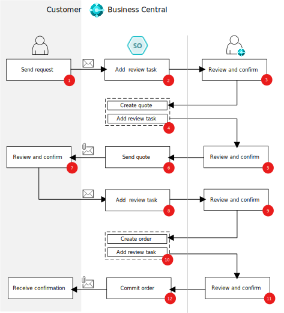

# Sales order agent overview (preview)

[!INCLUDE [preview-banner](~/../shared-content/shared/preview-includes/preview-banner.md)]

The sales order agent automates the process of taking sales orders; starting from a customer's request for a quote and concluding with the creation of an order. The agent begins the process by monitoring a designated mailbox for emails that seek a quote for items. From there, it orchestrates a series of tasks, under human supervision, to handle the request and eventually create the order in the system.

The agent is readily available in the product. You only need to activate it by specifying an email inbox you want the agent to monitor. You can also specify the users who can use the agent to process orders.

> [!TIP]
> Watch a short video in the Dynamics Business Central channel on YouTube at [Get started with the Sales Order Agent for Dynamics 365 Business Central](https://www.youtube.com/watch?v=6icbmbLc_Og).

[!INCLUDE [preview-note](~/../shared-content/shared/preview-includes/production-ready-preview-dynamics365.md)]

## Operation

A sales order agent uses AI to create and manage tasks for processing sales orders. The agent interacts with the Business Central web client through an API, reading data from pages and accessing UI elements to display its actions onscreen. It operates without human intervention (autonomously) for most tasks, acting on behalf of the company or users, but always keeps users informed and involves them when needed or required in specific scenarios.

The agent relies on an email dispatcher that continuously monitors a designated mailbox for item requests. The dispatcher triggers the agent to perform tasks and then sends results, such as prepared sales quotes, to the customer in response.

Learn more in [FAQ for sales order agent](faqs-sales-order-taker-agent.md).

## Process flow

Processing a sales quote request into an order involves three participants: 

- Customer who requests a sales quote via email
- Sales order agent, which monitors the mailbox and handles the incoming request and creates the quote and order  
- Business Central user who reviews agent tasks

The general flow is illustrated in the figure, which is followed by more details of the steps. The actual flow might vary depending on factors such as follow-up requests, changes or cancellations in review, blocking issues, and so one.

1. Customer: Sends email to Business Central mailbox asking for a sales quote for items. 
1. Sales order agent: Picks up unread email from inbox and creates a task with a step for reviewing incoming request. 
1. Reviewer: Reviews/confirms the step with email.  
1. Sales order agent: 

    1. Finds the requested items.
    1. Finds the contact. 
    1. Creates the sales quote. 
    1. Adds review step with a reply email with attached sales quote as pdf.
1. Reviewer: Reviews/confirms email and sales quotes. 
1. Sales order agent: Sends email and sales quote PDF to customer. 
1. Customer: Review sales quote and sends email requesting order. 
1. Sales order agent: Picks up email and adds review step 
1. Reviewer: Reviews/confirms the confirmation email for a sale order. 
1. Sales order agent: 

    1. Converts quote to order. 
    1. Adds review task with outgoing email confirming order. 
1. Reviewer: Reviews/confirms outgoing email. 
1. Sales order agent: Sends email to customer. 
  
## Next steps

- [Set up the sales order agent](sales-order-agent-setup.md)
- [Process sales quotes and orders with sales order agent](sales-order-agent-process.md)

## Related information

[Configure Copilot and AI capabilities](enable-ai.md) 