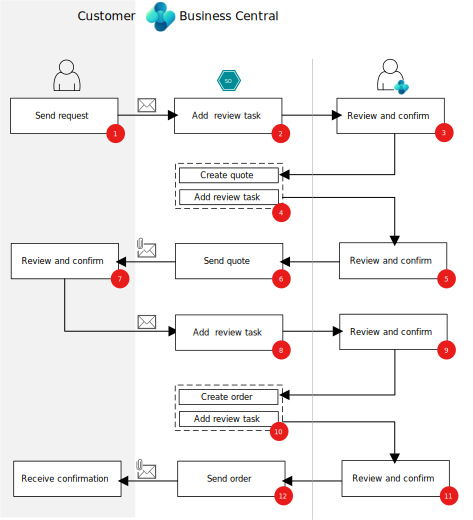

# Sales Order Agent overview

Sales Order Agent helps you automate the process of capturing information for sales orders. The agent uses AI to analyze customer requests received via email and locates the customer in [!INCLUDE [prod_short](includes/prod_short.md)]. If important details are missing or more choices are available, the agent engages in multiturn email conversations to clarify the request. It checks inventory and informs the customer about the availability of the items they're looking for. The agent then follows up with a sales quote or order, based on configuration. The sales document is formatted as a PDF and includes the requested items, quantities, units of measure, prices, taxes, requested delivery dates, provided external document reference, and other important details.

> [!TIP]
> Watch a short video in the Dynamics Business Central channel on YouTube at [Get started with the Sales Order Agent for Dynamics 365 Business Central](https://www.youtube.com/watch?v=6icbmbLc_Og).

## Functionality

### Activation and configuration

The agent is readily available in the product. To activate it, you specify the email inbox you want the agent to monitor. Additionally, specify your preferences for certain aspects of the agent's behavior and designate the users authorized to use the agent to process customers' orders, enabling the agent to act on behalf of a company, department, or team&mdash;not just an individual user.

### Permissions and profiles

The agent operates within the permissions and profile (role) assigned to it by the administrator. Permissions define which areas of the product (tables) the agent has access to. The profile outlines the UX elements (pages and actions) the agent can engage with during its work. Default permissions and the profile are assigned to the agent out of the box; however, administrators can update these permissions as needed.

### Operation

Sales Order Agent is designed to run autonomously in the background, using AI to perform its tasks while keeping users informed about key steps and involving them when necessary. Involvement might be needed in specific scenarios, for instance to review outgoing messages or to provide missing details, based on configured preferences.

Conceptually, the agent interacts with Business Central functionality in a manner similar to how Business Central users interact with it.

- The agent receives general instructions, expressed in natural language, that outline how to capture sales orders.
- It uses UI metadata, such as captions, tooltips, and other properties, along with data from Business Central pages. The agent combines this information with its own instructions to determine each required step.
- The agent, starting from the designated Role Center, navigates pages, invokes UI actions, and enters data as a user would.

This approach allows a high degree of flexibility and adaptability for the agent to achieve its goal. The agent’s interaction surface and steps aren’t hardcoded; instead, AI determines them based on the context of each step.

This flexibility enables the agent to discover and interact with relevant custom fields and actions. It can also attempt to automatically resolve validation errors by processing displayed error messages and adjusting the input accordingly.

### Email monitoring and communications

The agent relies on an internal email dispatcher running as a background task to continuously monitor a designated mailbox for item requests. The dispatcher triggers the agent to perform tasks and then sends results, such as prepared sales quotes or orders, to the customer in response.

The agent helps compose body texts for emails based on the context of the current step. For example, it can list available inventory or provide a brief description of the attached sales quote or sales order.

The agent validates incoming messages and attachments against a relevance model before it processes them. The relevance model filters out messages that are outside the agent's scope. For example, it filters out offers to sell, discount requests, or attempts to access internal data. A separate check runs on attachments to ensure non-sales-related documents don't trigger unnecessary processing. Filtered messages are tracked in telemetry for audit purposes.

### Customer and Business Central user involvement

You can inspect the agent's steps and the sales documents it creates. You can easily identify the data entered by the agent compared to data generated by business logic in [!INCLUDE [prod_short](includes/prod_short.md)]. If needed, you can provide more input, such as adding discounts or updating shipping costs.

If the customer decides to update the quote by sending another email listing required changes, the agent assists with these changes by locating the quote and making the requested updates. When the customer confirms the quote's accuracy, the agent converts it into a sales order, which is then also shared with the customer via email after you confirm it.

The agent always involves designated [!INCLUDE [prod_short](includes/prod_short.md)] users to review and approve all outgoing messages before it sends them to customers.

## How the agent processes requests

The agent monitors a designated mailbox for incoming customer emails about item inquiries. The mailbox is specified in the Sales Order Agent configuration (learn more in [Set up Sales Order Agent](sales-order-agent-setup.md)).

When an email is received, the agent analyzes the email&mdash;including subject line, body, and attachments (if configured)&mdash;to identify quote requests and extract relevant details. Attachments can be PDF or image files. It extracts relevant information from these files and generates a sales quote based on the content.

If the agent identifies a potential request in an email, it starts to prepare a sales quote. For example, it verifies whether the customer is registered in Business Central. It then checks item availability, creates a sales quote, and prepares an email response to the customer that includes the quote as a PDF attachment.

Some steps require your intervention, like reviewing email correspondence and assisting the agent as needed. Until an order is created, the agent handles back-and-forth email exchanges with the customer to resolve missing details and allow modifications to the original request. Learn more in [Agent process flow](#agent-process-flow).

### Identifying customers/contacts and related documents

The agent ensures that a request from one customer can't be about another customer's requests. When the agent processes a request, it first identifies the customer in Business Central using the sender's email address. The agent searches for the email among the registered Business Central contacts, sales quotes and orders, and then looks up the customer linked to that email:

- If a customer is found, the agent filters to use only sales quotes and orders that belong to the customer.

  This behavior ensures that the agent only creates and updates documents belonging to the customer that sent the email

- If a contact is found but it's not a customer, the agent filters to use only documents belonging to the contact. Quotes can be sent to contacts that aren't registered as a customer.
- If the agent doesn't find a contact, it displays a notification on the incoming message review page. You have three options to proceed:

- Create a new contact. Register the sender as a new contact (adds them to your contact list permanently).
- Use another contact one time. Pick an existing contact from your contact list and link them to this specific task only, without modifying any master data. Future emails from the same address still show as unregistered.
- Update an existing contact's email address. Select an existing contact and update their email address to the sender's address permanently.

### Finding products/items

The agent analyzes incoming emails to detect parameters for preparing a new sales quote or updating an existing one. Apart from the items themselves, parameters might include the item attributes, quantities, units of measure, requested delivery date, external document number, and more. The agent uses a multi-layer strategy to find the best matching items in your catalog:

1. Exact identifier match by item number, vendor item number, GTIN, or cross-references. Exact identifier matches have the highest confidence.
1. Semantic attribute matching uses item attributes from the customer's message (such as color, material, or size) and AI to rank candidates by relevance.
1. Broader fuzzy search falls back to a global search across all items when the direct and attribute-based searches don't produce results.

The agent searches across a wide range of related tables:

|Table|Fields|
|-|-|
|Items|No. Description Description 2 Search Description GTIN Vendor Item Number|
|Item Variant|Code Description Description 2|
|Item Reference|Reference No. Description Description 2|
|Item Attributes|Name Value|
|Item Category| Code Description Parent Category - 1 Level|
|Item Translation|Language Description Description 2|
|Item Identifier|Code|
|Extended text Line|Text|

Although the agent can find products based on vague and incomplete descriptions, the quality of product information in [!INCLUDE [prod_short](includes/prod_short.md)] affects its effectiveness. You can improve the agent's ability to find products by enhancing descriptions, attributes, categories, and extended text of your inventory items.

> [!TIP]
> In multilingual environments like Belgium, Switzerland, or Canada, the agent's item lookup accuracy depends on the text search language setting. By default, modern search uses a neutral language setting for indexing. To optimize search performance for a specific language, configure the text search language from **Advanced Settings**. Learn more in [Configure text search language for multilingual environments](admin-optimize-text-search-language.md).

> [!NOTE]
> It might take up to 15 minutes for newly entered data to become searchable as the system reindexes the tables in the background.

When it finds the items, the agent checks the items' availability by analyzing multiple parameters, such as required quantity, delivery date, location, scheduled and planned receipts, and more.

### Calculating delivery dates using capable-to-promise

The Sales Order Agent includes an option to use Business Central's capable-to-promise (CTP) functionality that lets the agent calculate the earliest possible delivery date for items not currently in stock.

CTP evaluates production capacity, procurement timelines, and supply chain constraints to determine when an item can realistically be delivered. This capability applies even when items aren't currently in stock and must be produced or procured based on lead times, not just inventory. For example, suppose a customer requests 10 units of an item, but only six are in stock or on scheduled orders. CTP determines when the remaining four units can be produced or sourced.

Learn more about capable-to-promise in [Calculate order promising dates](sales-how-to-calculate-order-promising-dates.md).

#### How capable-to-promise works

The Sales Order Agent uses the capable-to-promise logic inside Business Central, which is based in part on the configuration defined in the **Order Promising Setup** page.

When a customer requests an item, the agent checks inventory. If the item is unavailable, the agent calculates when it can be shipped and generates a quote with specific shipment dates based on:

| Parameter | Description |
|---|---|
| Work Date | The system uses the current work date as the starting point for all delivery calculations. |
| Order Promising Setup Offset (Time) | Offset on the **Order Promising Setup** page that defines how far into the future Business Central should look before issuing a new purchase, production, or transfer order (for example, 1D = one day after the work date). |
| Inventory Setup Safety Lead Time | Setting on **Inventory Setup** page that ensures items are available before the promised shipment date; accounts for internal delays like picking, packing, and labeling. |
| Item Lead Time Calculation | Per-item lead time on the **Item Card** page that reflects the time required to procure, produce, or transfer the item when it isn't in stock. |

The agent creates and sends an email response to the customer that includes the promised shipment dates for items. The process then continues. Learn where this step occurs in the full process in the [General flow](#general-flow).

## Agent process flow

### Participants

Processing a sales quote request into an order involves three participants:

- Customer who requests a sales quote via email.

    Here's an example of an email:

    > Hello,
    >
    > We are in the process of purchasing furniture for our lodge, and after reviewing your website I would like to request a quote for the following items:
    >
    > - 2 Antwerp tables
    > - 4 Berlin chairs
    > - 4 Rome chairs
    >
    > Could you please provide a sales quote? We will need the items delivered by March 2nd. Additionally, please note our purchase order number: DC1011234.
    >
    > Thank you,
    >
    > [Name]

- Sales order agent, which monitors the mailbox, handles the incoming request, and creates the quote and order.
- Business Central user who reviews agent tasks.

### General flow

The general flow is illustrated in the figure, which is followed by more details of the steps. The actual flow might vary depending on factors such as follow-up requests, changes or cancellations in review, blocking issues, and so on.

1. **Customer:** Sends email to Business Central mailbox asking for a sales quote for items.
1. **Sales order agent:** Picks up unread email from inbox and creates a task with a step for reviewing the incoming request.
1. **Reviewer:** Reviews/confirms the step with email.  
1. **Sales order agent:**
    1. Finds the contact or customer.  
    1. Finds the requested items and verifies their availability. If the agent is configured to use capable-to-promise (CTP), it calculates the earliest realistic shipment dates for items that aren't in stock.

       Learn more in [Item availability in Sales Order Agent (preview)](sales-order-agent-item-availability.md) and [Calculate order promising dates](/dynamics365/business-central/sales-how-to-calculate-order-promising-dates).
  
    1. Creates the sales quote.  
    1. Adds review step with a reply email with attached sales quote as a PDF.
1. **Reviewer:** Reviews/confirms email and sales quotes. 
1. **Sales order agent:** Sends email and sales quote PDF to customer.
1. **Customer:** Review sales quote and sends email requesting order.
1. **Sales order agent:** Picks up email and adds review step.
1. **Reviewer:** Reviews/confirms the confirmation email for a sale order.
1. **Sales order agent:**
    1. Converts quote to order.
    1. Adds review task with outgoing email confirming order.
1. **Reviewer:** Reviews/confirms outgoing email.
1. **Sales order agent:** Sends email to customer.

## Billing for use

Sales Order Agent uses Copilot Credits for AI interactions, which incur charges based on interaction complexity. Before using the agent, set up a billing model for your Business Central environment. Learn more in [Manage consumption-based billing](/dynamics365/business-central/dev-itpro/administration/tenant-admin-center-manage-consumption-billing).

> [!IMPORTANT]
> When Copilot Credits are depleted, the agent stops processing new emails but remains active and scheduled. When credits become available again, the agent automatically resumes and processes all unread emails that accumulated during the outage. To prevent unintended credit consumption after renewal, deactivate the agent when you don't need it running. Learn more in [Manage agent when Copilot Credits run out](sales-order-agent-setup.md#manage-agent-when-copilot-credits-run-out).

## Next steps

- [Set up the Sales Order Agent](sales-order-agent-setup.md)
- [Process sales quotes and orders with Sales Order Agent](sales-order-agent-process.md)

## Related information

[Configure Copilot and agent capabilities](enable-ai.md)  
