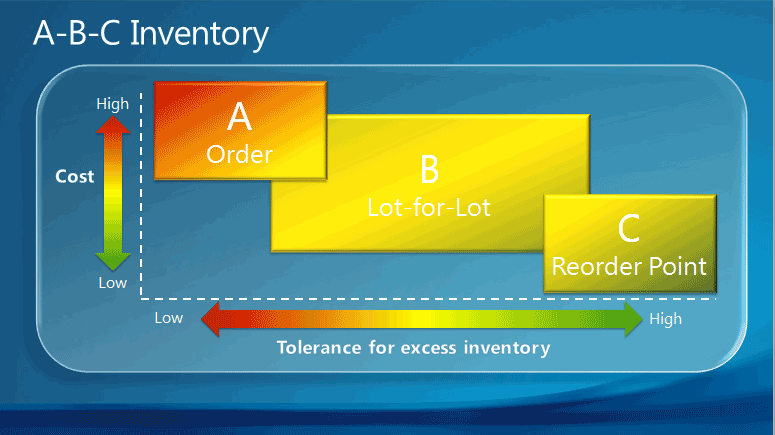

# Setup Best Practices: Reordering Policies
The **Reordering Policy** field on item cards offers four different planning methods that determine how the individual planning parameters interact.  

One best-practice foundation for selecting a reordering policy is the item’s ABC classification. When you use ABC classification for inventory control and supply planning, items are managed according to three different classes depending on their value and volume relative to the total stock. The value-volume distribution of the three classes is shown in the following table.

|Class|Percent of total stock volume|Percent of total stock value|
|-----|-----------------------------|----------------------------|
|A|10-20|50-70|
|B|20|20|
|C|60-70|10-30|

The ABC classification states that effort and money can be saved by applying looser control to items of low value-volume than to items of high value-volume. The following illustration shows which reordering policy in [!INCLUDE[d365fin](includes/d365fin_md.md)] is best suited for A, B, and C items respectively.

The following table provides best practices for selecting between the four policies.  

|Setup option|Best practice|Comment|  
|------------------|-------------------|-------------|  
|**Order**|Use for A items.   Use for make-to-order items.   In manufacturing, use for top-level items and for expensive components and subassemblies.   Use for items that are purchased as drop shipments and special orders.   Do not use if you do not accept automatic reservation.|A items, such as leather couches in a furniture store, are high-value items with low and irregular order velocity where inventory is unacceptable, or the required attributes vary. The best reordering policy is therefore one that plans specifically for each demand.|  
|**Lot-for-Lot**|Use for B items.   In manufacturing, use for components that occur in multiple BOMs. This ensures that purchase orders are combined for the same vendor, so better prices can be negotiated.   Use if you are not sure about which reordering policy to select.|B items, such as dining chairs, have a regular and fairly high order velocity, but also high carrying costs. The best reordering policy for B items is therefore one that is economical by bundling demand in the reorder cycle.   80 percent of items can use this policy.   Can be used successfully without planning parameters.|  
|**Fixed Reorder Qty.**|Use for C items.   Combine with reorder-point parameters.   In manufacturing, use for lowest-level components.   Do not use if the item is often reserved.|C items, such as tea cups, are low-value items with high and regular order velocity. The best reordering policy for C items is therefore one that guarantees constant availability by always staying above a reorder point.   If the user reserves a quantity for some distant demand, then the planning foundation will be disturbed. Even if the projected inventory level is acceptable with regard to the reorder point, the quantities may not be available because of the reservation.|  
|**Maximum Qty.**|Use for C items with high carrying costs or storing limitations.   Combine with one or more order modifiers (Minimum/Maximum Order Quantity or Order Multiple).|C items, such as tea cups, are low-value items with high and regular order velocity. The best reordering policy for C items is therefore one that guarantees constant availability by always staying above a reorder point, but below a maximum inventory quantity.   To modify the suggested order, you may want the order quantity to be decreased to a specified maximum order quantity, increased to a specified minimum order quantity, or rounded up to meet a specified order multiple. **Note:**  If used with a reorder point, then inventory stays between the reorder point and the maximum quantity.|  

## See Also  
 [Setup Best Practices: Supply Planning](setup-best-practices-supply-planning.md)   
 [Design Details: Handling Reordering Policies](design-details-handling-reordering-policies.md)   
 [Set Up Complex Application Areas Using Best Practices](set-up-complex-application-areas-using-best-practices.md)  
 [Working with [!INCLUDE[d365fin](includes/d365fin_md.md)]](ui-work-product.md)
