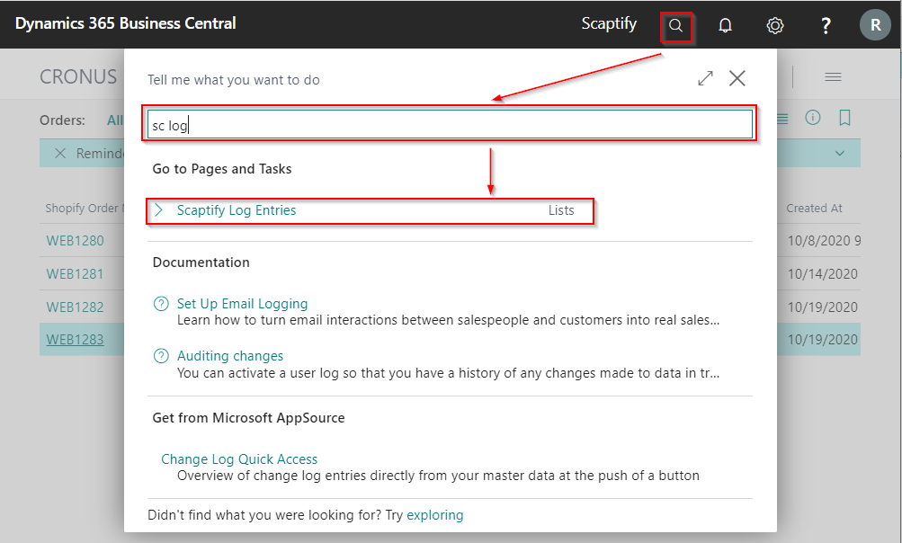
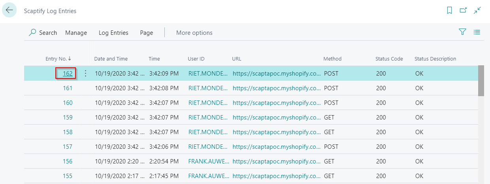
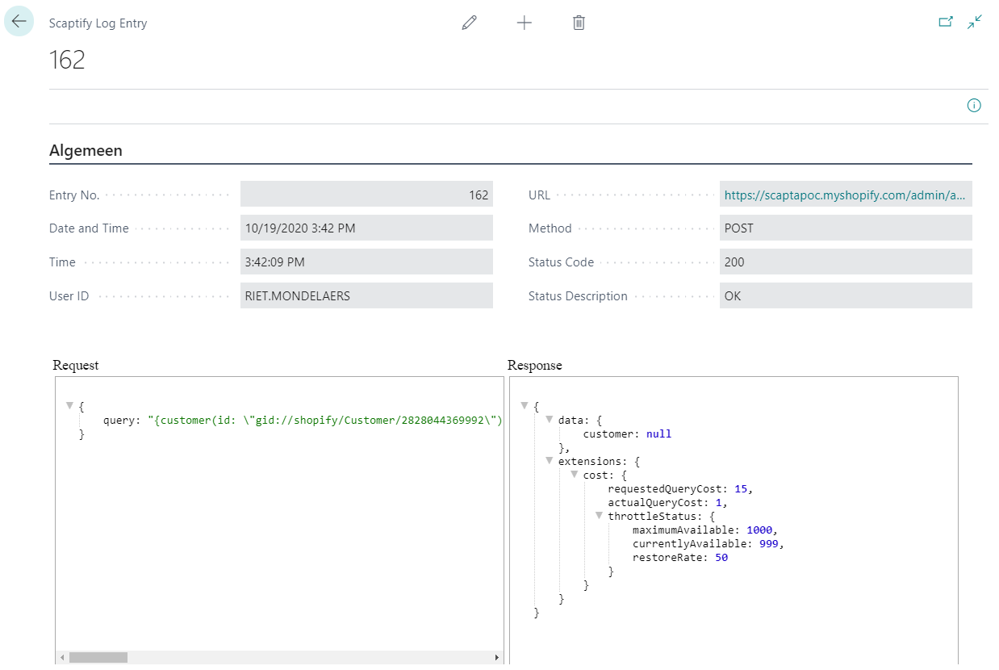
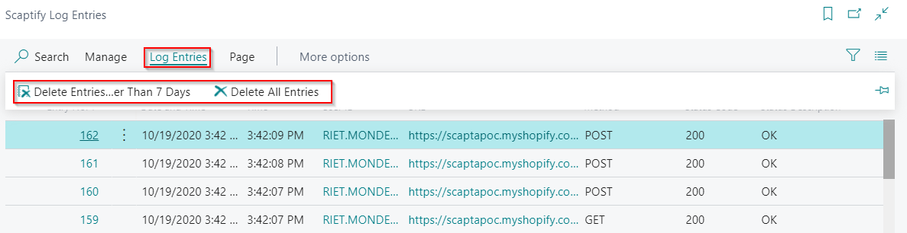
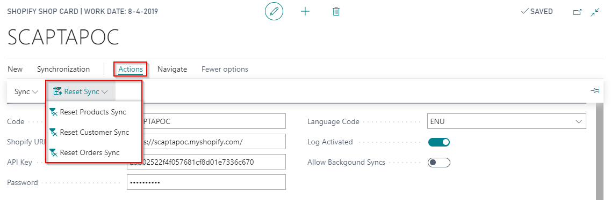

# Troubleshooting

## Logs

-   Activate the log.   //TBD: to be moved to "other, part trouleshouting. 

When a synchronization task from / to Shopify fails, you can activate logging on the tab 'General' in the Shopify Shop Card:

After you start the synchronization task again, you can check the Scaptify Log Entries for any errors / information:

Make sure to disable the logging when not needed, or to delete the entries periodically.

## Data Capture

Regardless of the **Log Activated** setting, system always logs some responces from Shopify which you can inspect or download using the **Data Capture List** windows.

Choose the **Retrieved Shopify Data** action in one of following pages:
- **Shopify Order**
- **Shopify Order Fulfilments**
- **Shopify Order Shipping Costs**
- **Shopify Order Transactions**
- **Shopify Payouts**
- **Shopify Payment Transactions**
- **Shopify Transactions**

## Reset sync

On the Shopify Shop card, there are functions available to reset the sync. This function ensures that when the sync is executed, all data is synced and not just the changes that have happened compared to the previous sync.

This function only applies to syncs from Shopify to [!INCLUDE[prod_short](../includes/prod_short.md)].

