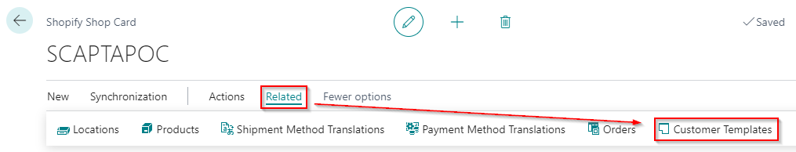
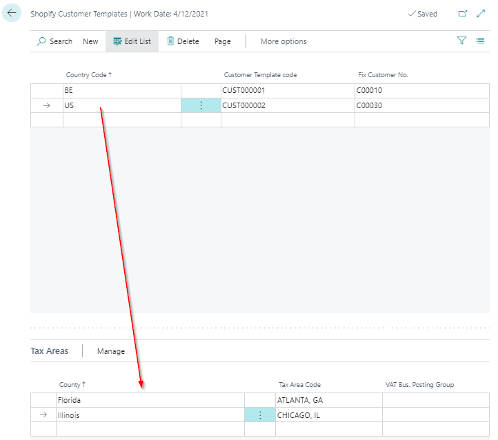
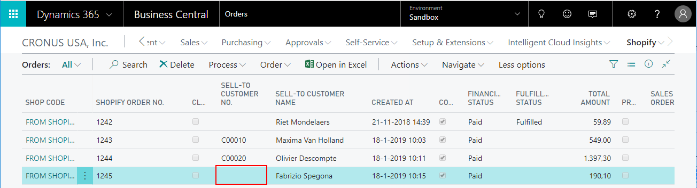
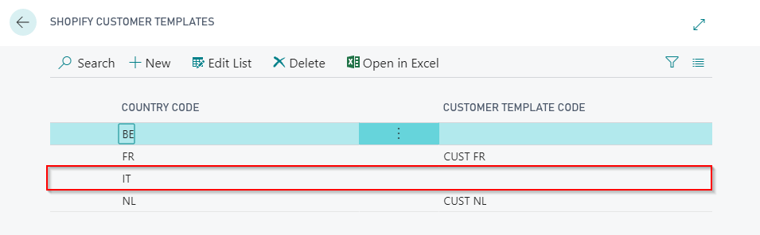

---
title: 
description: 
ms.date: 03/21/2022
ms.topic: article
ms.service: dynamics365-business-central
author: edupont04
ms.author: andreipa
manager: 
---

# Customer template per country

It is also possible to define a customer template per country. When synchronizing your Shopify orders from Shopify to Dynamics 365 Business Central, the customer template defined for the country of your customer will be used to create the customer in Dynamics 365 Business Central.

When you navigate to 'Customer Templates' on you Shopify Shop Card, you can define a customer template and default customer for each country.

The country codes are ISO 3166-1 alpha-2 country codes. For more information: <https://help.shopify.com/en/api/custom-storefronts/storefront-api/reference/enum/countrycode>

When you use multiple VAT/tax percentages, NAV should be leading. Furthermore, the item should already exist in NAV. A new item is created based on the defined item template and uses the VAT/tax percentage defined in this template, not the one set in the Shopify Shop.

When a customer has a country code for which you have not defined a template, the customer has not been created. The sell-to customer in the Shopify orders stays empty. In the Shopify customer templates, the country code was added so you can define a template for this.

Remark: If you have not defined a country-specific customer template, but a general customer template in the Shopify Shop setup, the general template will be used to create the customer in Dynamics 365 Business Central.

