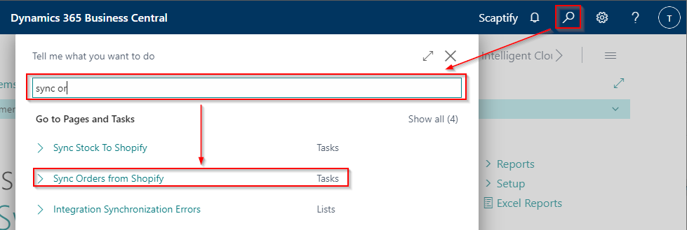
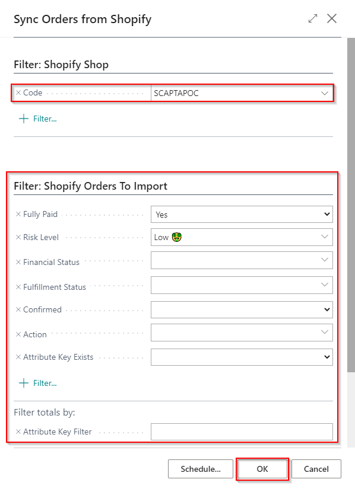
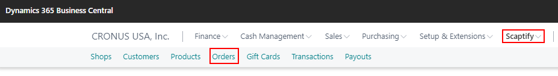
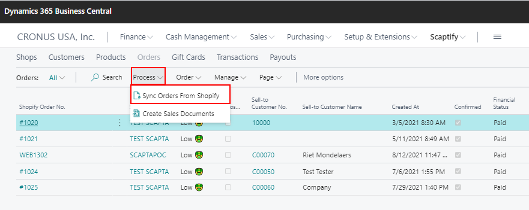
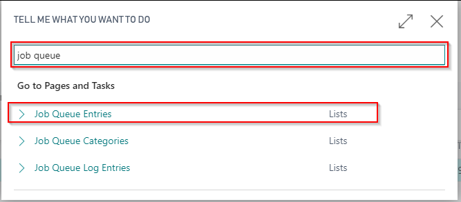
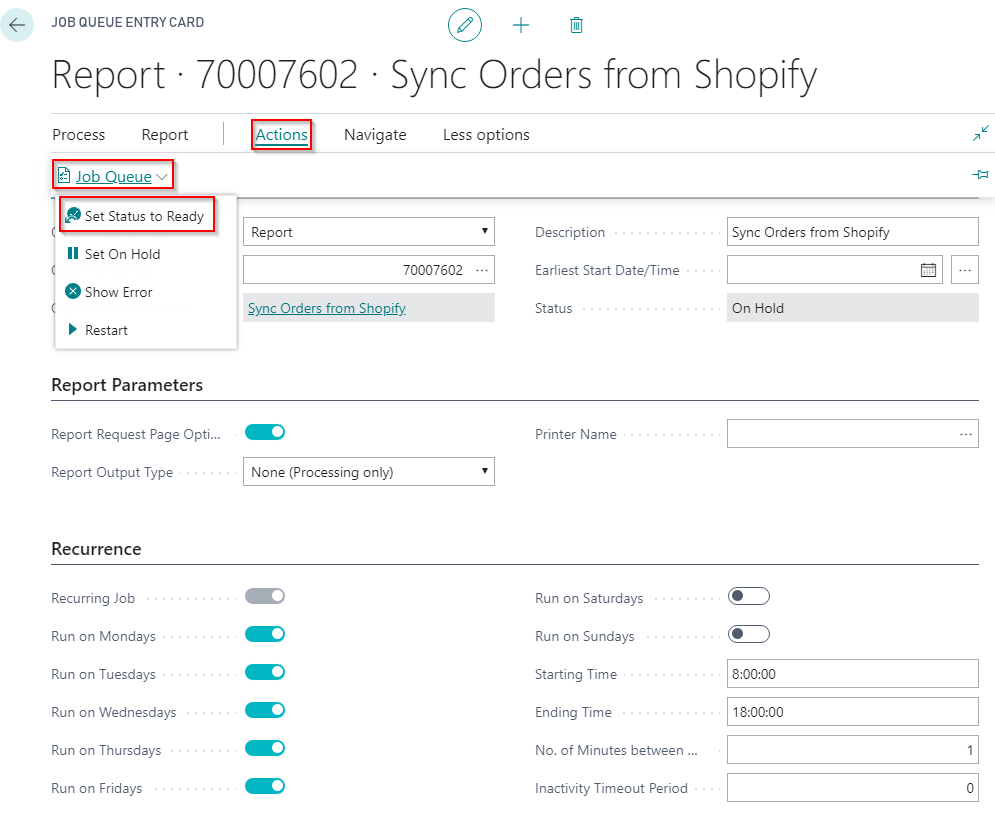

---
title: 
description: 
ms.date: 03/21/2022
ms.topic: article
ms.service: dynamics365-business-central
author: edupont04
ms.author: andreipa
manager: 
---

# Execute Order Synchronization

## By batch task

When an order is placed in Shopify, you can synchronize this to Dynamics 365 Business Central by executing the task "Sync Orders from Shopify".

You can find this task by using the search function from the Role Center:

It is possible to apply filters to synchronize only a limited number of orders, e.g. only those who have been paid in full or whose risk level is low.

When executing this task, the Shopify Orders are imported in Dynamics 365 Business Central.

## By action 'Sync orders from Shopify'

When you navigate to the Shopify Orders via your Shopify Shop, you can execute the function 'Sync Orders From Shopify' to synchronize the orders from your Shopify Account.

## By job queue

You can also schedule a job that runs for example every few minutes.

You can find the job queue entries by using the search function from the Role Center:

Define the recurrence of the job queue and start the job queue 'Sync Orders from Shopify'.

