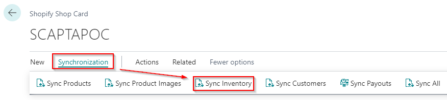
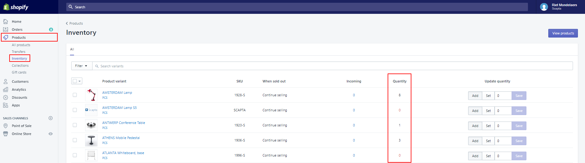
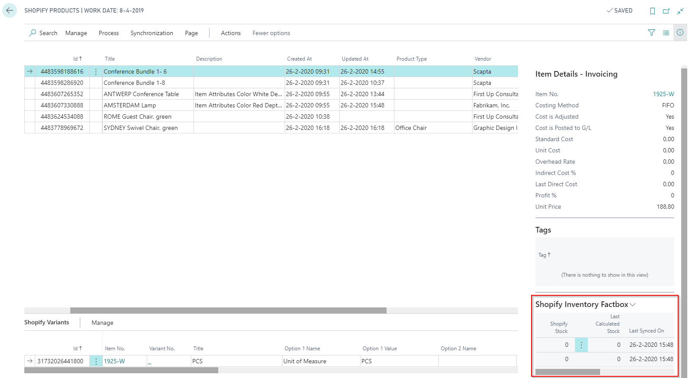

---
title: 
description: 
ms.date: 03/21/2022
ms.topic: article
ms.service: dynamics365-business-central
author: edupont04
ms.author: andreipa
manager: 
---

# Execute stock synchronization

On your Shopify Shop Card or on your Shopify Products, you can execute the function 'Sync inventory'.

The inventory of Shopify goes to Business Central. If there is a difference with the calculated inventory in Business Central, the inventory is updated in Shopify.

You can verify this on the admin page of your Shopify account.

On het Shopify Products page in Business Central, you can find the 'Shopify Inventory Factbox'. In this factbox you get an overview of the Shopify Stock and the last calculated inventory in Business Central. There is a record per location.

## Customer Synchronization

