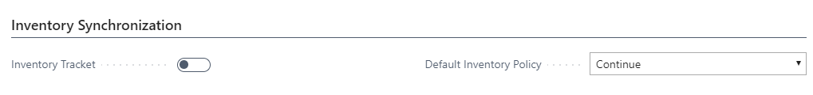

---
title: 
description: 
ms.date: 03/21/2022
ms.topic: article
ms.service: dynamics365-business-central
author: AndreiPanko
ms.author: andreipa
manager: 
---

# Getting Started

## Prerequisites
### For Shopify
- Shopify account and online store.

  To create a new Shopify Account or sign up for a free 14-day trial navigate to https://www.shopify.com/. For more information on how to create and personalize your online store, see https://help.shopify.com/.
  
- Addional sales channel, like Shopify POS, are supported.

### For [!INCLUDE[prod_short](../includes/prod_short.md)]
- **Connect to Shopify for [!INCLUDE[prod_short](../includes/prod_short.md)]** extension is installed

  Extension is pre-installed for all new signups. If you need to install extensions from Market place, see [Installing and Uninstalling Extensions](../ui-extensions-install-uninstall.md#install)

## Connecting Shopify and Business Central
### Starting from Shopify
1. Find [Dynamics 365 Business Central](https://fwlink?=TDB) app on the [Shopify AppStore](https://apps.shopify.com/)
2. Choose **Add App** button. Login into your Shopify account if prompted. Select online shop if you have more than one.
3. Review privacy and permissions details and choose **Install App** button.
  You can find and open installed **Dynamics 365 Business Central** app in the **Apps** section on the sidebar of **Shopify admin**.
4. Choose **Sign up now** to start [!INCLUDE[prod_short](../includes/prod_short.md)] trial or **Sign in** if you already using [!INCLUDE[prod_short](../includes/prod_short.md)]

### Starting from Business Central
1. Choose the  icon, enter **Shopify Shop**, and then choose the related link.
2. Choose the **New** action.  
3. Fill in the **Code** field.  
4. Fill in **Shopify URL** field with url to online shop your want to connect to.
5. Choose the **Request Access** action.
6. If prompted login into your Shopify account, review privacy and permissions details and choose **Install App** button.
 
Repeat steps 2-6 for all online shops you want to connect.

### Next steps
Now your online shop is connected to [!INCLUDE[prod_short](../includes/prod_short.md)]. Now need to define how and what you want to syncronize.
- Syncrhonize items. For more infomration, see [TBD]
- Synchronize customers. For more infomration, see [TBD]
- Synchronize orders. For more infomration, see [TBD]
- Other settins. For more infomration, see [TBD]

#TBD - move to other articles:
====================

-   Select the language code.   //TBD: to be moved to Customer sync

-   Activate the log.   //TBD: to be moved to "other, part trouleshouting. 

-   Select 'Allow Background Syncs' if you want to run the synchronization in background.    //TBD: to be moved to "other, part trouleshouting. 

-   Select how you want to sync your items

    -   From Dynamics 365 Business Central to Shopify

    -   From Shopify to Dynamics 365 Business Central

-   Select if you automatically want to create unknown items.

-   Select the Item template you want to use to create the items

-   Define if you only want to create or also update items.

-   Select if you want to sync images, extended texts, item attributes

-   Select if and how you want to create variants and stock keeping units in Business Central.

-   Decide what status products should have in Shopify when creating or deleting products in Business Central.

-   Define if you want to manage your inventory in Shopify based on Business Central.

-   Define if you to prevent negative inventory.

-   Select how want to import your customers from Shopify

    -   Not

    -   With order import

    -   All customers

-   Select how you want to map customers

    -   By email/phone

    -   By bill-to info

-   Select if you automatically want to create unknown customers.

-   Select a customer template based on which customers from Shopify, automatically or not, are created in Dynamics 365 Business Central.

-   Define which fields in Business Central needs to be filled with which fields in Shopify.

-   Select a customer on which the orders should be created if you do not want to create a customer in Business Central for each customer in Shopify.

-   Define if you only want to create or also update customers.

-   Define if you want to export your customers to Shopify.

The last step is to do some settings for order processing.

-   Enter the 'Shipping cost Account', the Sold Gift Card account and the Tip account.

-   Select if you want to show your Shopify Order No. in the lines of your Sales document in Dynamics 365 Business Central

-   Tax Area Source

**There are some <u>restrictions</u> for the Tax/VAT setup.**

-   The VAT/Tax setup must be the same in the Shopify shop and in Business Central.

-   When you use multiple VAT/tax percentages, Business Central should be leading. If Business Central is not leading and you use Collections in Shopify to handle Taxes you should use the same naming convention in Business Central for Tax setup, furthermore, the item should already exist in Business Central. When this is not the case a new item is created based on the defined item template and uses the VAT/tax percentage defined in this template, not the one set in the Shopify Shop.

The Shopify Connector is now setup and ready to use.
