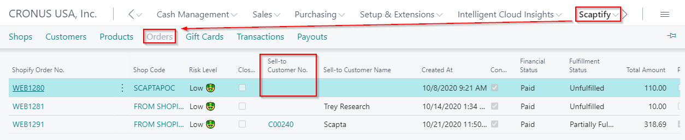
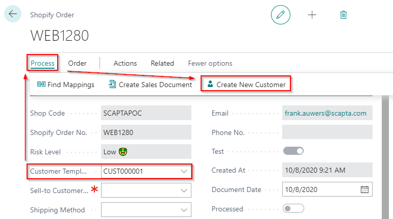

---
title: 
description: 
ms.date: 03/21/2022
ms.topic: article
ms.service: dynamics365-business-central
author: edupont04
ms.author: andreipa
manager: 
---

# Manually create customers

When the customer is not automatically created for one reason or another, it can be created manually.

In the Shopify Order, you can select a customer template code and create the customer via the function 'Create new customer' or you can select an existing customer.

In the Shopify Shop Customer List, you can select open the Shopify customer card and select an existing customer.

## Order Processing

