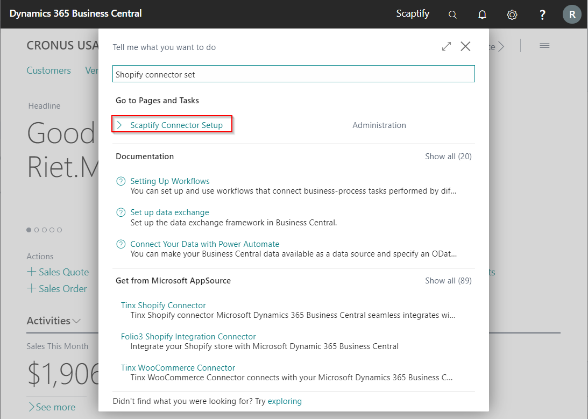
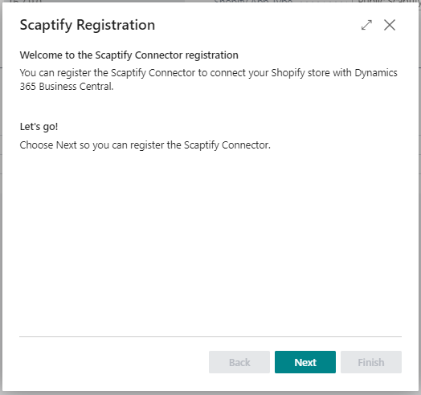
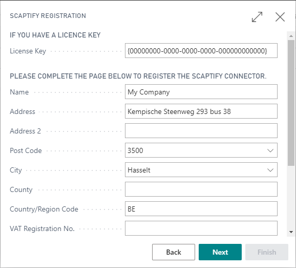
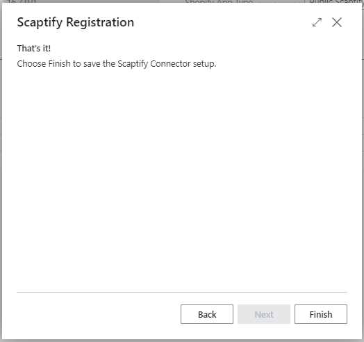
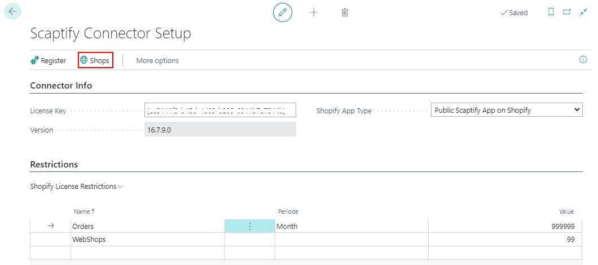
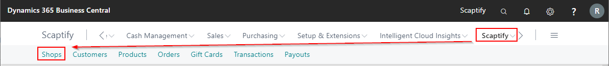
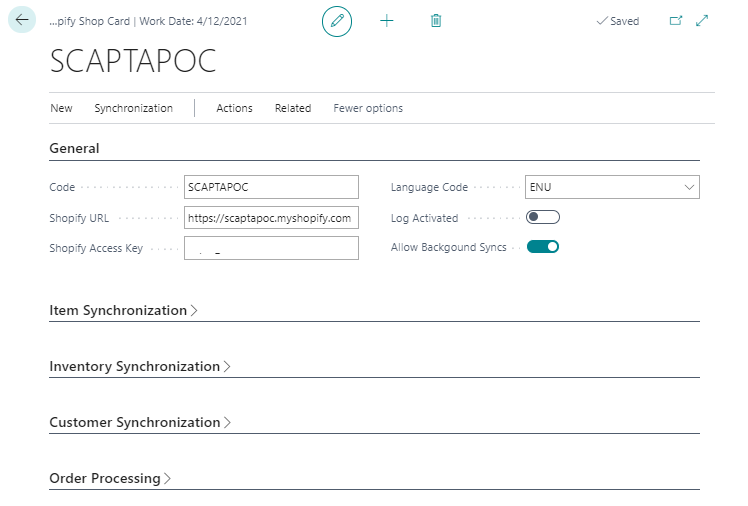
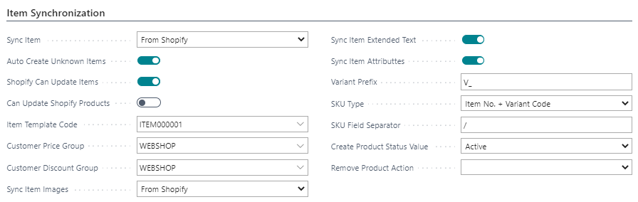
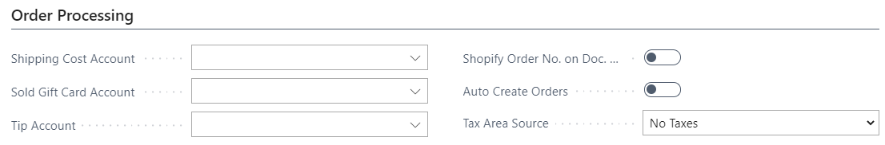

---
title: 
description: 
ms.date: 03/21/2022
ms.topic: article
ms.service: dynamics365-business-central
author: edupont04
ms.author: andreipa
manager: 
---

# Microsoft Dynamics 365 Business Central

## Shopify Connector Setup

This section describes the Shopify Connector Setup in Microsoft Dynamics 365 Business Central

-   In Microsoft Dynamics 365 Business Central go to the search function and choose 'Shopify Connector Setup'

The setup wizard will start :

-   Click Next on the welcome page.

-   Complete your company information and click next.

-   When you finish the wizard, the license key will be created.

-   You can consult your license key and restrictions in the Shopify Connector Setup page.

## Setup Shops

From the Shopify Connector Setup, you can create a connection to your Shopify Shops.

-   Open the Shopify Shops page via *Home &gt; Navigation &gt; Shops*

-   Create a new shop via 'New'.

-   Or follow the path 'Scaptify &gt; Shops'

Link your Shopify Shop.

-   Enter a Code for your Shopify Shop.

-   Enter the URL of your Shopify Store, together with the Shopify Access Key.  
    See [Install Scaptify app](shopify.md#install-the-scaptify-app).

-   Select the language code.

-   Activate the log.

-   Select 'Allow Background Syncs' if you want to run the synchronization in background.

The next step is to define how you want to synchronize your data. Depending on your choices, some fields will be added or will disappear.

More information about how to synchronize your data can be found in the user guide further in this document.

-   Select how you want to sync your items

    -   From Dynamics 365 Business Central to Shopify

    -   From Shopify to Dynamics 365 Business Central

-   Select if you automatically want to create unknown items.

-   Select the Item template you want to use to create the items

-   Define if you only want to create or also update items.

-   Select if you want to sync images, extended texts, item attributes

-   Select if and how you want to create variants and stock keeping units in Business Central.

-   Decide what status products should have in Shopify when creating or deleting products in Business Central.

-   Define if you want to manage your inventory in Shopify based on Business Central.

-   Define if you to prevent negative inventory.

-   Select how want to import your customers from Shopify

    -   Not

    -   With order import

    -   All customers

-   Select how you want to map customers

    -   By email/phone

    -   By bill-to info

-   Select if you automatically want to create unknown customers.

-   Select a customer template based on which customers from Shopify, automatically or not, are created in Dynamics 365 Business Central.

-   Define which fields in Business Central needs to be filled with which fields in Shopify.

-   Select a customer on which the orders should be created if you do not want to create a customer in Business Central for each customer in Shopify.

-   Define if you only want to create or also update customers.

-   Define if you want to export your customers to Shopify.

The last step is to do some settings for order processing.

-   Enter the 'Shipping cost Account', the Sold Gift Card account and the Tip account.

-   Select if you want to show your Shopify Order No. in the lines of your Sales document in Dynamics 365 Business Central

-   Tax Area Source

**There are some <u>restrictions</u> for the Tax/VAT setup.**

-   The VAT/Tax setup must be the same in the Shopify shop and in Business Central.

-   When you use multiple VAT/tax percentages, Business Central should be leading. If Business Central is not leading and you use Collections in Shopify to handle Taxes you should use the same naming convention in Business Central for Tax setup, furthermore, the item should already exist in Business Central. When this is not the case a new item is created based on the defined item template and uses the VAT/tax percentage defined in this template, not the one set in the Shopify Shop.

The Shopify Connector is now setup and ready to use.

## Item Synchronization

