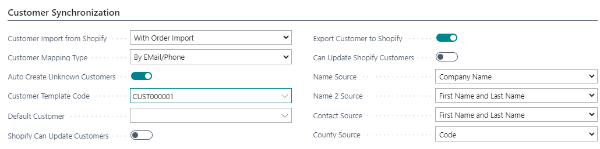

---
title: 
description: 
ms.date: 03/21/2022
ms.topic: article
ms.service: dynamics365-business-central
author: edupont04
ms.author: andreipa
manager: 
---

# Setup customers to synchronize

On the tab 'Customer Synchronization' of the Shopify Shop Card, you can enter to sync customers.

- **Customer Import from Shopify**  
    Define how you want to import the customers from Shopify in Microsoft Dynamics 365 Business Central

    -   None  
        Customers are not imported. You can use a default customer for your webshop orders.

    -   With order import  
        When an order is imported, the customer of this order is created.

    -   All customers  
        Select if you want to create all customers.

- **Customer Mapping Type  
 **Select how you want to map customers.

    -   By Email/Phone

    -   By Bill-to Info

- **Auto create unknown customers  
 **Select if you want to create customers automatically based on a customer template or if you want to do this manually.

- **Customer template code**  
    Select a customer template code which is used to create customers.

- **Default customer  
 **If you do not want to create customers of each webshop user, you can use a default customer for all webshop orders.

- **Shopify can update customers**  
    Define if Shopify can only create customers or also update customers.

- **Export customer to Shopify  
 **With this option, you can export all customers with a valid e-mail address from Microsoft Dynamics 365 Business Central to Shopify.

- **Can update Shopify Customers  
 **Define if Microsoft Dynamics 365 for Business Central can only create customers or also update customers.

- **Name Source**  
    Define how you want to sync the name of the customer

    -   Company name

    -   First name and last name

    -   Last name and first name

    -   Not

- **Name 2 Source**  
    Define how you want to sync name 2 of the customer

    -   Company name

    -   First name and last name

    -   Last name and first name

    -   Not

- **Contact Source**  
    Define how you want to sync the contact of the customer

    -   First name and last name

    -   Last name and first name

    -   Not

- **County Source**  
    Define how you want to sync the county

    -   Code

    -   Name

