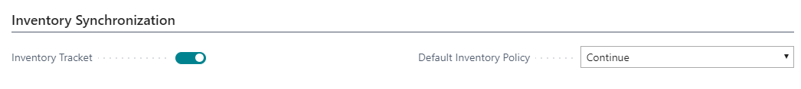

---
title: 
description: 
ms.date: 03/21/2022
ms.topic: article
ms.service: dynamics365-business-central
author: edupont04
ms.author: andreipa
manager: 
---

# Setup inventory to synchronize

On the tab 'Inventory Synchronization' of the Shopify Shop Card, you can enter to sync inventory.

- **Inventory Synchronization**  
    Define if you want to manage your inventory in Shopify based on Business Central.

- **Default Inventory Policy**  
    Define if you to prevent negative inventory.

    -   Continue: The inventory can go negative.

    -   Deny: You want to prevent negative inventory.

