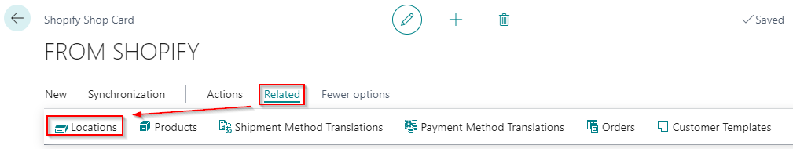

---
title: 
description: 
ms.date: 03/21/2022
ms.topic: article
ms.service: dynamics365-business-central
author: edupont04
ms.author: andreipa
manager: 
---

# Setup locations

In Shopify you can define more than one location via 'Settings' &gt; 'Locations'.

These locations need to be available in Microsoft Dynamics 365 Business Central.

On the Shopify Shop Card: Process &gt; Locations

Use the function 'Get Shopify Locations' to get the locations from Shopify.

The locations appear in Business Central. Link the Shopify location with the location in Business Central.

-   Table filter: determines the location(s) for which the stock must be counted.

-   Default location: determines the location to be used in the orders.

Uncheck 'Disable' if you want to sync the inventory for this location to Business Central.

