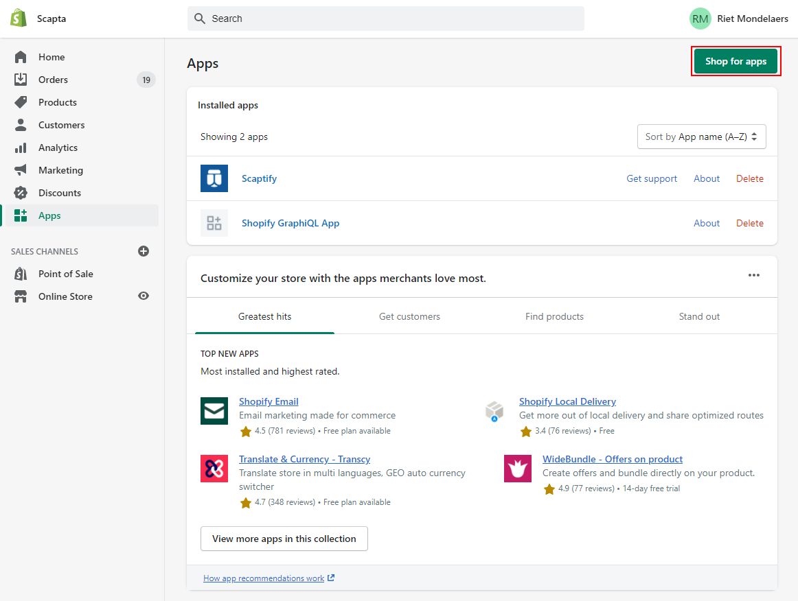
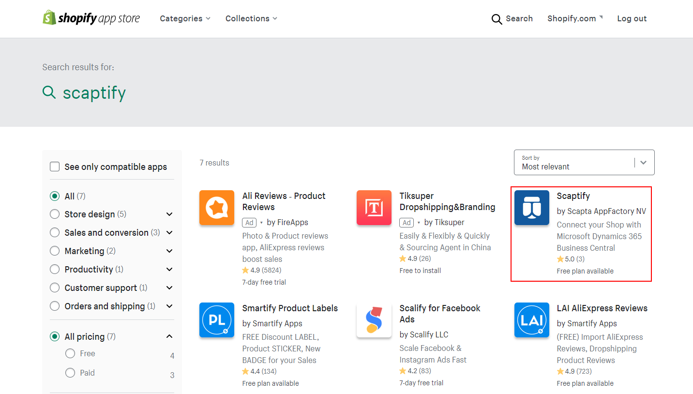
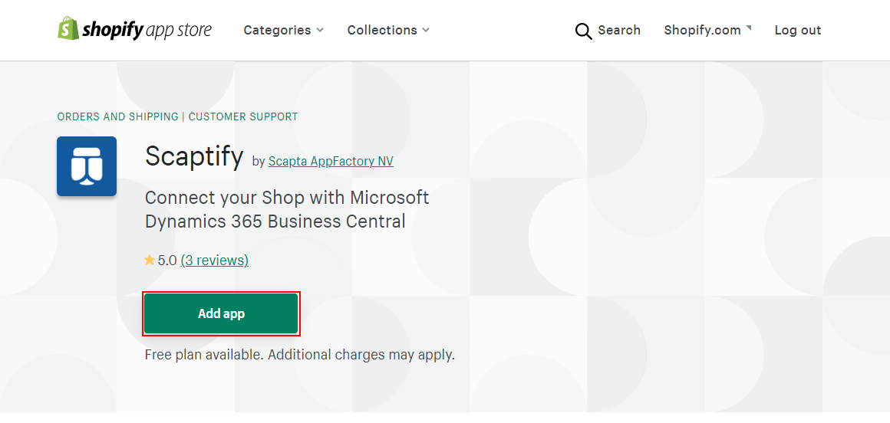
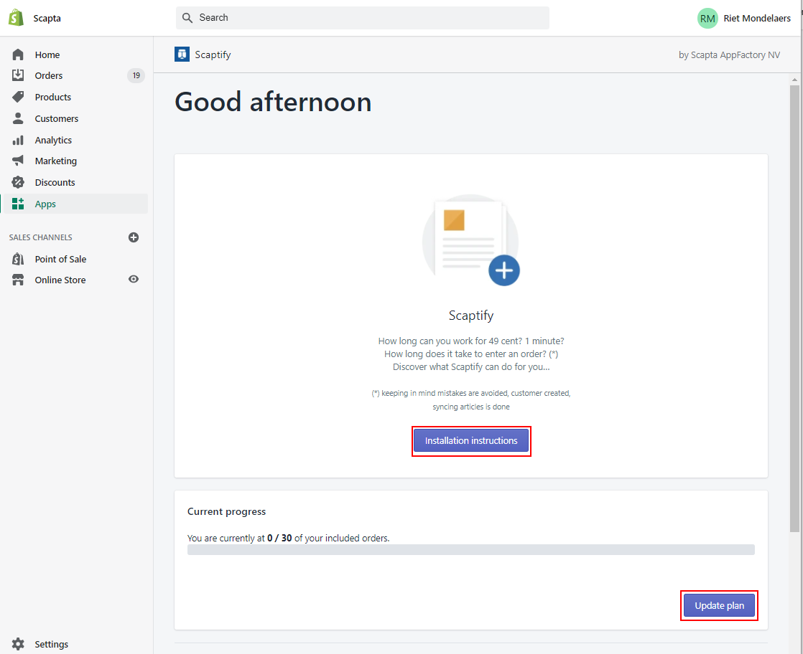
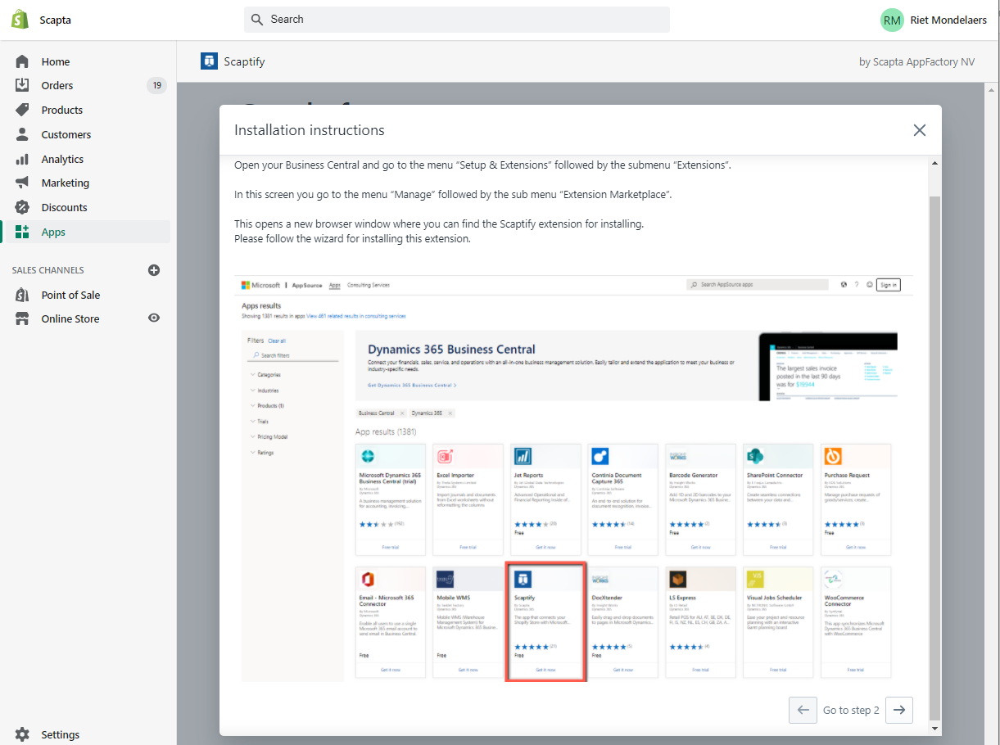
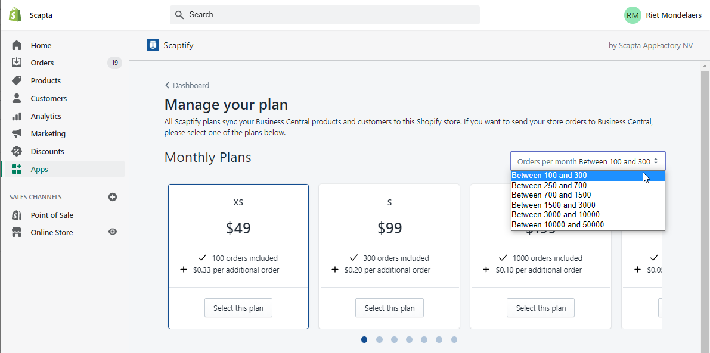
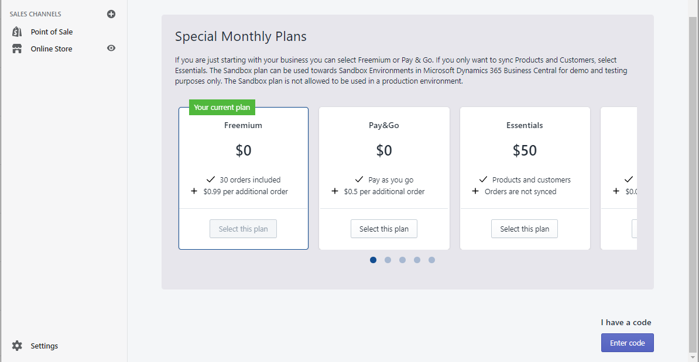
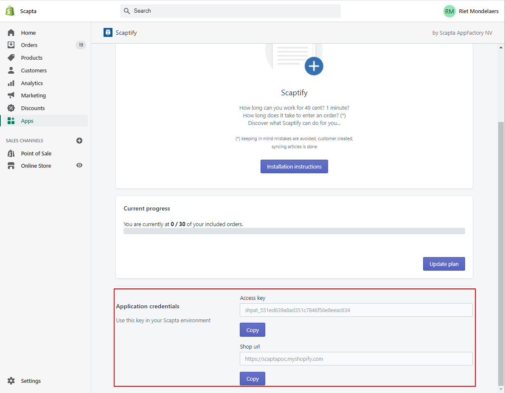

# Shopify

## Create Shopify Account

Create a new Shopify Account or sign up for a free 14-day trial at <https://www.shopify.com/>.

More information about how to create and personalize your Shopify store can be found at <https://help.shopify.com/>.

## Configure Shopify Account

## Install the Scaptify app

In order to allow Microsoft Dynamics 365 Business Central to securely connect to Shopify, you need to install the Scaptify app. It will create application credentials in Shopify that Microsoft Dynamics 365 Business Central will use to connect to Shopify.

Follow the steps below to create the credentials:

-   Log in to the Shopify Admin page of your store  
    e.g.:

-   In the menu on the left, click "Apps"  
    

-   Click 'Shop for Apps'.

-   Search for 'Scaptify'

Choose **'Installation instructions'** to see how you need to install Scaptify in Microsoft Dynamics 365 Business Central.

Choose **'Update plan'** to select the plan you need for your business. You have Monthly plans and special Monthly plans. In the Monthly plans, you can filter on the orders per month to see which plan fits for you.

 

-   When you close the installation instructions, you see the application credentials.  
    This information will be used later on in the setup of Microsoft Dynamics 365 Business Central.

If you want to consult this information later, you can go to 'Apps' and select the Scaptify app.

