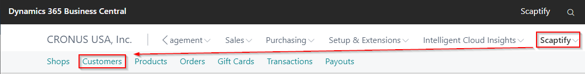
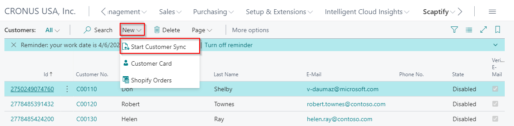
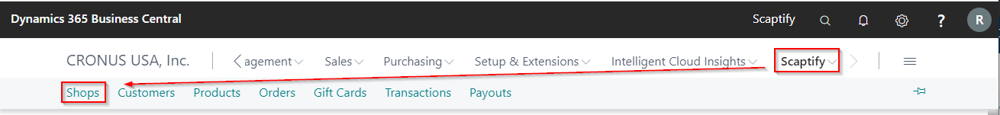
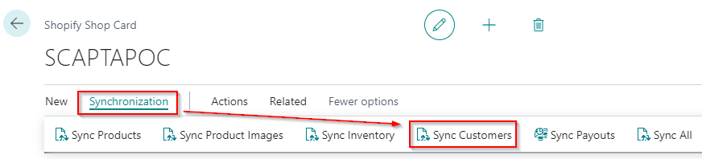
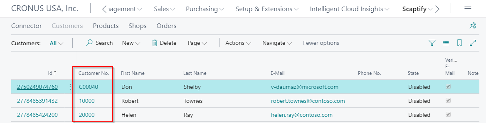
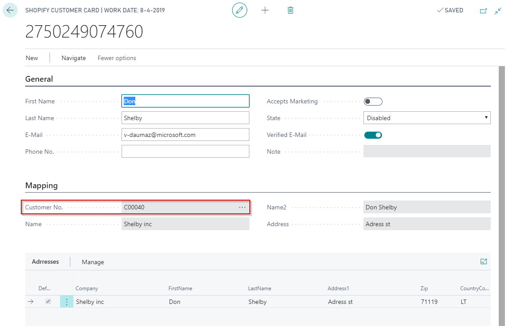

---
title: 
description: 
ms.date: 03/21/2022
ms.topic: article
ms.service: dynamics365-business-central
author: edupont04
ms.author: andreipa
manager: 
---

# Synchronize customers

Remark: The customer created is the bill-to customer.

## Manually sync customers

There are two ways to go to the customer sync.

-   Via 'Customers'

-   Via the Shopify Shop Card

##  Verify customer creation

Verify that the new customer is created in Dynamics 365 Business Central.
Go to 'Customers' and verify the customer is added to the list and a customer number is linked.

