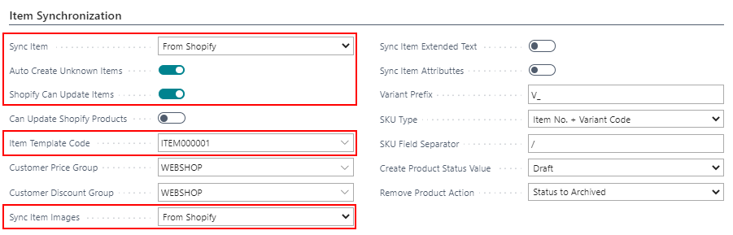
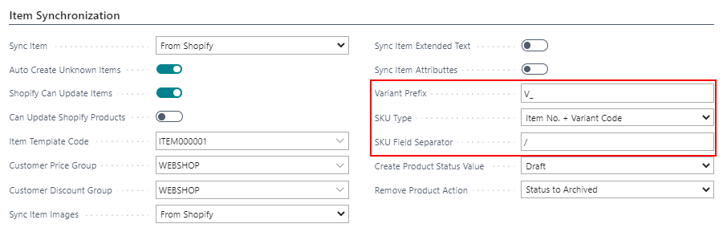
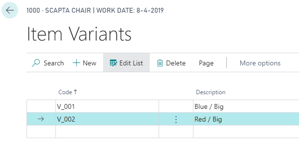
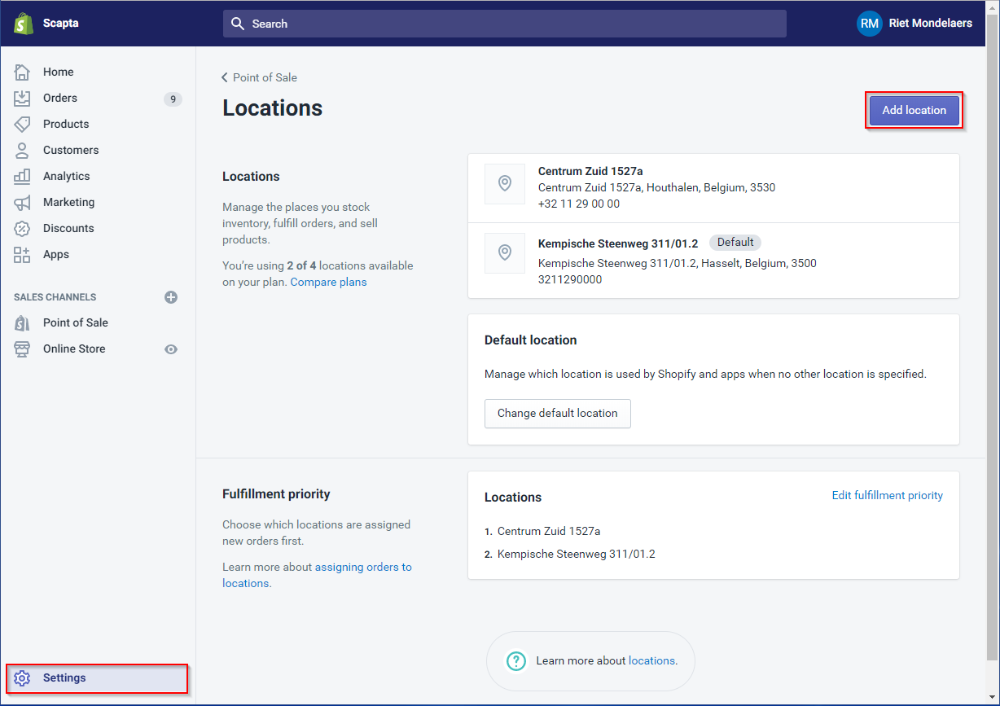
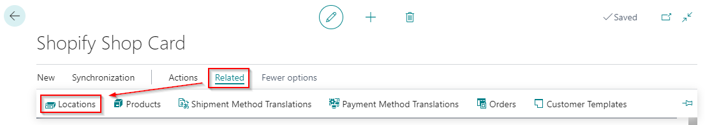
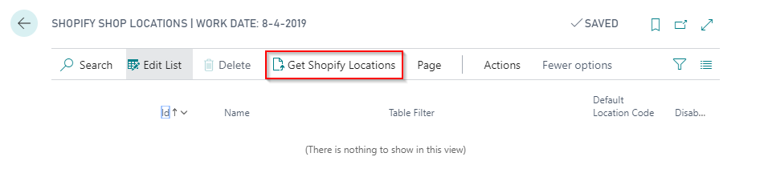
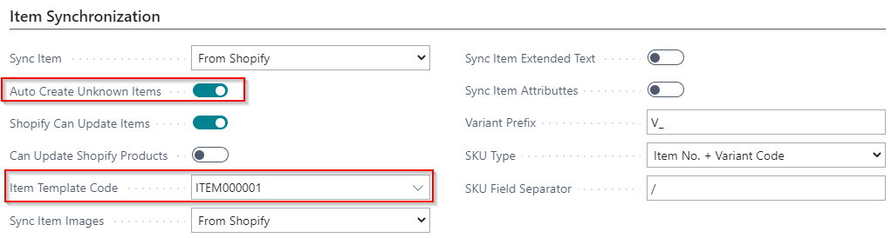
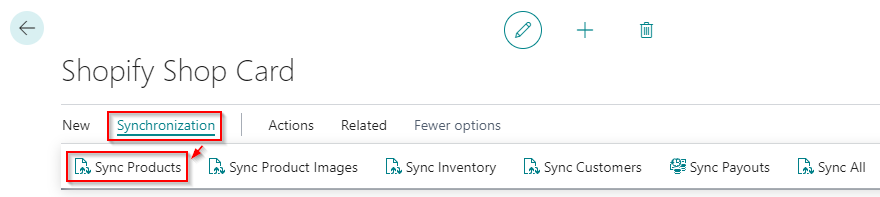
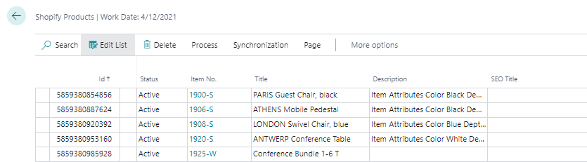
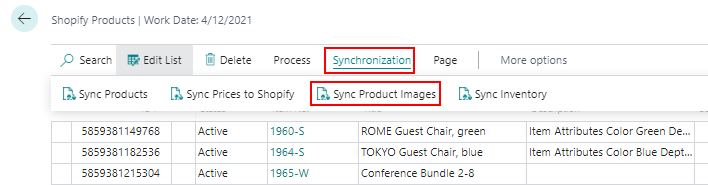

---
title: 
description: 
ms.date: 03/21/2022
ms.topic: article
ms.service: dynamics365-business-central
author: edupont04
ms.author: andreipa
manager: 
---

# Synchronize item from Shopify to Dynamics 365 Business Central

## Setup Items to synchronize

On the tab 'Item Synchronization' of the Shopify Shop Card, you can enter to sync the items from Shopify.

- **Sync item**  
    Sync your item 'From Shopify'.

- **Auto create unknown items  
 **Define if you want to automatically create unknown items.

- **Shopify can update items**  
    Define if Shopify can only create items or also update items

- **Sync item images**  
    Sync your items 'From Shopify'

    1.  ### Setup to sync variants

On the tab 'Synchronization' of the Shopify Shop Card, you can indicate if and how you want to synchronize variants and stockkeeping units from Shopify to Dynamics 365 Business Central.

- **Variant Prefix**  
    The variants you have defined in Shopify are created in Business Central based on an increasing number. You can choose a prefix for the variants.

- **SKU Type**  
    Define if and how you want to create variants in Dynamics 365 Business Central. The option you select is what you have defined in the SKU field in Shopify.

    - **Blanc**  
        = You do not want to create variants.

    - **Item no.**  
        = The item number is defined in the SKU field in Shopify. The SKU's in Shopify are created as different items in Dynamics 365 Business Central.

    - **Variant code**  
        = The variant is defined in the SKU field in Shopify. The SKU's are created as different variants based on de defined prefix for variants and an increasing number (see Variant prefix).

    - **Item No. + Variant Code**  
        = The item number and variant code are defined in the SKU field in Shopify. In the field 'SKU Field separator' in Business central, you define the used field separator. The SKU's are created as an item with different variants.  
        For example: if you create the variant '1000/001' in Shopify, the item number in Microsoft Dynamics 365 Business Central will be 1000 and the variant '001'.

    - **Vendor Item No.**  
        = The vendor item number is defined in the SKU field in Shopify. When you synchronize, the product will be linked to the item in Dynamics 365 Business Central with the same vendor item number.

    - **Barcode**  
        = The barcode is defined in the SKU field in Shopify. When you synchronize, the product will be linked to the item in Dynamics 365 Business Central with the same barcode.

- **SKU Field Separator**  
    Define a field separator for the SKU if you use 'Item. No + Variant Code' to create a variant.  
    For example: if you create the variant '1000/001' in Shopify, the item number in Microsoft Dynamics 365 Business Central will be 1000 and the variant '001'.

## Setup locations

In Shopify you can define more than one location via 'Settings' &gt; 'Locations'.

These locations need to be available in Microsoft Dynamics 365 Business Central.

On the Shopify Shop Card: Process &gt; Locations

Use the function 'Get Shopify Locations' to get the locations from Shopify.

The locations appear in Business Central. Link the Shopify location with the location in Business Central.

-   Table filter: determines the location(s) for which the stock must be counted.

-   Default location: determines the location to be used in the orders.

Uncheck 'Disable' if you want to sync the inventory for this location to Business Central.

## Setup to automatically create unknown items

On the tab 'Item Synchronization' of the Shopify Shop Card, you can indicate to automatically create unknown items from Shopify into Dynamics 365 Business Central based on an item template.

## Execute Item Synchronization

On the Products page, you can synchronize items from Shopify to Business Central via the function 'Sync Products'.

## Sync product images

When you navigate to 'Products' on you Shopify Shop Card, you can execute the function 'Sync Product Images' to synchronize the items in Business Central.

## Inventory Synchronization

The inventory of Shopify goes to Business Central. If there is a difference with the calculated inventory in Business Central, the inventory is updated in Shopify.

