---
title: 
description: 
ms.date: 03/21/2022
ms.topic: article
ms.service: dynamics365-business-central
author: edupont04
ms.author: andreipa
manager: 
---

# Synchronize item to Shopify

## Setup Items to synchronize

On the tab 'Item Synchronization' of the Shopify Shop Card, you can enter to sync the items (item data, item attributes, extended text, item tags…) and item images to Shopify.

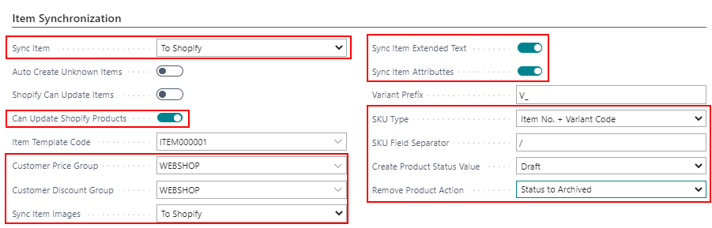

- **Sync item**  
    Sync your item 'To Shopify'.

- **Can update Shopify Products**  
    Define if Business Central can only create items or also update items

- **Customer Price Group**  
    Determine which price should be used for an item in Shopify. The sales price of this customer price group is taken. If no group is entered, the price of the item card is used.

- **Customer Discount Group**  
    Determine which discount should be used for an item in Shopify. The sales discount of this customer discount group is taken. If no group is entered, there is no discount.

- **Sync item images**  
    Sync your items 'To Shopify'

- **Sync item extended text**  
    Select if you want to sync the extended text of the item.

- **Sync item attributes**  
    Select if you want to sync the item attributes of the item.

- **Mapping**

    -   SKU Type  
        Choose how you want to define your SKU in Shopify

        -   Blanc

        -   Item No.

        -   Variant Code

        -   Item No. + Variant Code

        -   Vendor Item No.

        -   Barcode

    -   SKU Field Separator  
        Set a field separator if you choose the option 'Item No. + Variant Code' as SKU Type.

When you navigate to 'Products' on you Shopify Shop Card, you can add the items from Dynamics 365 Business Central you want to synchronize to Shopify.

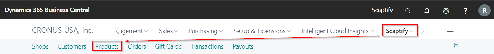

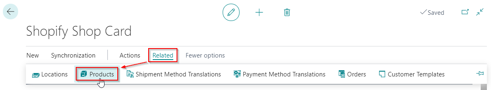

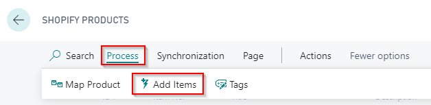

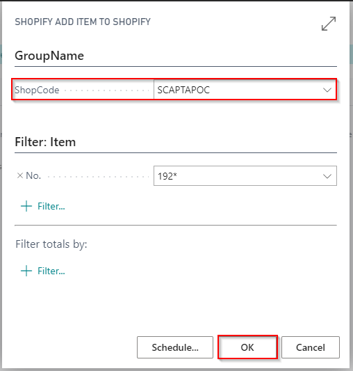

<u>Remark:</u> Items are automatically created in Shopify if you add items. In 'Id' you can see the Shopify-id.

In this overview, you can see the **status** of the products. The status depends on the setting you have made in your Shopify Shop for 'Create Product Status Value'. You can change the status in this overview. The status will be automatically changed in Shopify. If you delete an item in the 'Shopify Products' Page, the status in Shopify will be adjusted based on the settings in the field 'Remove Product Action' in the Shopify Shop.

You can find two fields for Search Engine Optimization (**SEO**), namely 'SEO Title' and 'SEO Description'. Filling in this fields automatically syncs them to Shopify.

At the bottom of the screen, you can find the variants of the selected product.

<u>Remark:</u> It is possible to add 'Item tags' to your items in Dynamics 365 Business Central. These tags are also synchronized to Shopify.

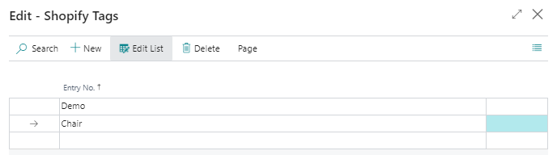

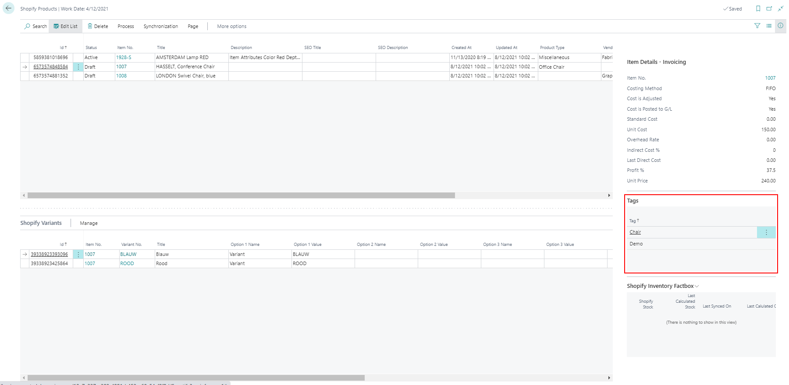

## Setup locations

In Shopify you can define more than one location via 'Settings' &gt; 'Locations'.

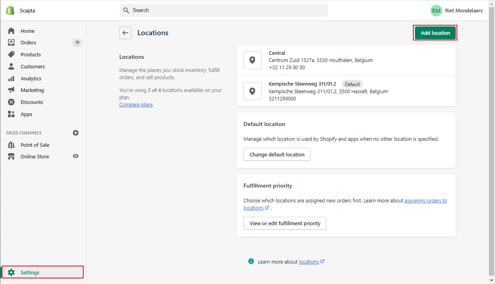

These locations need to be available in Microsoft Dynamics 365 Business Central.

On the Shopify Shop Card: Process &gt; Locations

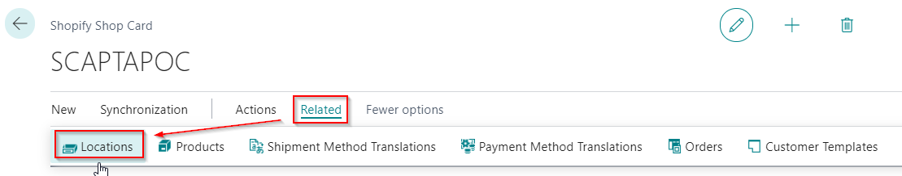

Use the function 'Get Shopify Locations' to get the locations from Shopify.

The locations appear in Business Central. Link the Shopify location with the location in Business Central.

-   Table filter: determines the location(s) for which the stock must be counted.

-   Default location: determines the location to be used in the orders.

Uncheck 'Disable' if you want to sync the inventory for this location to Business Central.

## Execute Item Synchronization

## By batch task

In the Role center, use the search function to find the task "Sync products":

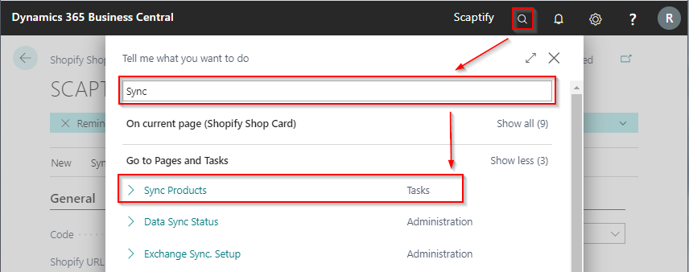

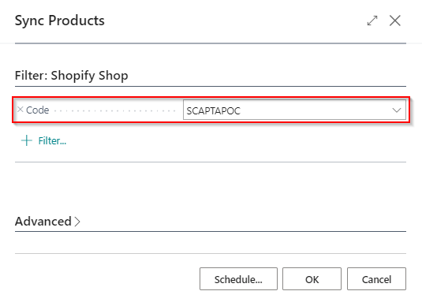

When executing this task, the configured items are synchronized to your Shopify account.

You can verify this on the admin page of your Shopify account.

## By action 'Sync'

When you navigate to 'Products' on you Shopify Shop Card, you can execute the function 'Sync Products' to synchronize the items to your Shopify Account. Only the updated products and fields are synchronized.

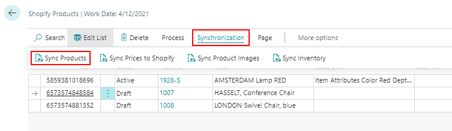

You can verify this on the admin page of your Shopify account.

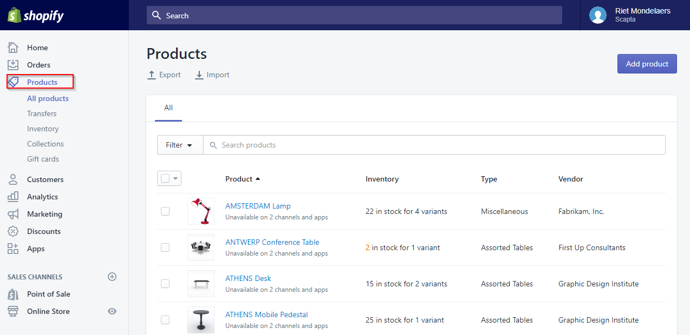

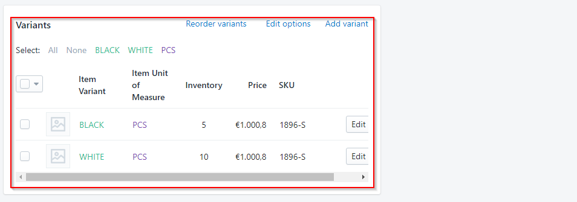

## Sync Product images

When you navigate to 'Products' on you Shopify Shop Card, you can execute the function 'Sync Product Images' to synchronize the item image to your Shopify Account.

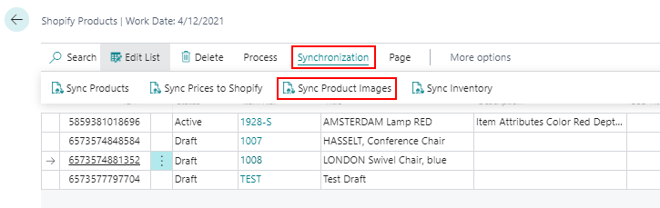

## Sync Prices to Shopify

Once you've updated your prices in Dynamics 365 Business Central, you can only synchronize prices to Shopify using the 'Sync Prices to Shopify' function on the 'Shopify Products' page.

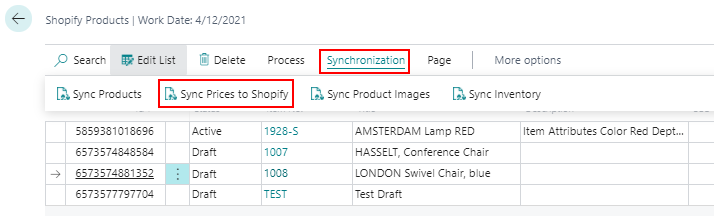

Remark: The price taken follows the standard price calculation of Dynamics 365 Business Central. The lowest valid price is taken.

