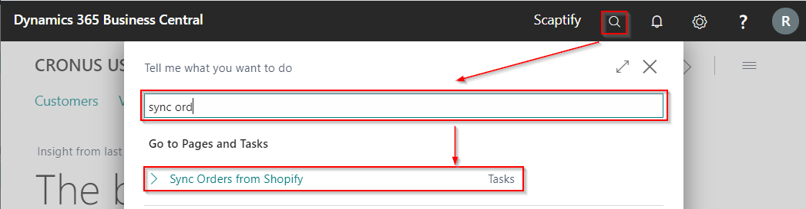
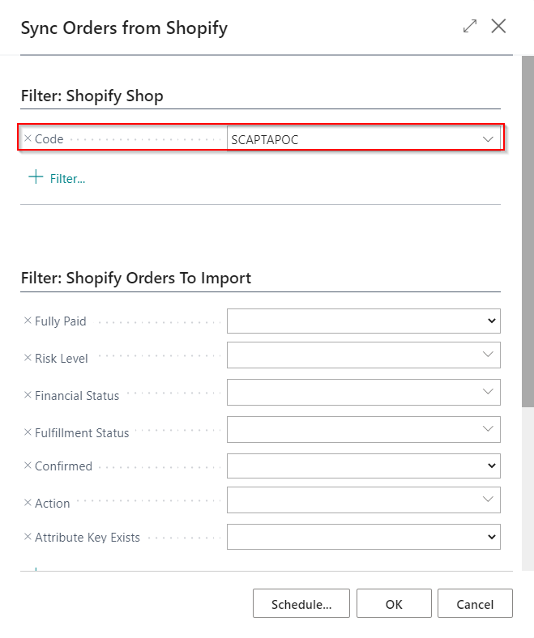
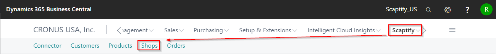
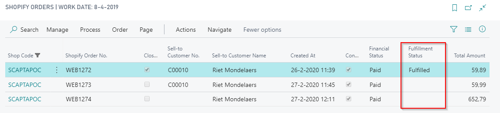
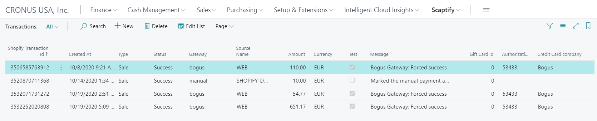
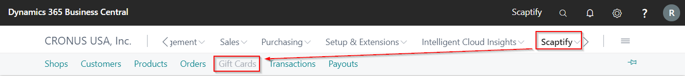
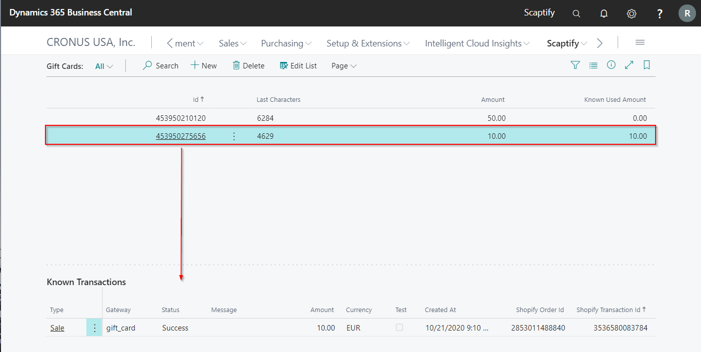
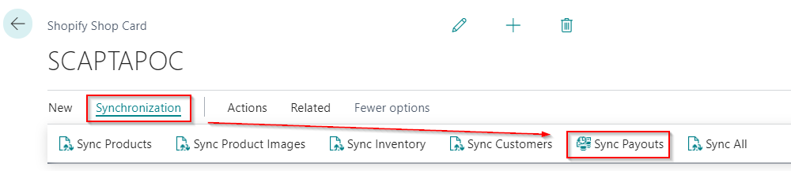
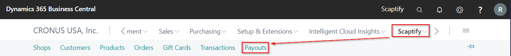

---
title: 
description: 
ms.date: 03/21/2022
ms.topic: article
ms.service: dynamics365-business-central
author: edupont04
ms.author: andreipa
manager: 
---

# Synchronize orders from Shopify

Synchronize the orders from Shopify again to update the fulfillment status in Dynamics 365 Business Central.

Enter your Shopify Shop

Open the Shopify Orders of the Shopify Shop

## Reset sync

On the Shopify Shop card, there are functions available to reset the sync. This function ensures that when the sync is executed, all data is synced and not just the changes that have happened compared to the previous sync.

This function only applies to syncs from Shopify to Business Central.

## Transactions

The transactions that took place in Shopify can be viewed in Business Central via 'Transactions'. They are synchronized together with the orders.

##  Gift Cards

In the Shopify Shop, you can buy gift cards. When you synchronize orders, gift cards are also synchronized to 'Gift Cards'.

You get an overview of the sold gift cards and the used amount of de gift card with the relevant transactions.

## Payouts

If your store has Shopify Payments enabled, then you receive payments through Shopify Payouts when a customer pays using Shopify Payments and specific accelerated checkouts.

The payouts can also be synchronized to Microsoft Dynamics 365 Business Central.

Go to your Shopify Shop and execute 'Sync Payouts'.

You get an overview of the payouts if you navigate to 'Scaptify' and then to 'Payouts'. You get a view of the details of the payouts.

## Troubleshooting

When a synchronization task from / to Shopify fails, you can activate logging on the tab 'General' in the Shopify Shop Card:

After you start the synchronization task again, you can check the Scaptify Log Entries for any errors / information:

Make sure to disable the logging when not needed, or to delete the entries periodically.

