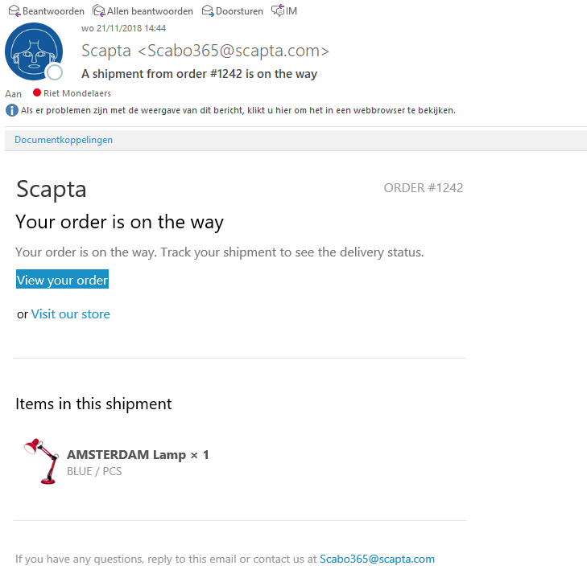
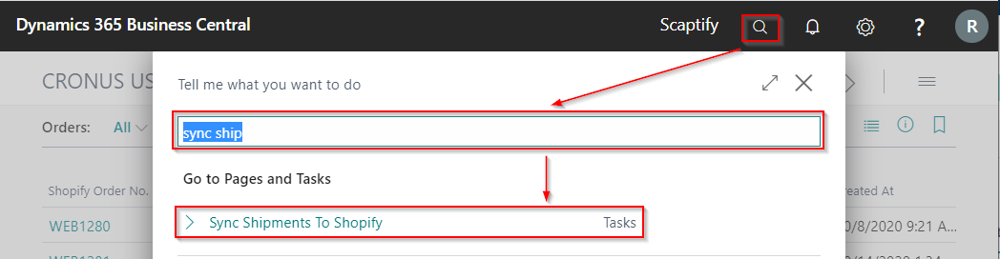
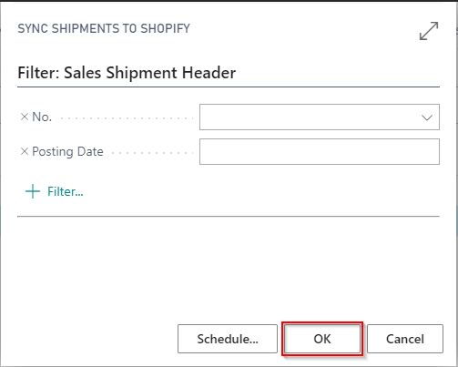
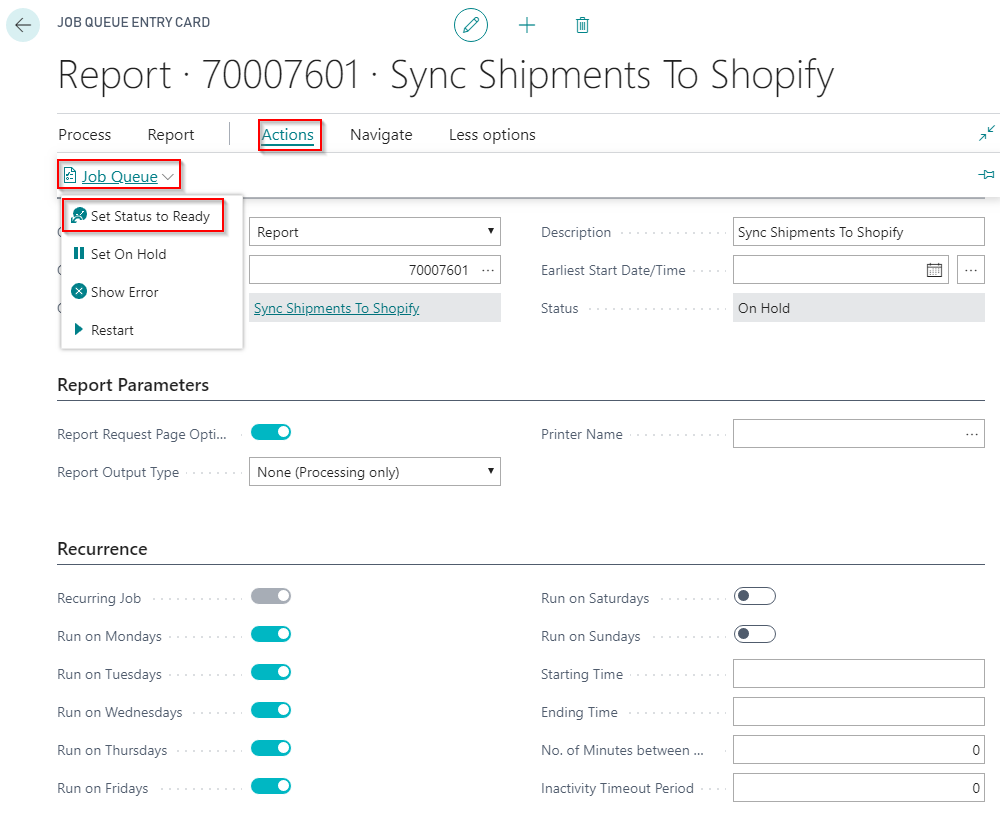

# Setup Order Processing

On the **Shopify Shop Card**, you can define some setup for order processing.

- **Shipping Cost Account**  
    Define the g/l account that should be used for shipping costs.

- **Sold Gift Card Account**  
    Define the g/l account that should be used for the sale of gift cards.

- **Tip account**  
    Define the g/l account that should be used for obtained tips.

- **Shopify Order No. on Doc. Line**  
    Check this option if you want to create sales line of type Comment with Shopify order number.

- **Auto Create Orders**  
    Determine whether order in Microsoft Dynamics 365 Business Central may be created automatically.

- **Tax area source  
    **Define your tax area source and the sequence that needs to be followed.

    -   No taxes

    -   Ship-to &gt; Sell-to &gt; Bill-to

    -   Ship-to &gt; Bill-to &gt; Sell-to

    -   Sell-to &gt; Ship-to &gt; Bill-to

    -   Sell-to &gt; Bill-to &gt; Ship-to

    -   Bill-to &gt; Sell-to &gt; Ship-to

    -   Bill-to &gt; Ship-to &gt; Sell-to

## Shipment method translations

When you have synchronized orders, the Shopify delivery methods are retrieved in Business Central. Go to your Shopify Shop and open the 'Shipment Method Translations'.

Name is the delivery method in Shopify. In 'Code', you set the corresponding shipping method in Microsoft Dynamics 365 Business Central.

>[!NOTE] if multiple shipping costs assosiated with Sales ORder - only one will be used in the Header.

## Shipping agents

When you navigate to the list of Shipping agents in Microsoft Dynamics 365 Business Central, the column 'Shopify Tracking Company' is added. Select the tracking company in Shopify where you can track your items.

## Payment method translations

When you have synchronized orders, the Shopify payment methods are retrieved in Business Central. Go to your Shopify Shop and open the 'Shipment payment Translations'.

You can define Payment Method translations for your Shopify Shop. The fields 'Gateway' and 'Credit Card Company' retrieved from Shopify. In 'Payment method' you define the corresponding method in Microsoft Dynamics 365 Business Central.

If a customer pays part via visa card and part via maestro, you can assign priorities. The payment method with the highest priority will be entered in the order. If both payment methods have the same priority, the payment method of the highest amount will be used.

# Execute Order Synchronization

## By batch task

When an order is placed in Shopify, you can synchronize this to Dynamics 365 Business Central by executing the task "Sync Orders from Shopify".

You can find this task by using the search function from the Role Center:

It is possible to apply filters to synchronize only a limited number of orders, e.g. only those who have been paid in full or whose risk level is low.

When executing this task, the Shopify Orders are imported in Dynamics 365 Business Central.

## By action 'Sync orders from Shopify'

When you navigate to the Shopify Orders via your Shopify Shop, you can execute the function **Sync Orders From Shopify** to synchronize the orders from your Shopify Account.

## By job queue

You can also schedule a job that runs for example every few minutes.

You can find the job queue entries by using the search function from the Role Center:

Define the recurrence of the job queue and start the job queue 'Sync Orders from Shopify'.

# View Shopify Orders

You can find the **Shopify Orders** using the search function from the Role Center.

## All Shopify Orders

This are all the open orders of all Shopify Shop Accounts.
>[!NOTE] Only open orders are there.

## Shopify Orders of a specific shop

Navigate to the Shopify Shop to get an overview of all the Shopify Orders for this Shop, including archived orders.

# Synchronize orders from Shopify

Synchronize the orders from Shopify again to update the fulfillment status in Dynamics 365 Business Central.

Enter your Shopify Shop

Open the Shopify Orders of the Shopify Shop

## Reset sync

On the Shopify Shop card, there are functions available to reset the sync. This function ensures that when the sync is executed, all data is synced and not just the changes that have happened compared to the previous sync.

This function only applies to syncs from Shopify to Business Central.

## Transactions

The transactions that took place in Shopify can be viewed in Business Central via 'Transactions'. They are synchronized together with the orders.

# Manually create customers

When the customer is not automatically created for one reason or another, it can be created manually.

In the Shopify Order, you can select a customer template code and create the customer via the function 'Create new customer' or you can select an existing customer.

In the Shopify Shop Customer List, you can select open the Shopify customer card and select an existing customer.

# Process Shopify Orders

Navigate to the Shopify Orders.

Edit the Shopify order.

On the Shopify Order Card, you can find all the information about the Shopify Order, for example the shipping costs, fulfillments, risk level … You can navigate easily to the Sales order, sales invoice.

Via 'Inspect', you can go to the 'Shopify Status Page' to see the order confirmation sent to the customer. The 'Retrieved Shopify Data' shows you the data from Shopify that was retrieved.

If the customer is not found automatically, you can select the correct customer, or create a new customer directly from the Shopify Order.

When the customer is selected, you can process the Shopify Order to a Sales Order.

## By action 'Create Sales Document'

You can process the Shopify order to a sales order by using the action "Create Sales Document".

A sales order is now created and can be handled by using the standard Dynamics 365 Business Central functionalities.

Shipment costs are added to the sales order.
If you checked the field 'Shopify order no. on doc. Line', the Shopify order number is visible in the sales lines.

Remark: If no sales order can be created for the Shopify Order, an error message is displayed.

<u>Remark:</u> If no sales order can be created for the Shopify Order, an error message is displayed.

## By job queue

You can also schedule a job to process the Shopify orders that runs for example every few minutes.

You can find the job queue entries by using the search function from the Role Center:

Define the recurrence of the job queue 'Process Shopify Orders' and start the job queue.

# Synchronize Shipments to Shopify

When a sales order that is created from a Shopify Order, is shipped, you can synchronize the shipments to Shopify.

The customer will automatically receive a shipment notice email.
When a Shipping Agent and a Tracking Code is specified on the shipment, the tracking information will be included in the email.

## By batch task

You can synchronize the shipment by executing the task "Synchronize Shipments To Shopify".

This task can be found by using the search function on the Role Center.

## By job queue

You can also schedule a job to synchronize shipments to Shopify orders that runs for example every few minutes.

You can find the job queue entries by using the search function from the Role Center:

Define the recurrence of the job queue 'Sync Shipments to Shopify' and start the job queue.

