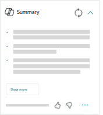

# Summarize records with Copilot (preview)

[!INCLUDE [preview-banner](~/../shared-content/shared/preview-includes/preview-banner.md)]

Use Copilot to get a quick summary of a record, such as a customer, item, or sales order, directly in the page's FactBox pane. Copilot uses AI to generate two or three concise bullet points that provide details and insights about the data tailored to your role in Business Central. The summary helps you understand the data and identify areas that need attention. Interact with the summary to link to data sources and open related pages, so you can act on your data.

[!INCLUDE [preview-note](~/../shared-content/shared/preview-includes/production-ready-preview-dynamics365.md)]

## How Copilot summarizes your data

Copilot uses fields from the record, information from FactBoxes, and fields from related statistics pages to create a summary. It works on your behalf and can only access data that you can access in Business Central. For example, if you personalize the page to hide a field, Copilot doesn't include that field in the summary. If security controls remove access to specific fields, Copilot doesn't include those fields in summaries.

## Prerequisites

The **Summarize** capability is active, and you have the required permissions to use it. Learn more in [Configure Copilot and agent capabilities](enable-ai.md).

## Supported languages

[!INCLUDE[copilot-language-support-en-only](includes/copilot-language-support-en-only.md)]

## Availability

This feature is available on most card and document pages, like a **Customer card** or a **Sales Order**. If it's not available on a page as expected, it might be hidden. [Learn how to show or hide the summary](#show-or-hide-the-summary).

## Summarize a record

1. Open the record.
1. In the **Summary** part at the top of the FactBox pane on the right side, select the  **Expand summary** icon to generate the summary.

   

   > [!TIP]
   > If the **Summary** part is expanded when the page opens, Copilot generates the summary immediately without your interaction. If the **Summary** is expanded when you close the page, Copilot automatically generates the summary the next time you open the page for a record.

1. The summary appears in a moment for you to review and interact with.

   

   Review the summary before making any decisions. The content is AI-generated and might be incorrect or inaccurate.

   - Explore the data

     Summaries are based on data from the record, FactBoxes that display related information, and related pages that show aggregated information like statistics pages. Some summary text is linked, so you can go to the data source. Select the links to view details or take action based on the summarized data.

   - Get more insights

     Select the **Show more** button to get more information about the record. The Copilot pane opens on the right side and generates more points of interest.

   - Regenerate the summary

     Select the **Regenerate summary** icon to generate a new summary, updated with changes to the record and related data. The same summary appears for a few minutes before a new one is automatically generated, but you can request a summary from the latest data at any time.

## Share the summary  

You can easily share any summary with your coworkers by using the **Copy summary** button, then pasting into your favorite app such as Microsoft Teams chats, Outlook emails, or in your project OneNote. Pasting a summary includes the summary bullet points and a link to the source page in Business Central that you can navigate to the full information.

- To copy the summary from the FactBox, select <kbd>...</kbd> **Show more options for FactBox pane** > **Summary** at the bottom of the FactBox, and then select **Copy summary**. The summary is now copied to your clipboard. You can also select or set focus to the FactBox using your keyboard and use the <kbd>Ctrl</kbd>+<kbd>C</kbd> shortcut, then switch apps and use <kbd>Ctrl</kbd>+<kbd>V</kbd> shortcut to paste.

- To copy the summary from the Copilot pane, hover over the summary message and select **Copy**. The summary is now copied to your clipboard. You can also select or set focus to the summary message and use the <kbd>Ctrl</kbd>+<kbd>C</kbd> shortcut, then switch apps and use <kbd>Ctrl</kbd>+<kbd>V</kbd> shortcut to paste.

> [!NOTE]
> Summaries are intended for use within your organization and might contain sensitive information. Review the summary carefully before sharing outside of your organization.

## Show or hide the summary

Business Central remembers if you collapsed, expanded, or hid the **Summary** the last time you had the page open.

- To show the **Summary** part, select <kbd>...</kbd> **Show more options for FactBox pane** > **Summary** at the top of the FactBox pane.
- To hide the **Summary** part, select <kbd>...</kbd> **Show more options for FactBox pane** > **Summary** at the top of the **Summary** part.
- Because the **Summary** part is in the FactBox pane, it's hidden if the FactBox pane is collapsed. To show the FactBox pane, select the  **Expand FactBox pane** icon.

## Related information

[Responsible AI FAQ for summarize](faqs-summarize.md)  
[FAQ for Copilot data security and privacy](/dynamics365/faqs-copilot-data-security-privacy?toc=/dynamics365/business-central/toc.json)  
[Configure Copilot and agent capabilities](enable-ai.md)  
[About Copilot in Business Central](copilot-overview.md)  
