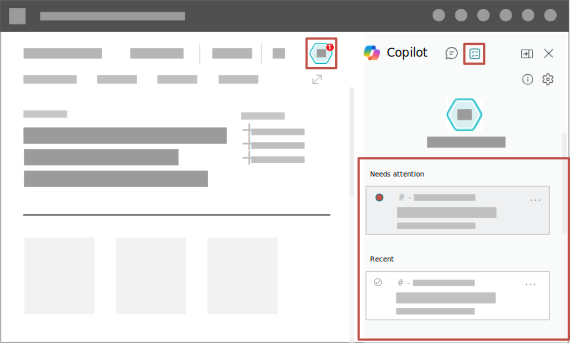

# Supervise agent activities in Copilot pane

You interact with Business Central agents, such as Payables and Sales Order agents, directly in Copilot's **Tasks** tab. You can monitor task status, review agent-generated drafts and suggestions, and provide confirmations or input to help tasks complete responsibly and accurately.

The process flow is different for each agent. This article explains the common aspects of working in the **Tasks** tab for all agents and answers frequently asked questions.

## Prerequisites

The agent is activated, and you have permission to use it. Learn more in [Set up Payables Agent](payables-agent-setup.md) or [Set up Sales Order Agent](sales-order-agent-setup.md).

## Get started

On the upper right of the navigation menu, select the icon for the agent:

-  **Payables Agent**
-  **Sales Order Agent**

A red circle with a number on the icon indicates the number of tasks that need attention.

Selecting the  icon opens the **Tasks** tab in the **Copilot** pane, where you can view tasks recently created by the agent. Tasks that require attention&mdash;like reviewing vendor information&mdash;are at the top of the list.  

For each inquiry the agent receives, like a request for a quote or invoice, the agent adds a **task** to track, review, and follow up on until the agent creates the entity. Each task has multiple steps that create a timeline of the process. A timeline is a visual sequence that shows each step taken for the task, helping you understand the progress and history.

## View summary of agent activities

Hover over the agent's icon or select the  **Show summary for agent** in the **Task** tab to get an overview of the agent's key performance indicators (KPIs) that measure the impact of the agent's work in your organization.

## Review and assist

The agent does most of the work autonomously, but sometimes it asks for user intervention to complete the process. When intervention is needed depends on the agent and  its setup, but here are some common situations:

- Reviewing and confirming incoming and outgoing emails
- Review and confirm contact or vendor information.
- Review and confirm the draft documents, like quotes, orders and purchase invoices.
- Help the agent get unblocked, like by providing missing data, creating a new contact for an order, or finding items.

Learn more about the agent's process flow in [Payables Agent process](payables-agent.md#payables-agent-process-flow) or [Sales Order Agent process](sales-order-agent.md#how-the-agent-processes-requests).

### Review a step

Steps that need intervention appear under **Needs Attention** in the **Tasks** tab. To review a step, follow these instructions:

1. In the **Task** tab, select the step requesting review or assistance.

   The task *timeline* opens, focused on the selected step. The timeline displays each step of a task, past and present, in chronological order.

1. Select **Review** for the step.

   The **Tasks** tab switches to **Review** mode, and the review content appears in the main display area.
1. Review the contents and make changes as needed.

1. If the agent needs assistance, a message appears at the top of the text explaining the problem.

   You often help the agent by making changes yourself, like making an item available, creating the right customer, contact, or vendor, or changing quantities in sales quotes. You can also [give instructions](#give-instructions-to-the-agent) to guide the agent to make changes for you.

1. When you're satisfied with the content and want the process to continue, select **Confirm** in the **Review** pane.

   If you want to complete the task yourself, select **Stop** to halt the agent's processing of this task. Learn more in [Stop a task](#stop-a-task).

After confirmation, the agent continues with the task. When a new notification appears on the agent icon after some time, follow the same flow to review and confirm the results.

## Give instructions to the agent

When you review a step, you might need to change something the agent created or help it get unblocked. For example, you might need to make an item available, create the correct customer or vendor, or change quantities in sales quotes before the task can continue. Instead of making the changes yourself, you can guide the agent to do the work by providing instructions in the **Tasks** tab.

:::image type="content" source="media/give-instructions-to-agent.svg" alt-text="Shows a step in Copilot Task pane that includes the options to give instructions to the agent.":::

In the **Give instructions to the agent** section of the step, you might get suggestions for instructions you can give. Copilot generates these suggestions automatically based on the current task. In some cases, there are no suggestions. Alternatively, you can write your own instructions in the **Type your instructions** box. After you select a suggestion or type instructions, select **Confirm** to let the agent resume the task.

> [!IMPORTANT]
> Your instructions are only used to complete this specific step. They aren't reused for the subsequent agent runs.

### How to write instructions

You're free to enter any text in the **Type your instructions** box, which lets you write instructions in plain, everyday language. Here are some tips to get the best results:

- Be specific and clear.
- Keep instructions focused on actions relevant to the current step.

Examples:

|Scenario|Instructions|
|---|---|
|When requested quantity of an item isn't available|Change the quantity to 50|
|When the agent can't determine the exact item|Give a quote for the Rome guest chair in blue|
|When you want to change a field| Change the shipping date to 09/01|
|When you want to give specific information when creating an entity|Create vendor using OCR data|

Here's what to avoid:

- Instructions that directly alter the workflow, such as stopping the task, skipping or discarding a step. These types of operations have dedicated actions in the interface rather than through freeform instructions.
- Instructions that are out of scope for the step or task, asking the agent to update unrelated records or perform actions outside the current task's context.

## Stop a task

Most steps of a task include a **Stop** button that lets you terminate the process. When you select **Stop**, a task isn't terminated immediately&mdash;you're asked to confirm before the task is stopped.

Before you stop a task, consider the following behavior:

- Stopped tasks can't be restarted.
- Stopping the task might leave some results incomplete or unwanted, and it might require follow-up actions. Follow up actions depend on where in the process the task was stopped.
- Stopped tasks aren't deleted immediately. You can still explore a task's timeline until it's deleted, typically by an administrator.

## Related information

[Configure Copilot and agent capabilities](enable-ai.md)  
[Payables Agent overview](payables-agent.md)  
[Set up Payables Agent](payables-agent-setup.md)  
[Sales Order Agent overview](payables-agent.md)  
[Set up Sales Agent](payables-agent-setup.md)  
