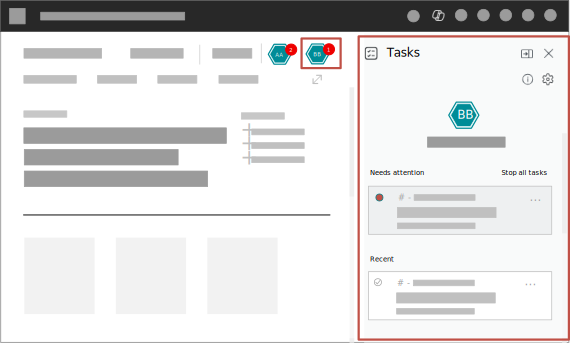

# Supervise agent activities

Business Central agents, such as the Payables Agent and Sales Order Agent, work autonomously to process requests like quotes and invoices. Sometimes, they need your input to verify information, approve drafts, or resolve issues they can't handle on their own.

You can review and approve agent work in two ways: from the **Tasks pane** on the side of the role center or **directly on document pages**. This article explains both approaches and covers common actions like giving instructions to agents and stopping tasks.

## Prerequisites

- The agent is activated.
- You have permission to use it.

Learn more in [Set up Payables Agent](payables-agent-setup.md) or [Set up Sales Order Agent](sales-order-agent-setup.md).

## Understand how agents request your help

Agents do most of their work without intervention, but they pause and request assistance in situations like:

- Review and confirm incoming and outgoing emails
- Review and confirm contact or vendor information
- Review and confirm draft documents, like quotes, orders, and purchase invoices
- Resolve issues like missing data, items that aren't available, or customers that don't exist

When an agent needs assistance, a notification badge appears on the agent icon in the navigation menu. The specific process flow differs by agent. Learn more in [Payables Agent process](payables-agent.md#payables-agent-process-flow) or [Sales Order Agent process](sales-order-agent.md#how-the-agent-processes-requests).

## Review and approve agent work

You can review agent work from either the Tasks pane or directly on document pages. Choose the approach that fits your workflow:

| Approach | Best for |
|----------|----------|
| **Tasks pane** | Reviewing the full task timeline, seeing what the agent did at each step, and providing instructions when the agent is blocked |
| **Directly on pages** | Quickly reviewing field-level suggestions on a document you're already viewing, without switching context |

Both approaches let you approve agent work and continue the task.

## Review from the Tasks pane

The **Tasks** pane shows all tasks from a selected agent, organized by status. Tasks that need your attention appear at the top.

1. On the upper-right side of the navigation menu, select the icon for the agent:

   -  **Payables Agent**
   -  **Sales Order Agent**

   A red circle with a number indicates how many tasks need your attention.

   

2. In the **Tasks** pane, select a task under **Needs Attention**.

   The task *timeline* opens, showing each step the agent completed and the current step that needs your input.

3. Select **Review** for the step that needs attention.

   The **Tasks** pane switches to **Review** mode, and the relevant content appears in the main display area.

4. Review the content and make changes as needed.

   If the agent needs help with resolving an issue, a message explains the problem. You can either make changes yourself or [give instructions](#give-instructions-to-the-agent) to guide the agent.

5. When you're satisfied, select **Confirm** to let the agent continue with the task.

After confirmation, the agent resumes work. When a new notification appears, follow the same flow to review the next step.

## Review directly on pages

When an agent creates or modifies a document, you can review its work directly on that page without opening the Tasks pane. A *data review bar* appears at the top of the page, showing which agent made changes and giving you quick access to review field-level suggestions.

:::image type="content" source="media/agents-data-review-bar.svg" alt-text="Shows a document created by an agent that includes the data review bar along the top."::: 

The data review bar appears regardless of how you navigate to the document—from a link in the Tasks pane or through standard navigation like search or menus. It also appears even if you don't have permission to use the agent that made the changes. In that case, you can still identify that agent-influenced data exists on the document, but links or buttons that open the agent task in the **Tasks** pane aren't shown.

### What the data review bar shows

The data review bar displays different elements depending on the situation:

| Situation | What displays |
|-----------|--------------|
| Agent task awaits review and modified fields | **Review agent task** link and **Review (N)** button |
| Agent task awaits review, no field modifications | **Review task** button |
| Agent modified fields, no task awaiting review | **Review (N)** button only |
| Multiple agents made changes | Stacked agent icons and a review message. If you have access to only some of the agents, task links or buttons appear only for those agents. |

### Review field suggestions

Fields that an agent modified have a **Show details about suggestion** :::image type="icon" source="media/info-tip-white.png"::: icon next to them. The tooltip for each field shows which agent modified the data, even when you don't have permission to open that agent's task. The icon color indicates confidence level:

- **White icon** :::image type="icon" source="media/info-tip-white.png"::: - Standard confidence. Review the value but it's likely correct.
- **Orange icon** :::image type="icon" source="media/info-tip-red.png"::: - Low confidence. The agent is less certain about this value, so review it carefully.

To review suggestions:

1. Select the **Review (N)** button on the data review bar to view a list of all modified fields.

   For documents with repeating lines (like invoice lines), the list shows a summary like "rows: 3, fields: 5" to indicate how many rows and fields have suggestions.

2. Select a field from the list to navigate to it.

3. Select the info tip icon next to the field to view:
   - Which agent made the modification
   - The reasoning (for example, "most frequently used value" or "based on vendor history")
   - The confidence level

4. Edit the value if needed, or leave it as suggested.

5. After you review all suggestions, select **Done** to complete the review.

### Open an agent task from the data review bar

If the data review bar shows a **Review agent task** link or **Review task** button, select it to open the task in the **Tasks** pane. If multiple agent tasks are pending for the document, select from the dropdown menu to choose which task to review.

### Complete or dismiss the review

When you finish reviewing a document, you have two options:

- **Done** - Marks the review as complete and records that you reviewed the document (including your name and the date). The agent's task can proceed, and the suggestion markers are cleared from the fields.
- **Dismiss** (X button) - Hides the data review bar and refreshes the page to clear suggestion markers. Use this button if you want to review the document later or if you already made your changes manually.

## Give instructions to the agent

When an agent is blocked, you can guide it by providing instructions instead of making changes yourself.

:::image type="content" source="media/give-instructions-to-agent.svg" alt-text="Shows a step in Copilot Task pane that includes the options to give instructions to the agent.":::

In the **Give instructions to the agent** section, Copilot might suggest common instructions based on the current task. You can select a suggestion or write your own in the **Type your instructions** box. Then select **Confirm** to let the agent resume the task.

> [!IMPORTANT]
> Your instructions apply only to the current step. They aren't saved or reused for future tasks.

### Tips for writing instructions

Write instructions in plain, everyday language. Be specific about what you want the agent to do.

| Scenario | Example instruction |
|----------|---------------------|
| Requested quantity isn't available | Change the quantity to 50 |
| Agent can't determine the exact item | Give a quote for the Rome guest chair in blue |
| You want to change a field value | Change the shipping date to 09/01 |
| Creating a new entity | Create vendor using OCR data |

Avoid instructions that:

- Try to alter the workflow (like stopping or skipping steps)—use the dedicated buttons instead
- Ask the agent to update unrelated records or do work outside the current task

## Stop a task

If you need to stop an agent from continuing a task, select **Stop** on the step. You're asked to confirm before the task stops.

To stop all active tasks at once, select **Stop all tasks**. Stopping a task is useful if the agent becomes blocked after importing too many tasks.

Before stopping a task, consider:

- Stopped tasks can't be restarted.
- The document might be left incomplete, and you might need to finish it manually.
- Stopped tasks remain visible in the timeline until an administrator deletes them.

## View summary of agent activities

To view key performance indicators (KPIs) that measure the agent's impact in your organization, hover over the agent's icon or select the  **Show summary for agent** in the **Tasks** pane.

## Troubleshooting

### Data review bar doesn't appear on a document

The data review bar only appears on certain page types (Card, Document, List Plus, and Worksheet pages). If you're viewing a document that an agent created but the bar isn't shown:

- Make sure you're viewing the main document page, not a subpage or embedded part.
- Check whether another user already completed the review by looking at the task in the **Tasks** pane.
- Refresh the page to ensure you have the latest data.

### Task not visible in the Tasks pane

The agent organizes tasks. Make sure you selected the correct agent icon in the navigation menu. Tasks that need attention appear at the top of the list under **Needs Attention**.

If you still can't find the task, it could be:

- Another user stopped or completed the task.
- The agent is still processing it. Wait a few moments and check again.
- An administrator deleted older tasks.

### Agent keeps getting blocked on the same issue

If an agent repeatedly gets blocked, consider:

- Setting up master data (vendors, customers, items) that the agent frequently needs
- Adjusting the agent's configuration to better match your business processes
- Reviewing the agent's setup to ensure it has the permissions it needs

Learn more in [Set up Payables Agent](payables-agent-setup.md) or [Set up Sales Order Agent](sales-order-agent-setup.md).

## Related information

- [Configure Copilot and agent capabilities](enable-ai.md)
- [Payables Agent overview](payables-agent.md)
- [Set up Payables Agent](payables-agent-setup.md)
- [Sales Order Agent overview](sales-order-agent.md)
- [Set up Sales Order Agent](sales-order-agent-setup.md)
