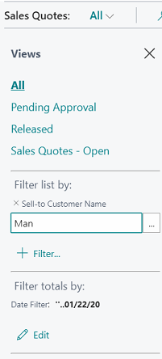
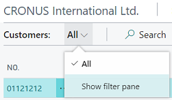

# Sorting, Searching, and Filtering Lists
There are a few things that you can do that will help you scan, find, and limit records in a list. These include sorting, searching and filtering. You can apply some or all of these simultaneously to quickly find or analyze your data.

> [!TIP]
> When viewing your data as tiles, you can search and use basic filtering. To use the full set of powerful features for sorting, searching and filtering, choose the  icon to show as a list.

<!--
When you want to search for data, such as customer names, addresses, or product groups, you enter criteria. In search criteria you can use all the numbers and letters that you normally use in the specific field. In addition, you can use special symbols to further filter the results. There are two ways to search: using the Quick Filter or column filters.
-->

## Sorting
Sorting makes it easy for you to get a quick overview of your data. If you have many customers, for example, you can choose to sort them by **Customer No.**, **Customer Posting Group**, **Currency Code**, **Country Region Code**, or **Sales Tax Registration No.** to get the overview you need.

To sort a list, you can either choose a column heading text to toggle between ascending and descending order, or choose the small down arrow in the column heading, and then choose **Ascending** or **Descending**.  

> [!NOTE]  
>   Sorting is not supported on images, BLOB fields, FlowFilters, and fields that do not belong to a table.  

## Searching
<!--## Searching by using the Quick Filter -->
At the top of each list page, there is a  **Search** icon that provides a quick and easy way to reduce the records in a list and display only those records that contain the data that you are interested in seeing.

To search, simply select the search icon, and then in the box, type the text that you are looking for. You can enter letters, numbers, and other symbols.

### Fine-tune the search
In general, search will attempt to match text across all fields; it does not distinguish between uppercase and lowercase characters (in other words, case insensitive), and will match text placed anwhere in the field (at the beginning, end, or in the middle).

However, you can make a more exact search by using the following special characters:

- To find only field values that match the entire text and case exactly, place the search text between single quotes `''` (for example, `'man'`).

- To find field values that start with a certain text and match the case, place `*` after the search text (for example `man*`).

- To find field values that end with a certain text and match the case, place `*` before the search text (for example `*man`).

- When using  `''` or `*`, the search is case sensitive. If you want to make the search case insensitive, place `@` before the search text (for example `@man*`).

The following table provides some examples to explain how you can use the search.

<!--
In search criteria you can use all the numbers and letters that you normally use in the specific field. In addition, you can use special symbols to further filter the results. There are two ways to search: using the Quick Filter or column filters.-->

<!--
The Quick Filter provides an easy access to filter data by entering plain text, but does also provide a lot of search criteria options. Depending on whether you enter plain text or text including symbols, the Quick Filter behaves differently.  

* If you enter plain text in the search criteria, the search criteria is interpreted as a case insensitive search that contains certain text.  
* If you enter text including symbols in the search criteria, the search criteria is interpreted exactly as you entered it, and the search is case sensitive.
-->
<!--

|Search Criteria|Interpreted as...|Finds...|
|---------------|----------------|----------|
|`man` or  `Man`|Contains the text; case insensitive|All records with fields that contain the text **man**, regardless of the case.|
|`'Man'`|Entire text match; case sensitive.|All records with fields that only contain **Man** exactly.|
|`Man*`|Starts with the text; case sensitive.|All records with fields that start with the text <b>Man</b> exactly.|
|`@Man*`|Starts with the text; case insensitive.|All records with fields that start with **man**, regardless of the case.|
|`@*man`|Ends with the text; case insensitive.|All records that end with **man**, regardless of the case.|
-->

|Search Criteria|Finds...|
|---------------|----------|
|`man` or  `Man`|All records with fields that contain the text **man**, regardless of the case. For example, **Manchester**, **manual**, or **Sportsman**. |
|`'Man'`|All records with fields that contain only **Man**, matching the case.|
|`Man*`|All records with fields that start with the text <b>Man</b>, matching the case. For example, **Manchester** but not **manual** or **Sportsman**.|
|`@Man*`|All records with fields that start with **man**, regardless of the case. For example, **Manchester** and **manual**, but not **Sportsman**.|
|`@*man`|All records that end with **man**, regardless of the case. For example **Sportsman**, but not **Manchester** or **manual**.|

> [!TIP]
> You can press F3 to activate and deactivate the search box. For more information see [Keyboard Shortcuts](keyboard-shortcuts.md#KeyboardFilter).

## Filtering
Filtering provides a more advanced and versatile way of controlling which records display in a list. There are two major differences between searching and filtering, as described in the table below.

|| **Searching** | **Filtering** |
|--|----------|------------|
| **Applicable fields** | Searches across all fields that are visible on the page. | Filters one or more fields individually, selecting from any field on the table, including fields that are not visible on the page. |
| **Matching** | Displays records with fields that match the search text, irrespective of casing or placement of that text. | Displays records where the field matches the filter exactly and is case sensitive, unless special filter symbols are entered.

Filtering enables you to display records for specific accounts or customers, dates, amounts, and other information by specifying filter criteria. Only records that match the criteria are displayed. If you specify criteria for multiple fields, then only records that match all criteria will be displayed.

### Working in the filter pane
The filter pane displays the current filters for a list, and enables you to set your own custom filters on one or more fields. The following figure shows an example filter pane for a Sales Quotes list.

To display the filter pane, use the **Shift+F3** keyboard shortcut. For lists within the Role Center, you can also choose the down arrow near the page title in the navigation bar above the list, and then choose **Show filter pane**.

A filter pane is divided in three sections: **Views**, **Filter list by**, and **Filter totals by**:

- **Views**

  Some lists will include the **Views** section. Views are variations of the list that have been preconfigured with filters. To switch to a different view of your list, simply select another link. You can temporarily change the filters on a view, but the changes will not be permanently saved.

- **Filter list by**

  The **Filter list by** section is where you add filters on specific fields to reduce the number of displayed records. To add a filter, select **+ Filter**, select the field that you want to filter from any field in the table, and then enter filter criteria in the box.

- **Filter totals by**

  Some lists that display calculated fields, such as amounts and quantities, will include the **Filter totals by** section where you can adjust various dimensions that influence calculations. For example, you can quickly analyze your chart of accounts by filtering amounts to a specific period, or you can view the totals for sales orders only from a specific warehouse.

  To add a filter, select **+ Filter**, select one of the predefined dimensions, and then add the filter criteria in the box.

  > [!NOTE]
  > Filters in the **Filter totals by** section are controlled by FlowFilters on the page design. For technical information, see [FlowFilters](https://docs.microsoft.com/en-us/dynamics365/business-central/dev-itpro/developer/devenv-flowfilter-overview).

### Entering filter criteria in the filter pane
To select a field to filter, do one of the following:
  - In the filter pane, choose **+ Field**. Type the name of the field you wish to filter, or pick a field from the menu that displays all fields in the table.

  - In a column heading, choose the down arrow, and then choose **Filter...**. This will open the filter pane and add the column to the filter pane.

You can now type or select your filter criteria in the box. The type of field you filter determines which criteria you can enter. For example, filtering a field that has fixed values will only let you choose from those values. For more information about special filter symbols, see [Filter criteria](#FilterCriteria) and [Filter tokens](#FilterTokens).

Columns that already have filters are indicated by the  in the column heading. To remove a filter, select the column heading, then choose **Clear Filter**.

### Entering filter criteria without the filter pane
You can specify simple filters directly within the list without having to use the filter pane.
With any field selected on a row, use the **Alt+F3** keyboard shortcut to display only the records having that same value. You can then select another field and use the same shortcut again to continue refining your filters. If the selected field is already filtered, using **Alt+F3** will clear that filter.

> [!TIP]
> Accelerate finding and analyzing your data by using combinations of keyboard shortcuts. For example, select a field, use **Shift+Alt+F3** to add that field to the filter pane, type the filter criteria, use **Ctrl+Enter** to return to the rows, select another field, and use **Alt+F3** to filter to that value.
For more information see [Keyboard Shortcuts](keyboard-shortcuts.md#KeyboardFilter).

## Filter criteria and symbols
When you enter criteria, you can use all the numbers and letters that you can normally use in the field. In addition, you can use special symbols to further filter the results. The following tables show the symbols which can be used in filters. For dates and times, you can also refer to [Working with Calendar Dates and Times](ui-enter-date-ranges.md) for more detailed information.

> [!IMPORTANT]  
>  There may be instances where field values contain these symbols and you want to filter on them. To do this, you must include the filter expression that contains the symbol in quotation marks (''). For example, if you want to filter on records that start with the text *S&R*, the filter expression is `'S&R*'`.  

### (..) Interval

|Sample Expression|Records Displayed|  
|-----------------------|-----------------------|  
|`1100..2100`|Numbers 1100 through 2100|  
|`..2500`|Up to and including 2500|  
|`..12 31 00`|Dates up to and including 12 31 00|  
|`P8..`|Information for accounting period 8 and thereafter|  
|`..23`|From the beginning date until 23-current month-current year 23:59:59|  
|`23..`|From 23-current month-current year 0:00:00 until the end of time|  
|`22..23`|From 22-current month-current year 0:00:00 until 23-current month-current year 23:59:59|  

### (&#124;) Either/or  

|Sample Expression|Records Displayed|  
|-----------------------|-----------------------|  
|`1200|1300`|Numbers with 1200 or 1300|  

### (<>) Not equal to  

|Sample Expression|Records Displayed|  
|-----------------------|-----------------------|  
|`<>0`|All numbers except 0   The SQL Server Option allows you to combine this symbol with a wild card expression. For example, <>A* meaning not equal to any text that starts with A.|  

### (>) Greater than  

|Sample Expression|Records Displayed|  
|-----------------------|-----------------------|  
|`>1200`|Numbers greater than 1200|  

### (>=) Greater than or equal to  

|Sample Expression|Records Displayed|  
|-----------------------|-----------------------|  
|`>=1200`|Numbers greater than or equal to 1200|  

### (<) Less than  

|Sample Expression|Records Displayed|  
|-----------------------|-----------------------|  
|`<1200`|Numbers less than 1200|  

### (<=) Less than or equal to  

|Sample Expression|Records Displayed|  
|-----------------------|-----------------------|  
|`<=1200`|Numbers less than or equal to 1200|  

### (&) And  

|Sample Expression|Records Displayed|  
|-----------------------|-----------------------|  
|`>200&<1200`|Numbers greater than 200 and less than 1200|  

### ('') An exact character match  

|Sample Expression|Records Displayed|  
|-----------------------|-----------------------|  
|`'man'`|Text that matches man exactly and is case sensitive.|  

### (@) Case insensitive  

|Sample Expression|Records Displayed|  
|-----------------------|-----------------------|  
|`@man*`|Text that starts with man and is case insensitive.|  

### (*) An indefinite number of unknown characters

|Sample Expression|Records Displayed|  
|-----------------------|-----------------------|  
|`*Co*`|Text that contains "Co" and is case sensitive.|  
|`*Co`|Text that ends with "Co" and is case sensitive.|  
|`Co*`|Text that begins with "Co" and is case sensitive.|  

> [!NOTE]  
>   You cannot use `*` when filtering on option (enumeration) fields, such as the **Status** field on sales orders. To enter a filter for this type of field, you can enter the numeric value as a filtering parameter. For example, in the **Status** field on a sales order that has the values **Open**, **Released**, **Pending Approval**, and **Pending Prepayment**, use the values `0`, `1`, `2`, and `3` to filter for these options.

### (?) One unknown character  

|Sample Expression|Records Displayed|  
|-----------------------|-----------------------|  
|`Hans?n`|Text such as Hansen or Hanson|  

### Combined format expressions  

|Sample Expression|Records Displayed|  
|-----------------------|-----------------------|  
|`5999|8100..8490`|Include any records with the number 5999 or a number from the interval 8100 through 8490.|  
|`..1299|1400..`|Include records with a number less than or equal to 1299 or a number equal to 1400 or greater (all numbers except 1300 through 1399).|  
|`>50&<100`|Include records with numbers that are greater than 50 and less than 100 (numbers 51 through 99).|  

## Filter tokens
When entering filter criteria, you can also type words that have special meaning, called filter tokens. After entering the token word, the word is replaced by the value or values that it represents. This makes filtering easier by reducing the need to navigate to other pages to look up values you want to add to your filter. The tables below describe some of the tokens you can type as filter criteria.

> [!TIP]
> Your organization may use custom tokens. To learn about the complete set of tokens available to you or to add more custom tokens, talk to your administrator. For technical information see [Adding Filter Tokens](/dynamics365/business-central/dev-itpro/developer/devenv-adding-filter-tokens)

### (%me or %userid) Records assigned to you

Use `%me` or `%userid` when filtering fields that contain the user ID, such as **Assigned to User ID** field, to display all records that are assigned to you.

|Sample Expression|Records Displayed|  
|-----------------------|-----------------------|  
|`%me` or `%userid`|Records that are assigned to your user account. |  

### (%mycustomers) Customers in My Customers

Use `%mycustomers` in the customer **No** field to display all records for customers that are included in the **My Customers** list on your Role Center.

|Sample Expression|Records Displayed|  
|-----------------------|-----------------------|  
|`%mycustomers`|Customers in the **My Customers** on your Role Center. |  

### (%myitems) Items in My Items

Use `%myitems` in the item **No** field to display all records for items that are included in the **My Items** list on your Role Center.

|Sample Expression|Records Displayed|  
|-----------------------|-----------------------|  
|`%myitems`|Items in the **My Items** on your Role Center. |  

### (%myvendors) Vendors in My Vendors

Use `%myvendors` in the vendor **No** field to display all records for vendors that are included in the **My Vendors** list on your Role Center.

|Sample Expression|Records Displayed|  
|-----------------------|-----------------------|  
|`%myvendors`|Vendors in the **My Vendors** on your Role Center. |  

## See Also
[Working with [!INCLUDE[d365fin](includes/d365fin_md.md)]](ui-work-product.md)  
[Common questions about Searching and Filtering](ui-search-filter-faq.md)
